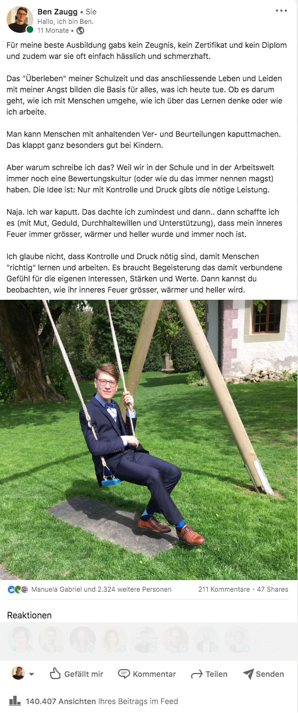

+++
title = "Life Loops"
date = "2022-06-03"
draft = false
pinned = false
tags = ["Biografie", "Ikigai", "Colearning", "Biografie", "Recovery", "Sinn"]
image = "whatsapp-image-2021-11-13-at-20.10.53.jpeg"
description = "Gibt es die Berufung, das Talent oder den Sinn? Wie findet man sein Ikigai und muss man das überhaupt? Heute habe ich (zumindest vorläufige) Antworten auf einige dieser Fragen und verbinde sie hier vor allem mit meinen ganz persönlichen Erkenntnissen. "
+++
### Ende und Anfang oder vielleicht einfach Life Loop

Es ist mittlerweile kein Geheimnis mehr, dass ich meine Schulzeit in schlechtester Erinnerung habe und in meiner Jugend- und frühen Erwachsenenzeit mit schlimmen Ängsten und Panikattacken zu kämpfen hatte. Dieses «Leben» ist so weit in die Ferne gerückt, dass sie kaum mehr wahr scheint. Wenn ich nun von Ende und Anfang schreibe, dann schaue ich zurück und zwar zu dem Zeitpunkt, an dem ich ganz bewusst meiner Berufung folgen wollte, respektive dem nachgehen, was meine Berufung sein könnte. Es scheint mir nämlich eine Illusion und heute mehr denn je, dass es *das* Talent, *die* Berufung oder *den* Sinn gibt. 

\
Die Frage ist erlaubt, warum ich immer noch von meiner Vergangenheit schreibe, obwohl sie in weite Ferne gerückt ist. Ganz einfach, weil ich noch einmal unterstreichen will, dass die Vergangenheit nicht die Zukunft bestimmt und das wir auch unter sehr widrigen Umständen unseren Weg gehen können. 

\
Auf dem Weg zur «Berufung» habe ich mich vor 1 ½  Jahren entschieden, den Schritt in die Selbstständigkeit zu wagen. Rückblickend war es nicht nur ein selbstständig machen, sondern ein Entdecken und Ausprobieren, es war eine Auszeit, eine intensive Arbeitszeit, eine Lernzeit, eine Entdeckungsreise und oft war ich innerhalb weniger Tage oder Stunden in komplett verschiedenen Welten unterwegs. Zwei kleine Beispiele: 

* Ich war an einem Tag «Tellerwäscher» (oder Küchenhilfe😉), um mein Einkommen zu sichern und einen Einblick in andere Arbeiten zu erhalten. Am nächsten Tag erzählte ich als Experte den Menschen etwas über Sinn, Berufung oder neue Arbeits- und Lernformen.
* In letzter Zeit habe ich mich intensiver mit dem Thema fehlende Grundkompetenzen (also auch mit der oft dazugehörenden Armut, dem Armutsrisiko etc.) auseinandergesetzt, während dem ich gleichzeitig intensiv in New Work und New Learning-Themen drin bin.  

So war meine Selbstständigkeit eben bisher nicht nur das selbstständige Arbeiten mit allem was dazugehört, sondern auch ein persönlicher Lern- und Entdeckungsprozess. Es war ein Leben mit vielen Unsicherheiten. Dieses Leben war früher so oder so undenkbar und es käme kaum mehr jemand auf die Idee, dass ich einer von denen war, aus denen «nichts» werden sollte. Übrigens: Menschen, aus denen nichts wird, sind mir bis heute nicht begegnet. Dafür viele, die lange mit schwierigen (Schul-)Erfahrungen kämpften oder noch immer irgendwo drin stecken.

Ich habe eingangs erwähnt, dass ich nicht mehr an die Berufung, den Sinn oder das Talent glaube und doch bin ich genauso überzeugt, dass es das gibt. Wie kommts? \
\
Es ist das (vielleicht vorläufige) Resultat 

* der intensiven Auseinandersetzung mit meinem eigenen Prozess 
* von dem, was ich bei meinen Kund*innen und Menschen rund um mich beobachten konnte
* von Erkenntnissen und Theorien aus Büchern, Podcasts etc.

Viel eher als *die* Berufung, *das* Talent, *den* Sinn gibt es Berufungsmöglichkeiten, verschiedene Talente in unterschiedlichen Ausprägungen oder Sinn-Möglichkeiten, die gefunden und gelebt werden können. Es ist auch nicht so, dass die (vorläufige) Erkenntnis vom eigenen Sinn, dem Talent und der Berufung in einer Vollzeitarbeit oder in Selbstständigkeit umgesetzt werden muss. Viel wichtiger ist es, sich mit diesen Erkenntnissen und Ideen auf den Weg zu machen. Das gilt übrigens auch für [Ikigai](https://www.bensblog.ch/ikigai-schon-wieder/) (nicht das Venn-Diagramm), dort beschreibt Ken Mogi ähnliche Beispiele von Menschen, die ihr Ikigai beispielsweise in der Freizeit leben.

Und so war ich auf meiner ganz persönlichen Reise in der Rolle als Selbstständiger und ganz stark auch als Lernender. Als Lernender, weil ich mich bewusst so auf den Weg gemacht habe und weil ich durch Colearning vieles dokumentiert und geteilt habe. So ist ein Lernportfolio oder eben auch mein Logbuch entstanden, welches vermutlich hier nicht fertig ist. 

Hier bin ich nun angekommen und habe ein ganz starkes Gefühl für das, was mir wichtig ist, für das was ich kann und will. \
\
Vor 11 Monaten habe ich meinen schon fast berühmten Linkedin-Post geschrieben. Dort stand ganz am Anfang: *«Für meine beste Ausbildung gabs kein Zeugnis, kein Zertifikat und kein Diplom und zudem war sie oft einfach hässlich und schmerzhaft.»* Heute, ein Jahr später könnte ich diese Aussage zur «besten Ausbildung» ergänzen mit den letzten 1 1/2 Jahren. Auch dafür gibts kein Zeugnis und kein Zertifikat und ich bin mir wahrscheinlich noch kaum bewusst, was ich alles gelernt habe.

#### Einige Gedanken zu diesem Weg in Kurzform

* Es war am Anfang sehr unangenehm, mich, meine Gedanken und Gefühle zu teilen und gleichzeitig schien es mir eine Notwendigkeit. Rückblickend hat es sich gelohnt. Nicht nur, weil es mir in meinem Prozess half, sondern weil ich andere Menschen inspirieren und ihnen Mut machen konnte. Die Rückmeldungen haben mich immer wieder ermutigt, weiterzumachen. 
* Um sich der eigenen Berufung, den Talenten und dem Sinn zu nähern, muss man sich auf den Weg machen. Je mehr Möglichkeiten und Freiheiten man sich dafür schaffen kann, umso mehr kann passieren. Neue Perspektiven und Menschen die einem dabei begleiten können helfen. 
* Auch wenn ich mich seit Jahren mit Sinn, Berufung, Werten etc. auseinandersetze, habe ich mit dem  Abtauchen in dieses selbstverantwortetes Leben noch einmal eine ganz andere Tiefe erreicht. 
* Diesen Frühling ist mir das [Buch Life Design](https://www.exlibris.ch/de/buecher-buch/deutschsprachige-buecher/sebastian-kernbach/life-design/id/9783791049229?gclid=CjwKCAjwv-GUBhAzEiwASUMm4sFxjseeYL-iU15Bl-Y1N-HMiiZZsxPieKDyejaCneR2WnH-wCKugRoCG9UQAvD_BwE&gclsrc=aw.ds) begegnet und wenn ich dort drin lese, dann habe ich vieles von dem was da beschrieben ist, bereits umgesetzt oder gelebt. Ich hatte jedoch in der Vergangenheit kein gutes Gefühl beim immer wieder Aufhören und Neuanfangen. Je mehr wir uns jedoch diese dort drin beschriebenen Prozesse oder diese Life Loops erlauben, umso eher finden wir heraus, was wir gut können und wirklich gerne machen.
* Ich habe in 1 1/2 Jahren so viel Zeit, Geld und Energie investiert und ich konnte in dieser Zeit vieles aufbauen. Dann wurde mir trotzdem oder vielleicht gerade deshlab klar, dass diese Selbstständigkeit heute nicht mein Weg ist. Nicht weil ich zu "faul" oder zu ängstlich wäre, Unternehmer zu sein, sondern weil ich glaube, dass ich meine (Kern-)Fähigkeiten an einem anderen Ort besser einsetzen kann.
* Habe ich denn nun mein Ikigai, meine Berufung oder meinen Sinn gefunden? Ja und Nein. Ich habe ein gutes Gefühl (vor allem aus den Begegnungen mit anderen Menschen und vielen Rückmeldungen) für meine Talente entwickelt. Für das, was mein Ikigai oder die Dinge, die mein Ikigai sein können, habe ich ebenfalls ein ganz gutes Gefühl (man könnte hier auch Why, Berufung, o. ä. hinschreiben). Dann bleibt noch der Sinn und auch da habe ich Ideen. Aber auch hier sehe ich eher den Sinn als etwas nicht statisches. Vielleicht zwei passende Textteile von Viktor E. Frankl dazu: 

> «Die Frage ist falsch gestellt, wenn wir nach dem Sinn unseres Lebens fragen. Das Leben ist es, das Fragen stellt; wir sind die Befragten, die zu antworten haben.»
>
> «Die Aufgabe wechselt nicht nur von Mensch zu Mensch – entsprechend der Einzigartigkeit jeder Person – sondern auch von Stunde zu Stunde, gemäß der Einmaligkeit jeder»

#### Hättest du dir doch noch etwas konkreteres gwünscht? Dann ist das für dich.

Ich sei ein wacher Zuhörer und Beobachter mit einem feinen Gespür für die Dinge hinter dem Offensichtlichen. Einer, der Möglichkeiten sieht und andere inspiriert. Das ist es, was sich aus den Gesprächen und Rückmeldungen aus den letzten Jahren zusammenfassen lässt und ich wünsche mir, dass es stimmt. Wenn ich so unterwegs sein kann, dann habe ich ein Sinngefühl und bin nahe an dem, was man Ikigai nennen kann.