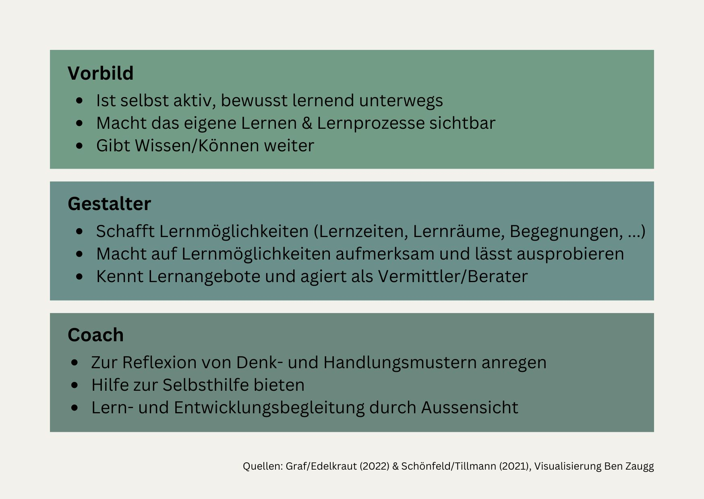

+++
title = "Neues Lernen für eine neue Arbeitswelt."
date = "2024-10-31"
draft = false
pinned = false
tags = ["CAS", "CAS-BI", "Kompetenzentwicklung", "NewWork", "NewLearning", "Lernen", "Bildung"]
image = "neues-lernen-fu-r-eine-neue-arbeitswelt.jpg"
description = "Mit dem Wandel in der Arbeitswelt, der durch schnelle Veränderungen und kürzeren Lebenszyklen sowie einer immer höheren Vernetzung geprägt ist, sind nicht nur die Anforderungen an unsere Arbeit anders, sondern auch unser Lernen ist davon betroffen. "
footnotes = "Dieser Beitrag ist Teil eines Konzepts, welches im Rahmen des CAS Business Impact erstellt wurde. Zu einem weiteren Teil geht es hier: [Selbstorganisiertes Lernen gestalten](https://www.bensblog.ch/selbstorganisiertes-lernen-gestalten/)\n\n\\[1] Heike Bruch in Sternstunde Philosophie SRF, 30.04.2023, Minute 10:20, <https://www.srf.ch/audio/sternstunde-philosophie/schoene-neue-arbeitswelt?id=12377370> , aufgerufen am 17.10.2024\n\n\\[2] vgl. Foelsing J., Schmitz A. (2021)\n\n\\[3] vgl. Das 70:20:10-Modell – Lernen neu entdecken, <https://www.haufe-akademie.de/blog/themen/personalentwicklung/das-702010-modell-lernen-neu-entdecken/> aufgerufen am 16.10.2024\n\n\\[4] vgl. Schönfeld J, Tillman T. (2021), S. 10\n\n\\[5] Schleuter F., Schönfeld J., Schuder P., Tillmann T. (2024), S. 25\n\n\\[6] Vgl. Schönfeld J, Tillman T. (2021), S. 10\n\n\\[7] Schönfeld J, Tillman T. (2021), S.16\n\n\\[8] Arnold R. (2017), S. 42\n\n\\[9] Graf N., Gramss D., Edelkraut F. (2022), S. 243\n\n\\[10] Vgl. Graf N., Gramss D., Edelkraut F. (2022), S. 243\n\n\\[11] Vgl. Schönfeld J, Tillman T. (2021), S. 17\n\n\\[12] Foelsing J., Schmitz A. (2021), S. 198\n\n\\[13] Vgl.  Lernen A. 198 ff\n\n\\[14] Arnold R. (2017), S. 119\n\n\\[15] Graf N., Gramss D., Edelkraut F. (2022), S. 199\n\n\\[16] Arnold R. (2017), S. 43\n\n\\[17] Foelsing J., Schmitz A. (2021)\n\n\\[18] Vgl. Graf N., Gramss D., Edelkraut F. (2022), S. 151 und Schönfeld J, Tillman T. (2021), S. 2\n\n\\[19] Foelsing J., Schmitz A. (2021), S. 51"
+++
# Rollen und Praktiken zur Förderung von arbeitsplatzbezogenem kontinuierlichem Lernen in einer digitalen und agilen Arbeitswelt.

## 1.0 Einleitung: Das Lernen in der Arbeitswelt ist in Bewegung

> «Wir leben heute in der langsamsten Zeit, in der wir je leben werden.»\[1]

Mit dem Wandel in der Arbeitswelt, der durch schnelle Veränderungen und kürzeren Lebenszyklen sowie einer immer höheren Vernetzung geprägt ist, sind nicht nur die Anforderungen an unsere Arbeit anders, sondern auch unser Lernen ist davon betroffen. Wir kommen aus einer Zeit, in der Lernbedarfe von aussen (Personalentwicklung, HR) eruiert und Bildungsangebote konzipiert wurden. Diese Prozesse brauchen Zeit und können vielen Anforderungen in der heutigen digitalisierten (Arbeits-) Welt zunehmend weniger gerecht werden, da Wissen und Informationen schnell benötigt werden oder genauso schnell veraltet oder überholt sein können. Es braucht deshalb ein neues Lernverständnis für die Arbeitswelt in der digitalen Netzwerkgesellschaft, wie Foelsing und Schmitz\[2] sie nennen. Bei dieser stehen die individuellen Lern- und Entwicklungsthemen der Arbeitnehmenden im Zentrum. 

### 1.1 Lernen und Arbeiten in Verbindung

Mitarbeitende lernen heute vieles am Arbeitsplatz. Das lässt sich gut am 70:20:10 Modell\[3] veranschaulichen. Bei diesem sogenannten informellen Lernen beschaffen sich Mitarbeitende Lerninhalte (Videos, Bücher, Podcasts, Artikel etc.) selbst, suchen sich Expertinnen und Experten (z. B. über Linkedin oder innerhalb der eigenen Organisation) oder tauschen sich mit Kolleg:innen aus.\[4] Viele Ressourcen in der Personalentwicklung werden noch in die 10 % gesteckt, wobei hier aus Sicht des arbeitsplatzbezogenen und kontinuierlichen Lernens in der sich schnell verändernden VUCA-Welt ein Change in Richtung 70 & 20 anzustreben ist.  

> «Die Weiterentwicklung des Lernens im beruflichen Kontext lässt sich als fortschreitender Prozess der Einswerdung von Arbeiten und Lernen beschreiben.»\[5]

**Das 70:20:10 Modell\[6]**

* 70 % unserer Kompetenzen (Wissen & Können) kommt durch und aus unserer Arbeit. Das entwickeln wird durch die Herausforderungen, Problemstellungen etc. im Arbeitsalltag. 
* 20 % unseres Lernens findet in der Begegnung mit Menschen statt. Das kann sowohl mit Mitarbeitenden wie auch mit externen Partnern sein (Kundinnen und Kunden, Lieferanten, etc.)
* 10 % stammen aus dem Lernen in formellen Lernsettings wie Kurse (Präsenz und Online, E-Learnings), Workshops, Weiterbildungen und weitere. 

Diese Prozentzahlen sind als ungefähre Angabe zu verstehen. 

### 1. 2 Ziel dieses Dokuments

In diesem Dokument geht es um Umsetzungspraktiken für selbstorganisiertes Lernen bei und während der Arbeit von Mitarbeitenden in der digitalen Netzwerkgesellschaft. Es geht also um die Förderung der 70 und 20 % des oben genannten Modells. Diese lassen sich praktisch und einfach in den Arbeitsalltag integrieren. Dies kann auch zu Experimentierzwecken im Sinne des Sammelns von Erfahrungen mit dieser «neuen» Art von Lernen stattfinden. Neben den praktischen Anwendungen wird es nötig sein, ein neues Verständnis der Rollen (Mitarbeitende als Lernende, Personalentwicklung, Führungspersonen) zu entwickeln, um diese langfristig in der Organisation zu nutzen und zu verankern. Darauf wird auf den folgenden Seiten eingegangen. 

## 2.0 Blick in die Zukunft: Lernkultur und Rollen

«Ziel muss es sein, dass jeder Einzelne selbst zum Gestalter seiner bzw. ihrer Weiterentwicklung wird.»\[7]

«Lernen folgt einer Aneignungs- und keiner Vermittlungslogik.»[\[8]](applewebdata://69B8C8F5-A6F9-438E-BFE1-8E9A5784C4ED#_ftn8) Das schreibt Dr. Rolf Arnold in seinem Buch «Entlehrt euch». Dazu kommt, dass die Einführung von agilen- und anderen modernen Lern- und Arbeitsmethoden am besten bereits in iterativen Prozessen von Try & Error stattfinden. So nähern sich Mitarbeitenden und Vorgesetzte sowie ganze Organisationen im Sinne von «Learning by Doing» an den neuen Soll-Zustand an. In diesem Prozess werden sich zwangsläufig auch die Rollen der Personalentwicklung sowie der Führungspersonen in Bezug auf Lernen anpassen. Wie das aussehen kann, wird im nächsten Abschnitt beleuchtet.  

### 2.1 Lernkultur

> «Der Begriff «Lernkultur» meint, die Kultur des Lernens und Lehrens in einem Unternehmen.»\[9]

Die Lernkultur ist ein Teil der Unternehmenskultur und steht mit dieser in Wechselwirkung. Die (Lern-) Kultur sollte so entwickelt oder beeinflusst werden, dass Mitarbeitende Verantwortung für sich und ihren eigenen Lern- und Entwicklungsprozess übernehmen können und sollen. Da sich die Kultur immer auch durch das Tun, die gelebten Handlungen entwickelt und zeigt, wird der Schwerpunkt dieses Dokument auf konkrete Umsetzungsmöglichkeiten des Lernens bei und mit der Arbeit gelegt, welche eine moderne Lernkultur positiv beeinflussen. Graf, Gramms, Edelkraut schreiben dazu, dass dabei alle (vom Topmanagement bis zu den Trainer:innen) gefordert sind.[\[10]](applewebdata://69B8C8F5-A6F9-438E-BFE1-8E9A5784C4ED#_ftn10) Denn wie bei Lernhacks beschrieben, hat eine starke Lernkultur u. a. einen positiven Einfluss auf die die Zukunftsfähigkeit, Produktequalität und Mitarbeiterproduktivität.\[11]

Gemäss Foelsing & Schmitz\[12] zeichnet sich eine lernförderliche Organisationskultur für die Arbeitswelt im momentanen Umfeld durch diese Elemente aus: 

* Hoher Stellenwert des Lernens im Unternehmen
* Das kontinuierliche Lernen von Individuen und Teams wird als ein entscheidendes Element erachtet, um zukünftige Herausforderungen und Veränderungen bewältigen zu können.
* Das Lernen wird als Grundlage für Innovations-, Wettbewerbs- und Anpassungsfähigkeit bewertet.  

### 2.2 Neue Rollen

Wenn Lernen mehr im Arbeitskontext und im «Moment of Need» stattfindet, dann müssen und werden sich auch die Aufgaben und Rollen in der Personalentwicklung, von Führungspersonen sowie Mitarbeitenden verändern. 

#### 2.2.1 Rollen der Personalentwicklung

Bei der Personalentwicklung verschieben sich die Rollen weg von Planung und Bereitstellung von Entwicklungsangeboten und Lerninhalten in Richtung verschiedener Rollen, wie Graf, Gramss, Edelkraut beschreiben\[13]. Diese Rollen werden und müssen je nach Organisation und Grösse von einer oder mehreren Personen ausgefüllt werden. In Bezug auf den Fokus in diesem Dokument sind alle Rollen wichtig, da sie ineinanderfliessend sind und sich ergänzen. 

> «Mitarbeiterinnen und Mitarbeiter, die tatsächlich zur Verantwortung und Selbstorganisation fähig sind und entsprechend handeln, kann die betriebliche Personalentwicklung nur fördern, wenn sie gleichzeitig deren Mündigkeit und Kritikfähigkeit gezielt nutzt.»\[14]

####  2.2.2 Rollen der Führungspersonen

Wenn Mitarbeitende dazu aufgefordert sind, selbstorganisert ihr Lernen zu planen und umzusetzen, dann kommen den Führungspersonen ebenfalls neue Rollen zu. Sie werden selbst zu Lernenden und agieren dabei (insbesondere in der Change-Phase) aber auch darüber hinaus als Vorbilder. Sie sind neben und mit der Personalentwicklung dafür zuständig, ein Umfeld zu gestalten, in dem Mitarbeitende Lernen, sich und ihre Kompetenzen entwickeln können. Sie agieren, ebenfalls in Zusammenarbeit mit der Personalentwicklung als Lernleader oder Lerncoaches. Passende Führungsstile könnten der transformationale oder empowermentorientierte Führungsstil sein.  

### [2.2.3 Rollen Mitarbeitende](<>)

«Menschen lernen in der Form einer Suchbewegung. Diese ist stets Ausdruck einer eigenen Begründung bzw. eines eigenen Lernprojektes.»\[16]

Bei einem neuen Lernverständnis von «kontinuierlichem arbeitsplatzbezogenem Lernen»\[17] verändern sich die Rollen der Lernenden. Sie übernehmen selbst Verantwortung für ihre Kompetenzentwicklung. Dabei sind sie selbst für den gesamten Lernprozess von der Initiierung bis zum Abschluss verantwortlich.\[18] Dabei werden sie von der Personalentwicklung sowie ihren Führungspersonen unterstützt und begleitet. Es sind also Elemente dabei (u. a. Planung, Organisation & Durchführung), die in der Vergangenheit vor allem durch die Personalentwicklung übernommen wurden. 

####  **2.2.4 Ganzheitliches Zusammenspiel von Rollen und Lernen**

Ein anzustrebender Zielzustand als Idealbild für die Ermöglichung und Förderung von selbstorganisiertem Lernen bei der Arbeit könnte also wie folgt (siehe Abbildung 5) aussehen. Dabei spielen die drei Bereiche Leadership, Personalentwicklung und Mitarbeitende zusammen. Wobei diese im Spannungsfeld und der Wechselwirkung zwischen der bestehenden und anzustrebenden Organisations- und Lernkultur stehen. Das Ziel ist, Lernen und Kompetenzentwicklung bewusst im Arbeitsalltag zu integrieren und zu etablieren. 

## 3.0 Reifegrad in der Organisation

Organisationen befinden sich in unterschiedlichen Reifegraden was moderne Arbeitsweisen wie flachere Hierarchien, Agilität, Selbstorganisation, Kollaboration, Kommunikation etc. betrifft. Es kann sein, dass sich ein Unternehmen in vielen Teilen noch sehr traditionell Stufe 1 und 2 unterwegs ist. Je nach Reifegrad ist der Fokus bei der Einführung oder dem Experimentieren anders zu legen. So ist es zum Beispiel wenig sinnvoll, Führungspersonen aus klassisch hierarchischen Rollen zu (Lern-)Coaches bewegen zu wollen. Eine Entwicklung hin zu Lernleadern ist hier sinnvoller und zielführender. Bei diesen Studen beziehe ich mich auf das New Work und New Learning Development Framework (Abbildung 6) von Foelsing/Schmitz (2021).[\[19]](applewebdata://69B8C8F5-A6F9-438E-BFE1-8E9A5784C4ED#_ftn19) Auch wenn die Organisation noch eher im blau/orangen Bereich aufgestellt ist, kann mit kleinen Experimenten ein arbeitsplatzbezogenes Lernen integriert und gefördert werden. 

