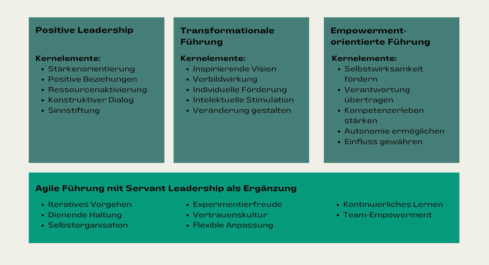
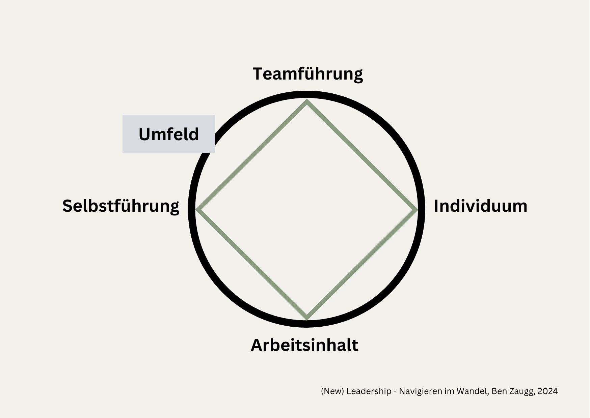
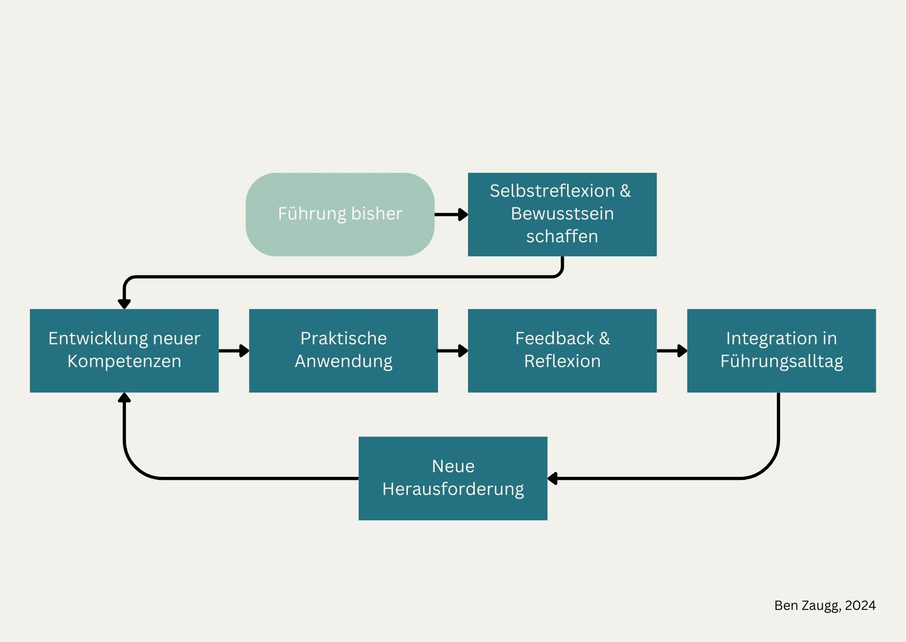
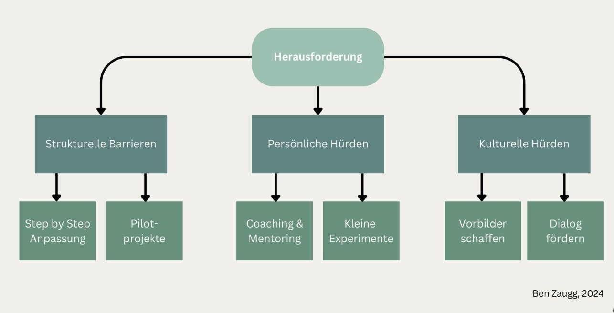
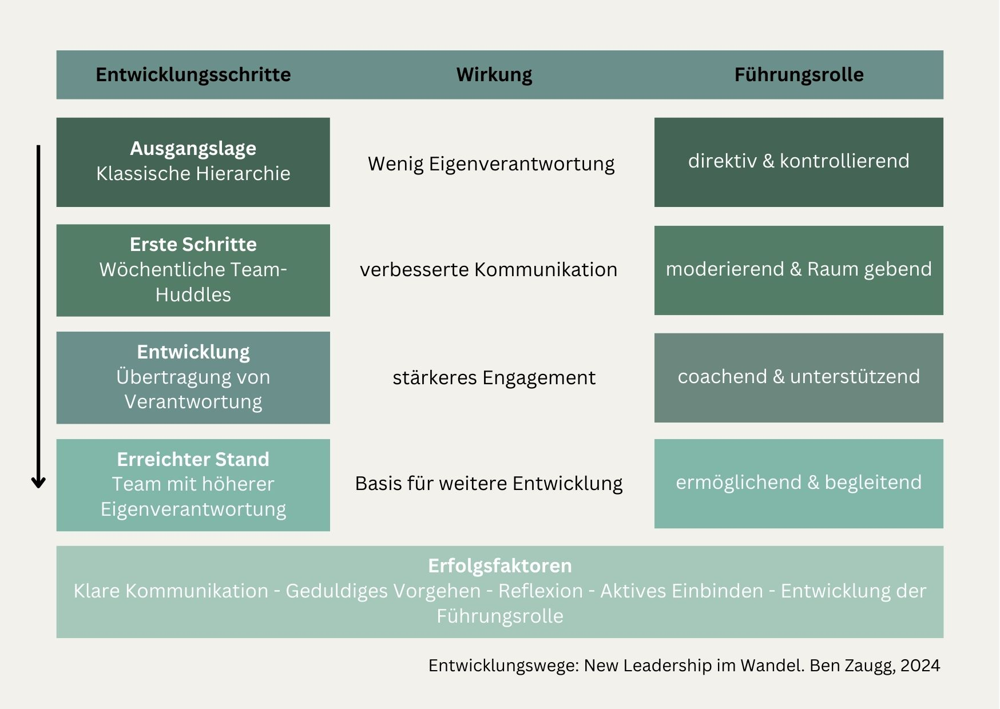

+++
title = "New Leadership: Navigieren im Wandel "
date = "2024-12-20"
draft = false
pinned = false
tags = ["CAS-BI", "Personalentwicklung", "Organisationsentwicklung", "Leadership", "NewLeadership", "NewWork"]
image = "compass-4891499_1280.jpg"
description = "In einer von Wandel geprägten Arbeitswelt braucht es ein neues Verständnis von Führung, das Orientierung gibt und gleichzeitig Entwicklung ermöglicht. Dieser Beitrag zeigt, wie eine moderne Führungskultur durch die Integration verschiedener Führungsansätze gestaltet werden kann und dabei der Fokus auf der Entwicklung von Menschen und ihren Potenzialen liegt."
footnotes = "\\[[1]]Vgl. Starker Vera, Thies David-Ruben, Frommelt Mona (2022), S. 148\n\n\\[[2]]Edmondson A. (2020), S. 14 und Janssen B. (2023) S. 171\n\n\\[[3]]Ebner M. (2024), S. 57\n\n\\[[4]]Ebner M. (2024)\n\n\\[[5]] Foelsing J., Schmitz A. (2021) S. 212\n\n\\[[6]]Schermuly C. (2021), S. 197\n\n\\[[7]]Schermuly C. (2021), S. 206\n\n\\[[8]]C. Quarch, J. Teunen (2021), S. 45\n\n\\[[9]]Ebner M. (2024), S. 57\n\n\\[[10]]Foelsing J, Schmitz A. (2021)\n\nℹ️Dieser Beitrag entstand als Modulabschluss innerhalb des CAS Business Impact\n\n📚**Passende** **Bücher**\n\n📘[New Work - Gute Arbeit gestalten, Psychologisches Empowerment von Mitarbeitern](https://www.exlibris.ch/de/buecher-buch/deutschsprachige-buecher/carsten-c-schermuly/new-work-gute-arbeit-gestalten/id/9783648150023/)\n\n💻[\\--> Einblick und Gedanken zum Buch in diesem Blogbeitrag](https://www.bensblog.ch/new-work-gute-arbeit-gestalten-buch-von-carsten-c-schermuly/)\n\n📕[Die angstfreie Organisation, Wie Sie psychologische Sicherheit am Arbeitsplatz für mehr Entwicklung, Lernen und Innovation schaffen](https://www.exlibris.ch/de/buecher-buch/deutschsprachige-buecher/amy-c-edmondson/die-angstfreie-organisation/id/9783800660674/)\n\n📘 [Das neue Führen, Führen und sich führen lassen in Zeiten der Unvorhersehbarkeit, Bodo Janssen](https://www.exlibris.ch/de/buecher-buch/deutschsprachige-buecher/bodo-janssen/das-neue-fuehren/id/9783424202854/)\n\n💻**[\\--> Einblicke und Gedanken zum Buch in diesem Blogbeitrag](https://www.bensblog.ch/das-neue-fuehren/)**\n\n📕 [New Work braucht New Learning, Eine Perspektivreise durch die Transformation unserer Organisations- und Lernwelten](https://www.exlibris.ch/de/buecher-buch/deutschsprachige-buecher/jan-foelsing/new-work-braucht-new-learning/id/9783658327576/)\n\n📘[Future Skills, 30 Zukunftsentscheidende Kompetenzen und wie wir sie lernen können](https://www.exlibris.ch/de/buecher-buch/deutschsprachige-buecher/69-co-creators/future-skills/id/9783800666355/)\n\n📕 [TZI - Die Kunst sich selbst und eine Gruppe zu leiten](https://www.exlibris.ch/de/buecher-buch/deutschsprachige-buecher/cornelia-loehmer/tzi-die-kunst-sich-selbst-und-eine-gruppe-zu-leiten/id/9783608961225/)\n\n📘[Die angstfreie Organisation, Wie Sie psychologische Sicherheit am Arbeitsplatz für mehr Entwicklung, Lernen und Innovation schaffen](https://www.exlibris.ch/de/buecher-buch/deutschsprachige-buecher/amy-c-edmondson/die-angstfreie-organisation/id/9783800660674/)\n\n📕 [Trust me, warum Vertrauen die Zukunft der Arbeit ist, Karin Lausch](https://www.exlibris.ch/de/buecher-buch/deutschsprachige-buecher/karin-lausch/trust-me-warum-vertrauen-die-zukunft-der-arbeit-ist/id/9783648172353/)\n\n📘[Mindful Leadership, Die 7 Prinzipien achtsamer Führung von Marc Lesser ](https://www.exlibris.ch/de/buecher-buch/deutschsprachige-buecher/marc-lesser/mindful-leadership-die-7-prinzipien-achtsamer-fuehrung/id/9783867812740/)"
+++
## Einleitung

Die Arbeitswelt befindet sich in einer stetigen Veränderung. Digitalisierung, beschleunigter Wissenszuwachs und zunehmende Komplexität prägen unseren Arbeitsalltag. In diesem Umfeld reicht klassisches Management nicht mehr aus – es braucht ein neues Verständnis von Führung, das Orientierung gibt und gleichzeitig Entwicklung ermöglicht. Die zentrale Frage ist nicht mehr, wie Veränderungen gesteuert werden können, sondern wie eine Kultur geschaffen werden kann, in der kontinuierliche Anpassung und Entwicklung natürlich stattfinden. Führungskräften kommt dabei eine Schlüsselrolle zu – nicht oder immer weniger als Steuernde, sondern als Ermöglichende. 

## Meine Definition von New Leadership

New Leadership ist für mich untrennbar mit meiner Definition von New Work verbunden. Diese definiere ich als Gestaltung guter Arbeit in der Arbeitswelt im Wandel verbunden. Dies bedeutet, organisationale Rahmenbedingungen zu schaffen, die es Menschen ermöglichen, ihre Arbeit kompetent und gesundheitserhaltend auszuüben. Dabei steht die Förderung persönlicher wie fachlicher Entwicklung im Zentrum. Eine ressorcen- und stärkenorientierte Führung führt nicht nur zu besseren Ergebinssen, sondern auch zu zufriedeneren Mitarbeitenden. \[[1]]

Dazu kommt, dass die Gestaltung einer guten Zusammenarbeit, also wirkungsvollen und verbundenen Teams in der aktuellen Zeit immer wichtiger wird.\[[2]] Führungspersonen haben also eine wichtige und verantwortungsvolle Rolle in Organisationen. Nachfolgend wird beschrieben, wie der Weg hin zu New Leadership gestaltet werden kann. 

## 3.0 Theoretische Basis

Eine genaue oder einheitliche Definition von New Leadership gibt es nicht. In einer dynamischen und komplexen (Arbeits-)Welt gibt es auch nicht die eine richtige Führungsstrategie.\[[3]] Zusammenfassend könnte man also sagen: New Leadership verbindet und integriert verschiedene moderne Führungsansätze. Dazu gehören für mich: 

### 3.1 Positive Leadership 

Diese Art der Führung setzt den Fokus auf Stärken und Potenziale der Menschen. Dieser Ansatz fokussiert auf die Bedeutung positiver Beziehungen und Emotionen in der Zusammenarbeit. Führungskräfte schaffen ein Umfeld, in dem Menschen ihre Stärken entfalten können und aktivieren vorhandene Ressourcen. Sie fördern durch konstruktiven Dialog und wertschätzende Kommunikation ein positives Arbeitsklima und stiften Sinn durch die Verbindung individueller Beiträge mit übergeordneten Zielen. 

Dazu passt das PERMA-Lead-Modell\[[4]] von Dr. Markus Ebner.\
\
**PERMA** steht für:

**P**ositive Emotionen

**E**ngegement

**R**elations

**M**eaning

**A**ccomplishment

### 3.2 Transformationale Führung 

Die transformative Führung zielt auf die inspirierende Vermittlung von Visionen und Zielen sowie die individuelle Förderung von Mitarbeitenden. Führungskräfte wirken als Vorbilder und Impulsgeber. Sie motivieren durch Sinnstiftung und fördern innovatives Denken. Dieser Ansatz ist besonders wertvoll für die Gestaltung von Veränderungsprozessen, da er Orientierung gibt und gleichzeitig Entwicklung fördert. *«Transformationale Führung ist darauf ausgerichtet in Zeiten kontinuierlicher und disruptiver Veränderung Sinn und Orientierung zu vermitteln, Mitarbeitende für die gemeinsame Vision zu begeistern und sie auf emotionaler Ebene anzusprechen, um ihr Engagement zu fördern.» \[[5]]

Die Rollen der transformativen Führung\[[6]]

* Idealisierter Einfluss / Idealized Influence – Rolle Vorbild
* Inspirierende Motivation / Inspirational Motivation  - Rolle Visionär 
* Intellektuelle Stimulation / Intellectual Stimulation – Rolle Problemlöser 
* Individuelle Förderung / Individual Consideration – Rolle Coach 

### **3.3 Empowermentorientierte Führung** 

Der empowermentorientierte Führungsstil zielt auf die vier Dimensionen des psychologischen Empowerments ab. Diese sind:

* Kompetenz
* Bedeutsamkeit
* Einfluss
* Selbstbestimmung

Führungskräfte schaffen Rahmenbedingungen, in denen Menschen Selbstwirksamkeit erleben und Verantwortung übernehmen können. Sie fördern das Kompetenzerleben ihrer Mitarbeitenden und ermöglichen ihnen, Einfluss auf ihre Arbeit zu nehmen. Dieser Ansatz stärkt die intrinsische Motivation und das Engagement der Mitarbeitenden. 

**Die Rollen der empowermentorientierten Führung**\[[7]]

* Sinnstiftung: Rolle Sinnstifter
* Individualisierte Berücksichtigung: Coach
* Partizipation: Rolle Begleiter
* Verantwortung: Rolle Eermächtiger
* Kompetenzentwicklung: Rolle Personalentwickler
* Idealisierter Einfluss: Rolle Vorbild

Diese drei Führungsansätze können ergänzt und verstärkt werden durch Prinzipien agiler Führung. Agile Führung mit ihren Elementen des Servant Leadership betont die Wichtigkeit von Selbstorganisation, schnellem Lernen und flexibler Anpassung. Führungskräfte verstehen sich dabei als Ermöglichende und Dienende, die den Rahmen für selbstorganisierte Teams schaffen. Sie fördern:

* Iteratives Vorgehen und kontinuierliches Lernen
* Eine dienende Haltung zur Unterstützung der Teamentwicklung
* Experimentierfreude und Anpassungsfähigkeit
* Empowerment durch Übertragung von Verantwortung
* Eine Kultur des gegenseitigen Vertrauens und der Zusammenarbeit

Die Integration dieser Führungsansätze ermöglicht es, situativ und flexibel zu führen und dabei sowohl den Menschen als auch den Anforderungen der Organisation gerecht zu werden. Die verschiedenen Ansätze ergänzen sich und bilden zusammen ein ganzheitliches Führungsverständnis für die moderne Arbeitswelt.

Abbildung 1: Integriertes Führungsverständnis New Leadership, eigene Darstellung

## 4.0 Ganzheitliches Führungsverständnis

> \*«Orientieren Sie sich bei Führungsaufgaben an der Tätigkeit des Gärtners: Sorgen Sie dafür, dass Ihre Mitarbeiter:innen ein gutes Arbeitsklima vorfinden, dass sie mit den nötigen Nährstoffen versehen werden, dass sie Wurzeln schlagen und einander unterstützen können, um zur Schönheit zu erblühen und reiche Frucht zu tragen»\[[8]]

Im Kern von New Leadership steht für mich die Integration von vier wesentlichen Dimensionen, die in einem dynamischen (Arbeits-)Umfeld immer wieder ausbalanciert werden müssen. Martin Ebner beschreibt im Buch Positive Leadership die Führung von Menschen als das Führen von unterschiedlichen Individuen und dabei u. a. deren Wertesysteme, kulturelle Hintergründe und Bedürfnisse zu berücksichtigen.\[[9]]

**Selbstführung:** Die bewusste Entwicklung der eigenen Führungspersönlichkeit bildet das Fundament. Das heisst, die eigenen Werte zu kennen und zu leben, authentisch zu handeln und lernen mit Veränderungen umzugehen. Dabei ist es wichtig, sich der eigenen Denk- und Verhaltensmuster bewusst zu werden und diese zu reflektieren. Der konstruktive Umgang mit persönlichen Hürden und das Lernen, Unsicherheiten als Teil des Entwicklungsprozesses zu akzeptieren, sind zentrale Elemente dieser Selbstführung.

**Teamführung:** Die Führungskraft schafft den Rahmen für erfolgreiche Zusammenarbeit und ermöglicht es dem Team, sein volles Potenzial zu entfalten. Wie ein Bergführer oder Trainer ist sie Teil des Teams und hat gleichzeitig den notwendigen Überblick.

**Individuum:** Jedes Teammitglied bringt einzigartige Stärken, Bedürfnisse und Entwicklungspotenziale mit. Die Führungskraft erkennt diese und schafft Raum für persönliches Wachstum.

**Arbeitsinhalt:** Die eigentliche Aufgabe und die zu erreichenden Ziele bleiben im Blick. Die Führungskraft sorgt für Klarheit über Prioritäten und schafft die Bedingungen für erfolgreiches Arbeiten.

**Umfeld:** Die (Führungs-)Arbeit findet immer in einem Kontext statt, der von äusseren Faktoren wie Unternehmenskultur, Marktbedingungen, gesellschaftlichen Entwicklungen und Gesetzen etc. Diese Umfeldbedingungen haben einen Einfluss auf die (Führungs-)Arbeit. Eine Führungskraft sollte sich dieser bewusst sein und diese Einflüsse wahrnehmen, verstehen und bei ihren Entscheidungen berücksichtigen.

Abbildung 2: Ganzheitliches Führungsverständnis «New Leadership» - Navigieren im Wandel. Eigene Darstellung.

## 5.0 Der Entwicklungsweg zu New Leadership

Die Entwicklung zur New Leadership ist ein kontinuierlicher und vielschichtiger Prozess. Dieser wird geprägt durch die bestehende Organisations- und Führungskultur, die individuellen Kompetenzen und Erfahrungen der Führungspersonen sowie des angestrebten Zielbildes und den Rahmenbedingungen in der Organisation. Je nach Ausgangslage und Kontext ergeben sich unterschiedliche Schwerpunkte und Entwicklungspfade. Wesentliche Elemente dabei sind:

### 5.1 Reflexionsräume schaffen

Die bewusste Entwicklung von Führungskompetenzen erfordert persönliche Reflexion. Dafür braucht es sowohl zeitliche Ressourcen als auch eine psychologisch sichere Umgebung, in der ehrliches Feedback möglich ist. Organisationen sollten entsprechende Gefässe etablieren, z. B. Coachings, Mentorings oder Peer-Learning-Formate. Diese geschützten Räume ermöglichen es Führungskräften, ihre Erfahrungen zu verarbeiten, blinde Flecken zu erkennen und neue Perspektiven zu entwickeln.

* Regelmässige Reflexion der eigenen Führungspraxis
* Coaching, Mentoring oder kollegiale Beratung
* Geschützter Raum für ehrliches Feedback

### 5.2 Lernen im Alltag verankern

Echte Führungsentwicklung findet vor allem in der täglichen Praxis statt. Dies erfordert eine Kultur des «kontinuierlichen, arbeitsplatzbezogenen Lernens»\[[10]](applewebdata://0AC45A0F-C249-4BF5-9E4A-B4EC31A5B169#_ftn10). Führungskräfte sollten ihre Alltagssituationen bewusst als Lernfelder gestalten und nutzen. Indem sie selbst eine lernende Haltung vorleben und ihre Entwicklungsschritte transparent machen, werden sie zum Vorbild für ihre Mitarbeitenden. So tragen sie aktiv zur Etablierung einer organisationsweiten Lernkultur bei, in der kontinuierliche Weiterentwicklung als selbstverständlich gilt.

* Bewusstes Gestalten von Führungssituationen
* Integration von Lernen in den Arbeitsalltag
* Kontinuierliche Weiterentwicklung der Praxis

### 5.3 Gemeinsam wachsen

Der Weg zu New Leadership ist keine einsame Reise, sondern gedeiht am besten im Austausch mit anderen. In einer vertrauensvollen, psychologisch sicheren Umgebung können Führungskräfte voneinander lernen, sich gegenseitig unterstützen und gemeinsam neue Führungsansätze entwickeln. Formate wie Learning Communities oder regelmässige Peer-Austausche bieten wertvolle Plattformen für dieses kollektive Wachstum. Hier können Erfahrungen geteilt, Herausforderungen gemeinsam reflektiert und innovative Lösungsansätze erarbeitet werden.

* Austausch mit anderen Führungskräften
* Learning Communities
* Peer-Learning und gegenseitige Unterstützung

Abbildung 3: Entwicklungswege zu New Leadership, eigene Darstellung

### 5.4 Herausforderungen und Stolpersteine bei der Entwicklung von New Leadership

Der Weg zu einer neuen Art von Führung (Ermöglichen, Ressourcen- und Stärkenorientierung, Partizipation) kann auch verschiedene Herausforderungen mit sich bringen. 

**Strukturelle Barrieren**

Organisationsstrukturen und etablierte Prozesse können die Entwicklung zu New Leadership erheblich erschweren. Oft sind diese über Jahre gewachsen und tief in der Organisation verankert. Typische Hindernisse sind:

* Starre Hierarchien und Prozesse
* Fehlende Ressourcen für Entwicklung
* Widersprüchliche Anforderungen

**Persönliche Hürden**

Der Weg zu New Leadership erfordert von Führungskräften teilweise eine tiefgreifende persönliche Transformation. Diese Veränderung kann sehr herausfordern sein und verunsichern und innere Widerstände aktivieren. Häufig zeigen sich folgende Herausforderungen:

* Gewohnte Denk- und Verhaltensmuster
* Angst vor Kontrollverlust
* Überforderung durch Komplexität
* Zeitmangel für Reflexion und Entwicklung
* Unklarheiten bezüglich der eigenen (zukünftigen) Rolle

**Kulturelle Widerstände**

Eine etablierte Organisationskultur mit traditionellen Führungsverständnissen kann den Wandel zu New Leadership deutlich erschweren. Bestehende Denkmuster und Erwartungshaltungen wirken oft als unsichtbare Barrieren. Dies zeigt sich in:

* Traditionellem Führungsverständnis
* Widerstand gegen Veränderungen
* Fehlendes Verständnis für neue Ansätze

Die Implementierung von New Leadership muss dem Reifegrad und der Kultur der Organisation entsprechen. Widerstände können auf allen Ebenen auftreten und sollten als wichtige Signale ernst genommen werden. Ein schrittweises Vorgehen mit offenem Dialog erhöht die Chancen für eine erfolgreiche Transformation.

Abbildung 4: Herausforderungen und Stolpersteine auf dem Weg zu New Leadership und passende Lösungsansätze. Eigene Darstellung. 

## [6.0 New Leadership in verschiedenen Kontexten](<>)

Die erfolgreiche Implementierung von New Leadership hängt stark vom organisationalen Kontext ab. Jede Organisation bringt ihre eigene Geschichte, Kultur und Strukturen mit. Die Umsetzung von New Leadership sollte dem Reifegrad der Organisation angepasst werden:

**Traditionelle Strukturen**

In hierarchisch geprägten Organisationen ist ein vorsichtiges, schrittweises Vorgehen besonders wichtig. Der Fokus liegt dabei auf der gezielten Integration neuer Führungsansätze in bestehende Strukturen:

* Fokus auf schrittweise Entwicklung innerhalb bestehender Hierarchien
* Pilotprojekte in einzelnen Teams oder Abteilungen
* Dokumentation und Kommunikation von Erfolgen
* Aufbau von Verständnis durch Dialog und Information

**Organisationen im Wandel**

Organisationen in Veränderungsprozessen bieten besondere Chancen für die Integration moderner Führungsansätze. Die bereits laufenden Entwicklungen können als Treiber genutzt werden:

* Integration von New Leadership in bestehende Entwicklungsprozesse
* Verknüpfung mit modernen Arbeits- und Führungsmethoden
* Nutzung etablierter Entwicklungsformate
* Regelmässige Reflexion und Anpassung

**Moderne Organisationen** 

In bereits modern aufgestellten Organisationen geht es vor allem um die Vertiefung und Weiterentwicklung bestehender Ansätze. Der Fokus liegt auf der Integration fortgeschrittener Führungskonzepte:

* Weiterentwicklung bestehender Führungspraktiken
* Stärkere Integration von Selbstorganisation
* Fokus auf systemische Perspektive
* Experimentieren mit innovativen Führungsformen

## 7.0 Praxisbeispiel

Als Beispiel für einen Change-Prozess könnte der Weg eines Teams dienen. Die Führungsperson entwickelte dabei bewusst ihre Rolle vom klassischen Vorgesetzten zur modernen Führungskraft. Ausgehend von einer traditionellen Struktur entwickelte sich das Team innerhalb eines Jahres in Richtung moderne Organisation:

***Change-Prozess eines Teams***

***Ausgangslage:*** Klassische Hierarchie mit klaren Führungslinien, wenig Eigenverantwortung der Mitarbeitenden → Führungsrolle: Direktiv und kontrollierend

***Erste Schritte:*** Einführung von wöchentlichen Team-Huddles → Wirkung: Verbesserte Kommunikation und erste Schritte zu mehr Eigenverantwortung → Führungsrolle: Moderierend und Raum gebend

***Entwicklung:*** Schrittweise Übertragung von Verantwortung an das Team → Wirkung: Stärkeres Engagement und Initiative der Mitarbeitenden → Führungsrolle: Coachend und unterstützend

***Erreichter Stand:*** Team mit höherer Eigenverantwortung → Wirkung: bietet die Basis für weitere Entwicklung → Führungsrolle: Ermöglichend und begleitend

* Kritische Erfolgsfaktoren können sein:
* Klare Kommunikation der Entwicklungsrichtung
* Geduldiges Vorgehen in kleinen Schritten
* Konsequente Reflexion und Anpassung
* Aktives Einbinden aller Teammitglieder
* Bewusstes Entwickeln der eigenen Führungsrolle

Abbildung 5: Entwicklungswege: New Leadership im Wandel, eigene Darstellung

## 8.0 Fazit

New Leadership entwickelt sich nicht über Nacht, sondern ist ein stetiger Prozess des Lernens und Wachsens - sowohl für die Organisation als Ganzes, für die Führungspersonen wie auch für die Mitarbeitenden. Der Fokus liegt dabei auf der Integration verschiedener Führungsdimensionen und der kontinuierlichen Entwicklung der eigenen Führungspraxis.

Erfolgreiche Entwicklung bedeutet:

* Die Balance zwischen den verschiedenen Führungsdimensionen finden
* Bewusst mit Herausforderungen umgehen
* Schrittweise und nachhaltig entwickeln
* Authentisch den eigenen Weg gehen
* Die eigenen Unsicherheiten und veränderte Rolle in der Entwicklung akzeptieren und aktiv gestalten

Das Ziel ist nicht, ein perfektes Führungsmodell umzusetzen. Stattdessen geht es darum, die eigene Art zu führen Schritt für Schritt weiterzuentwickeln - für zufriedene, gesunde Mitarbeitende und eine erfolgreiche Organisation.