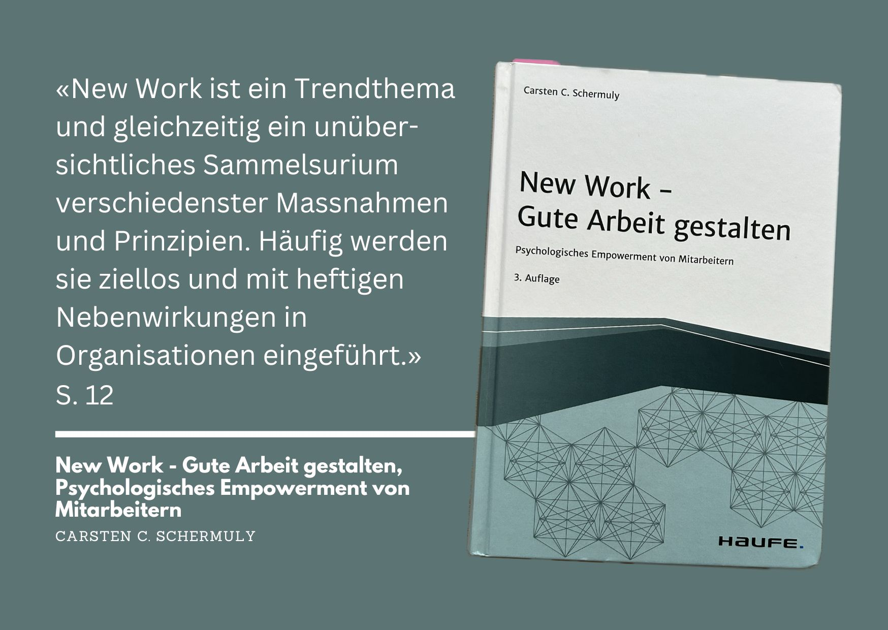

+++
title = "New Work – Gute Arbeit gestalten - Buch von Carsten C. Schermuly"
date = "2024-11-11"
draft = false
pinned = false
tags = ["Buch", "NewWork", "Leadership", "Organisationsentwicklung"]
image = "new-work.jpg"
description = "Einblicke und Gedanken zum Buch von Carsten C. Schermuly"
footnotes = "🛒[Zum Buch New Work - Gute Arbeit gestalten (4. Auflage) bei exlibris](https://www.exlibris.ch/de/buecher-buch/deutschsprachige-buecher/carsten-c-schermuly/new-work-gute-arbeit-gestalten/id/9783648176290/)\n\n🌐[Webseite des Autors](https://carstenschermuly.de)\n\nPS: Das ist meine vierte [«Buchrezension»](https://www.bensblog.ch/tags/buch/) und ein weiterer Versuch. Nachdem ich in meinem ersten Podcastformat vor ein paar Jahren über Bücher erzählt habe und ich etliche positive Rückmeldungen erhielt, dachte ich mir schon lange, ich könnte doch auch einmal etwas schreiben. Wie gefällts dir?\n\nPPS: Keine bezahlte Werbung, nur persönliche Einschätzung & Empfehlung."
+++
## Zusammenfassung

Das Buch von Carsten C. Schermuly beschäftigt sich intensiv mit dem Thema [New Work](https://www.bensblog.ch/tags/newwork/) und beleuchtet es aus der Perspektive des psychologischen Empowerments der Mitarbeitenden. Der Autor stellt dabei die Frage in den Mittelpunkt, wie Menschen in ihrer Arbeit gestärkt werden können und welche positiven Auswirkungen ein solches Empowerment haben kann. Schermuly führt kurz durch die historische Entwicklung der Arbeitswelt und greift dabei vier Trends auf, die die Zukunft der Arbeit massgeblich beeinflussen: Wissenszuwachs, Digitalisierung, Globalisierung und der demografische Wandel.

## Wichtige Inhalte und Konzepte

#### Geschichte und Definition von New Work

Das Buch startet mit einer Einführung in das Konzept von New Work und zieht eine kleine historische Linie der Arbeitswelt. Es gibt einen kurzen Einlick in den Ansatz von Frithjof Bergmann oder von New Work als Containerbegriff, bevor es mit dem psychologischen Empowerment weitergeht. 

#### Strukturelles vs. Psychologisches Empowerment als Grundlage

Das Buch beginnt mit einer Einführung in das strukturelle und psychologische Empowerment, um das Zusammenspiel beider Ansätze verständlich zu machen. Diese Grundlage hilft, das folgende Konzept des psychologischen Empowerments in der Arbeitsgestaltung besser zu verorten.

#### Der Boden, auf dem psychologisches Empowerment wachsen kann

> «Bei einer empowermentorientierten Grundhaltung verschmelzen der Erfolg und das Wohl der Mitarbieter mit dem Erfolg und dem Wohl des Unternehmens.»
>
> *aus dem Buch S. 99*

Der Autor beschreibt sieben Grundhaltungen, die für psychologisches Empowerment wichtig sind. Dazu gehören u.a. die Wertschätzung der Mitarbeitenden, Vertrauen statt Kontrolle und eine organisationsweite Empowerment-Strategie. Diese Grundhaltungen schaffen die Basis, dass psychologisches Empowerment in der Praxis nachhaltig Wirkung entfalten kann.

#### Förderung des Empowerments durch die Arbeitsgestaltung

Ein weiterer Schwerpunkt liegt auf der Frage, wie [psychologisches Empowerment](https://www.bensblog.ch/psychologisches_empowerment/) durch die Gestaltung der Arbeit gefördert werden kann. Schermuly beschreibt, wie Arbeitsprozesse und -umgebungen gezielt gestaltet werden können, um den Mitarbeitenden mehr Kompetenz, Selbstbestimmung, Einfluss und Bedeutsamkeit zu ermöglichen – die vier wesentlichen Facetten des psychologischen Empowerments.

> «Menschen haben eine tiefe Sehnsucht danach, dass ihr Handeln bedeutsam ist.»
>
> *aus dem Buch S. 62*

#### Rolle der [Führungskraft](https://www.bensblog.ch/tags/leadership/)

Ein weiterer zentraler Aspekt ist die Rolle der Führungskraft im Empowerment-Prozess. Der Autor schreibt, dass Führungskräfte eine wesentliche Rolle spielen, indem sie ein Umfeld schaffen, das Empowerment fördert, und durch ihre Haltung und ihr Verhalten das psychologische Empowerment aktiv unterstützen.

> «Empowermentorientierte Führungskräfte klären und erklären Arbeitsziele. Sie helfen den Mitarbeitern zu verstehen, wie die Teilziele miteinander verbunden sind und durch die Teilziele das Gesamtziel erreicht wird.»
>
> *aus dem Buch S. 208*

#### Einfluss der [Organisationskultur](https://www.bensblog.ch/tags/organisationskultur/)

Auch die Organisationskultur wird umfassend thematisiert. Eine offene Fehlerkultur, gerechte Strukturen und eine Kultur der Wertschätzung werden als entscheidende Faktoren hervorgehoben, die eine nachhaltige Umsetzung des psychologischen Empowerments fördern können. Themen wie Altersdiskriminierung im Kontext von New Work werden ebenfalls aufgezeigt. 

#### Personalauswahl und -entwicklung

Schermuly beleuchtet zudem, wie die gezielte Personalauswahl und passgenaue [Personalentwicklung](https://www.bensblog.ch/tags/personalentwicklung/) das psychologische Empowerment verstärken können. Er spricht sich gegen einen Giesskannenansatz aus und betont die Notwendigkeit, individuelle Entwicklungsmassnahmen anzubieten, die auf die Bedürfnisse und Potenziale der Mitarbeitenden abgestimmt sind.

## Persönliche Gedanken

Das Buch überzeugt durch seinen wissenschaftlichen Ansatz und hebt sich dadurch von anderen Veröffentlichungen zum Thema New Work ab. In einer Zeit, in der das Thema oft als «die Lösung» genutzt wird, um oberflächliche Massnahmen zu rechtfertigen, bietet das Buch fundierte wissenschaftliche Einsichten und konkrete Praxisbeispiele. Es ist nicht nur für Organisationsentwicklerinnen und Personalentwicklerinnen, sondern auch für Führungskräfte äusserst wertvoll und nützlich. Die Ausführungen bieten klare Orientierung, wie Unternehmen gute Arbeit gestalten und das psychologische Empowerment der Mitarbeitenden fördern können – ein Leitfaden für alle, die ernsthaft an einer nachhaltigen Veränderung der Arbeitswelt interessiert sind.

## Lese-Empfehlung

«New Work – Gute Arbeit gestalten» ist ein wertvolles Werk für all jene, die das Thema New Work nicht nur als Modebegriff, sondern als echtes, wissenschaftlich fundiertes Konzept verstehen und umsetzen möchten. Die Verbindung von Praxis und Theorie sind anschaulich und fundiert. Absolute Leseempfehlung.