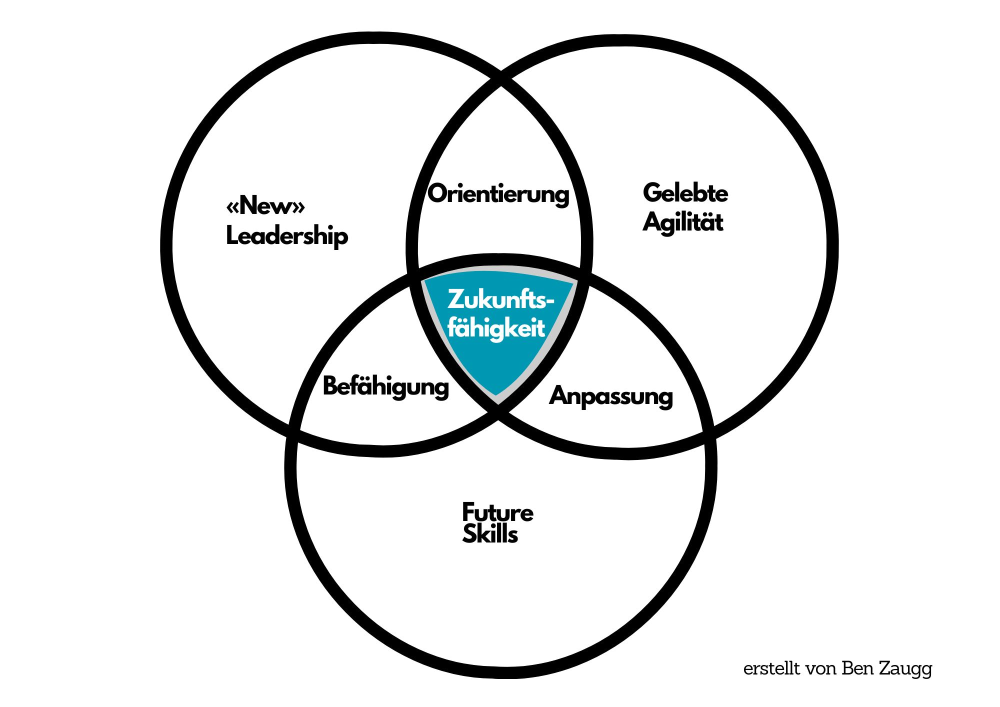

+++
title = "New Work: (M)eine Definition"
date = "2024-08-20"
draft = true
pinned = false
tags = ["CAS", "CAS-BI", "NewWork"]
image = "new-work-definition.jpg"
footnotes = "Einen Überblick über alle Beiträge zum CAS Business Impact findest du [hier](https://www.bensblog.ch/cas_businessimpact_verzeichnis/)."
+++
New Work habe ich als Thema für mein erstes Modul gewählt. Weshalb? Darüber habe ich im Beitrag New Work: [Ein Meer voller (Un-)Tiefen](https://www.bensblog.ch/new-work_modul1/) geschrieben. Hier gibt’s einen kurzen Einblick, wo ich gelandet bin. 

##  **New Work oder so**

In den letzten Jahren habe ich mich immer wieder mit guter Arbeit beschäftigt. Ich stellte und verfolgte Fragen zur Sinnfindung in der Arbeit, dem (An-)Erkennen der eigenen Stärken und einer damit verbundenen Gestaltung der Karriere. Diese fanden im Rahmen Ausbildungen in den Bereichen Coaching und Erwachsenenbildung statt. Dabei ging es um Werte, um Akzeptanz, um Selbsterkenntnis, Selbstmanagement und und und. Diese Ansätze nahmen immer die Menschen in die Pflicht. Es ist nicht nur Pflicht, sondern auch Chance, das eigene Leben und die eigene Arbeit zu gestalten. Gleiche und ähnliche Themen tauchen auch bei New Work auf. New Work kann auf der individuellen Ebene in Form von Karrieregestaltung im Sinne Bergmanns stattfinden. Damit habe ich mich in diesem Modul wenig beschäftigt. Es ging mir um eine eigene Definition oder um ein eigenes Verständnis von New Work. Wie definiere ich es? Wie würde ich es umsetzen? Was heisst es auf organisationaler Ebene oder auf der Ebene eines Teams? Was heisst es für meine Arbeit?

Bei der Definition habe ich eine relativ einfache gefunden: «New Work ist die Gestaltung von guter Arbeit in der Arbeitswelt im Wandel.» Wobei mich dieser New Work Begriff zunehmend stört, weil er so nichtssagend ist. Carsten Schermuly nennt ihn auch Containerbegriff. Jede und jeder schmeisst rein was gerade passt und nimmt raus, was gerade passend ist. New Work sei sowieso ein Begriff, der fast nur noch im deutschsprachigen Raum verwendet wird und vielleicht bald abgelöst wird. Man spricht als «Ersatz» von Future Work, Next Work und mir gefällt Good Work. Im [Trendradar des Zukunftsinstituts](https://www.zukunftsinstitut.de/blog-megatrend-new-work) erscheint als einer der 13 Zukunftstrends von New Work die «Post New Work Era», es bewegt sich also etwas. Es ist eh egal, wie man Massnahmen oder den Weg zu neuer und guter Arbeit nennt, Hauptsache ist, es zeigt sinnvolle Wirkung. 

Das sind ein paar Gedanken zu diesem Modul. Zum Abschluss habe ich ein Wirkungskonzept erstellt und mit meinem Modul-Coach besprochen. Diesen Teil halte ich hier zurück. Einen kleinen Einblick gibt es trotzdem. In einem Venn-Diagramm habe ich eine mögliche Ausrichtung für die Umsetzung von «New Work» Massnahmen zum Aufbau und Erhalt der Zukunftsfähigkeit auf Teamebene dargestellt. Ein Fokus auf die drei Bereiche «New» Leadership, Gelebte Agilität (vgl. Jankowski) und die Entwicklung von Future Skills könn(t)en ein Weg sein, gute Arbeit zu gestalten und eine gute Grundlage für die Zukunft zu schaffen. 

## **Schlussgedanken**

Ich bin tief getaucht und habe mich mit Themen wie Sinn, Innovation, Gesundheit, Zusammenarbeit, Arbeitsräume, Leadership, Kommunikation und vielem mehr im Zusammenhang mit New Work beschäftigt. New Work kann ein Fass ohne Boden (oder ein Meer voller (Un-) Tiefen)) sein. Es kann helfen, sich mit der New Work Charta, den Prognosen des Zukunftsinstituts (auch mit Handlungsempfehlung für die Gegenwart) oder mit der Forschung zu den Zielen und der Wirksamkeit von New Work Massnahmen auseinanderzusetzen. Am Ende ist es egal wie gute Arbeit (bei der es nicht um Wohlfühloasen, Hierarchiefreiheit o. Ä. geht) gestaltet wird. Wichtig ist, dass Organisationen und Menschen Wege finden und umsetzen(!), ihre Arbeit zukunftsfähig und gesund zu gestalten.