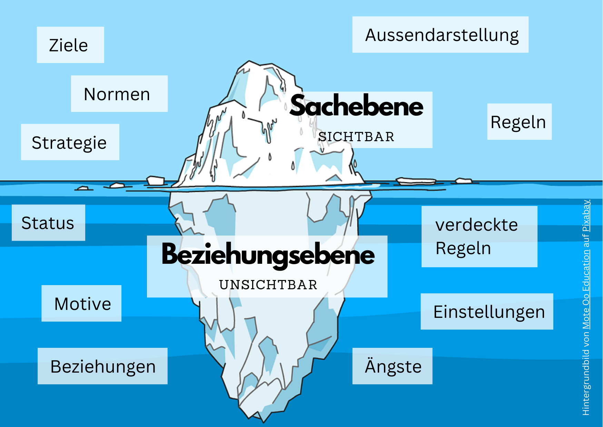
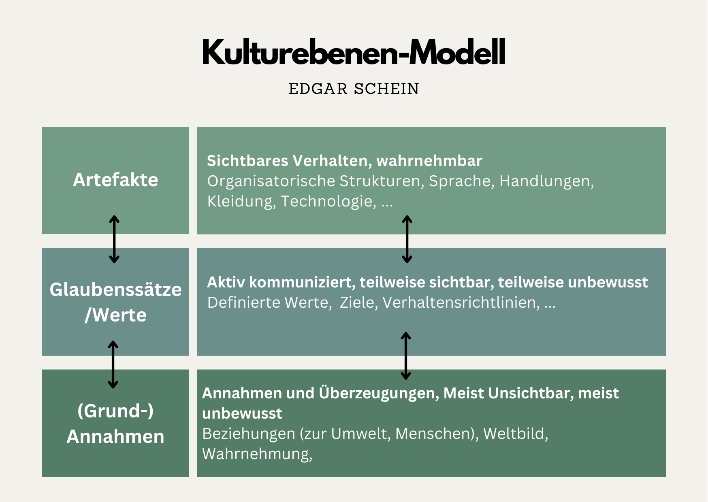

+++
title = "Kulturentwicklung in Organisationen und Wege zur Veränderung"
date = "2024-05-14"
draft = false
pinned = false
tags = ["CAS", "Organisationsentwicklung", "Kulturentwicklung", "Organisationskultur"]
image = "blogbilder-2.png"
description = "Die Unternehmenskultur spielt eine wichtige Rolle für den Erfolg eines Unternehmens. Doch was genau verbirgt sich hinter dem Begriff Unternehmens- oder Organisationskultur? Wie kann sie aktiv entwickelt und verändert werden?"
footnotes = "Titelbild: [Rosy / Bad Homburg / Germany](https://pixabay.com/de/users/roszie-6000120/?utm_source=link-attribution&utm_medium=referral&utm_campaign=image&utm_content=7697330) auf [Pixabay](https://pixabay.com/de//?utm_source=link-attribution&utm_medium=referral&utm_campaign=image&utm_content=7697330)\n\nBild Eisbergmodell: eigene Visualisierung, Hintergrundbild von [Mote Oo Education](https://pixabay.com/de/users/moteoo-466065/?utm_source=link-attribution&utm_medium=referral&utm_campaign=image&utm_content=3273216) auf [Pixabay](https://pixabay.com/de//?utm_source=link-attribution&utm_medium=referral&utm_campaign=image&utm_content=3273216)\n\nBild Kulturebenen-Modell: eigene Visualisierung"
+++
Die Unternehmenskultur spielt eine wichtige Rolle für den Erfolg eines Unternehmens. Sie hat einen wesentlichen Einfluss auf die Mitarbeitenden, ihre Zufriedenheit und die Zusammenarbeit. Doch was genau verbirgt sich hinter dem Begriff Unternehmens- oder Organisationskultur? Wie kann sie aktiv entwickelt und verändert werden? Im Rahmen des CAS Organisationsentwicklung & Change Leadership beschäftige ich mich im Moment intensiv damit. Deshalb gibt es deinen Einblick in die Kultur (-entwicklung) von Unternehmen und wie sie gestaltet werden kann. 

## **Das Eisberg-Modell – Edward T. Hall**

Das Eisbergmodell der Kultur wurde von Edward T. Hall geprägt und bietet ein anschauliches Bild für Kultur (Eisberge müssen ja für so viele Beispiele herhalten). Wie beim Eisberg, bei dem nur ein kleiner Teil über der Wasseroberfläche sichtbar ist, besteht Kultur auch aus sichtbaren und unsichtbaren Elementen.

### **Die sichtbare Ebene**

Diese umfasst die offensichtlichen Anteile einer Kultur. Dazu gehören z. B. Kleidung, Symbole, Logo, Sprache und Verhaltensweisen. Diese Elemente sind leicht zu erkennen, jedoch nur die Spitze (der sichtbare Teil über Wasser) des Eisbergs.

### **Die unsichtbare Ebene**

Unter Wasser liegt die unsichtbare Ebene. Diese umfasst die verwurzelten Werte, Überzeugungen, Normen und Annahmen. Diese Aspekte sind für die Mitarbeitenden oft weniger offensichtlich, aber sie prägen das Verhalten und die Zusammenarbeit in einer Organisation massgeblich.

## **Kulturebenen-Modell – Edgar Schein**

Gemäss Edgar Schein besteht Kultur aus drei Ebenen.

### **Artefakte und sichtbare Symbole**

Diese sind die offensichtlichen Aspekte der Kultur. Dazu gehören z. B. die Raumgestaltung, die Rituale und wie sich die Organisation nach aussen zeigt.

### **Werte**

Unter der Oberfläche der Artefakte liegen die Werte einer Organisation, die ihre Grundüberzeugungen und Prioritäten widerspiegeln. Diese Werte beeinflussen die Entscheidungsfindung und das Verhalten der Mitarbeiter.

### **(Grund-) Annahmen**

Auf der tiefsten Ebene befinden sich die Grundannahmen, die die Kernidentität einer Organisation ausmachen. Diese Annahmen sind oft implizit und schwer zu erkennen, aber sie prägen die grundlegenden Überzeugungen darüber, wie die Welt funktioniert und wie die Organisation ihre Ziele erreichen kann.

## **Möglichkeiten zur Kulturentwicklung und -veränderung**

Die Veränderung der Unternehmenskultur ist eine komplexe und länger dauernde Aufgabe. Um als Organisation langfristig erfolgreich zu bleiben, kann es jedoch entscheidend sein, sich aktiv und bewusst um die Unternehmenskultur zu kümmern. Deshalb hier ein paar Möglichkeiten, wie die Unternehmenskultur aktiv entwickelt und verändert werden kann. 

### **Werte und Visionen klar kommunizieren**

Eine klare Formulierung von Unternehmenswerten und einer gemeinsamen Vision schafft Orientierung und dient als Leitfaden für das Verhalten der Mitarbeiter. Am besten werden Werte und Visionen gemeinsam mit den Mitarbeitenden entwickelt. 

### **Partizipative Entscheidungsfindung fördern**

Mitarbeitende wissen oft genau, wo der Schuh drückt und gestalten (oft unbewusst) die Kultur mit. So sollen sie auch (Kultur-) Veränderungsprozesse mitgestalten und auch mittragen. Durch die Einbindung der Mitarbeiter in Entscheidungsprozesse fühlen sie sich stärker mit der Organisation verbunden und tragen aktiv zur Gestaltung der Kultur bei.

###  **Feedbackkultur etablieren**

Durch eine offene und konstruktive Feedbackkultur wird Raum geschaffen, indem Mitarbeitende ihre Gedanken und Ideen einzubringen können. Eine gute Feedbackkultur fördert eine gute Zusammenarbeit und den Vertrauensaufbau. 

### **Gesunde Fehlerkultur**

Wie wird mit Fehlern umgegangen? Gibt es Raum für Fehler? Können diese offen angesprochen werden oder haben alle Angst davor? Eine gesunde Fehlerkultur trägt ebenfalls wesentlich zu einer guten Zusammenarbeit und Vertrauen bei. Zudem hilft das bewusste An- und Besprechen von Fehlern als Individuum, Team und Organisation besser zu werden. 

**\-->** Hier kommt wieder die [psychologische Sicherheit](https://www.bensblog.ch/psychologische-sicherheit/) ins Spiel.

### **Führungsentwicklung**

Bei der Gestaltung der Organisationskultur spielen Leader:innen eine wichtige Rolle. Sie können und sollten explizit dazu befähigt werden, eine Kultur des Miteinanders, der Offenheit und der Entwicklung zu fördern und zu etablieren. Sie agieren dabei im Idealfall selbst eher in der Rolle als Coaches. Zudem gehen sie mit gutem Beispiel voran. Gerade in der Kulturentwicklung müssen es meines Erachtens nicht zwingend Führungskräfte sein, sondern Menschen, die ein natürliches Talent und eine intrinsische Motivation haben, sich diesem Thema anzunehmen. 

## **Kultur(-entwicklung) ist nie abgeschlossen**

Eine Unternehmenskultur lebt von und mit den Menschen, die in der Organisation und darum herum arbeiten. Kulturentwicklung ist also kein Projekt, das man beginnen und abschliessen kann. Will man als Organisation aktiv an der eigenen (positiven und förderlichen) Kultur arbeiten, muss man wachsam und aktiv bleiben. 

Was manchmal einfach klingt, ist in Wahrheit eine (grosse) Herausforderung. Entwicklung und Veränderung (nicht nur von Kultur) ist ein Prozess, der oft nie abgeschlossen ist. Zudem sind, wie wir gesehen haben, viele Aspekte der Kultur unter der (Wasser-) Oberfläche und kaum sichtbar. Wichtig sind eine klare Haltung und die passenden Strategien. Nicht erst dann, sondern bereits bei der Erarbeitung der Strategie braucht es die aktive Mitarbeit der Menschen, die in der Organisation arbeiten.