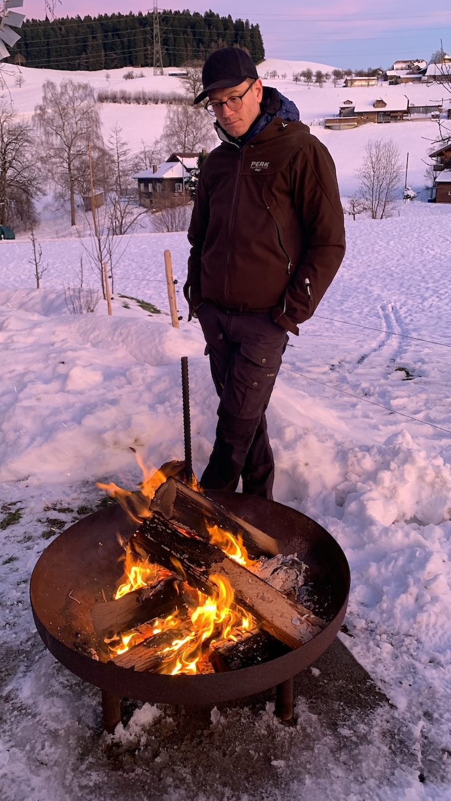

+++
title = "Orientierung als Change Begleiter"
date = "2025-01-18"
draft = false
pinned = false
tags = ["CAS-BI", "Change", "Leadership", "Personalentwicklung", "Organisationsentwicklung"]
image = "orientierung-change-begleiter.jpg"
description = "Wie behalte ich als Begleiter in Change-Prozessen selbst die Orientierung? Diese Frage führte mich zur Entwicklung eines persönlichen Kompasses für meine Arbeit in der Personal- und Organisationsentwicklung. Ein Einblick in meinen Reflexionsprozess."
footnotes = "Hintergrund Titelbild: Erstellt mit Bing Image Creator"
+++
# **(M)Ein Kompass für die Rolle(n) als Personal- und Organisationsentwickler** 

In den letzten Wochen habe ich mich erneut intensiv mit Change Leadership auseinandergesetzt. Ich habe dieses Thema als eines der letzten Module im [CAS Business Impact](https://www.bensblog.ch/cas_businessimpact_verzeichnis/) gewählt, weil es sehr gut zu meiner neuen beruflichen Tätigkeit passt, die ich bald starte. Bei der Erstellung des Wirkungskonzepts habe ich mich dafür entschieden, eine Art Kompass für mich zu erstellen, der mir als Orientierung dient. Dieser fasst meine Leitgedanken, Rollen und Perspektiven zusammen. In diesem Beitrag möchte ich weniger auf die Inhalte selbst eingehen, sondern darauf, wie ich zu diesem Dokument «Kompass» gekommen bin und warum mir der Prozess wichtig war.

## **Vom Impuls zur Reflexion**

Die Begleitungen von Menschen und insbesondere in [Change](https://www.bensblog.ch/tags/change/) Prozessen kann zuweilen die eigene Orientierung durcheinanderbringen. Ähnlich, als wäre man mit einem Schiff in einen Sturm geraten. Da hilft es als Navigator, die Karten und den Kompass zu kennen und auf etwas «Festes» zurückgreifen zu können. Also stellte ich mir gemeinsam mit meinem Modul Coach Fragen wie «Was treibt mich in meiner Arbeit wirklich an?» oder «Wie will ich arbeiten?». Ich bewege mich seit Jahren in Kontexten, in denen ich Menschen in Veränderungs- und Entwicklungskontexten begleite. Dabei nehme ich mir auch immer wieder die Zeit, über die eigenen Grundprinzipien nachzudenken. Dieses CAS-Modul in Kombination mit dem bevorstehenden Neubeginn, bot nun Anlass, dieses mit Fokus auf Change Leadership zu verschriftlichen. 

## **Ein Leitfaden für die Zukunft**

Der Kompass entstand aus der Idee heraus, Klarheit über meine Rolle und den Beitrag meiner Begleitungen zu gewinnen. Für mich selbst und vielleicht auch für die Menschen, mit denen ich arbeite. Es geht darum, eine Orientierung zu schaffen, die in der zunehmend komplexen und dynamischen Arbeitswelt (und vor allem in turbulenten Zeiten) Bestand hat. Dabei war mir wichtig, eine Balance zwischen der Förderung individueller sowie kollektiver  Stärken und dem Blick auf das grössere Ganze – das Zusammenspiel von Teams und Organisationen – zu finden.

## **Mein Prozess**

Aussensichten und aufmerksame Ohren helfen. So habe ich mit meinem Modulcoach Themenfelder identifiziert, die mir wichtig sind und die mich ausmachen. Da waren Fragen wie: Welche Werte leiten mich in meiner Arbeit? Was macht Veränderungsprozesse wirklich erfolgreich? Welche Rollen nehme ich dabei ein? Wie ergänzen sich diese? etc. 

## **Warum ich hier «nur» über den Prozess schreibe**

Auch wenn ich mit vielen persönlichen Themen hier offen umgehe, ist mir dieses Dokument (zumindest noch so frisch) zu persönlich, um es hier zu teilen. Warum ich «nur» über den Prozess schreibe? Ich glaube daran, dass die Reflexion über unsere eigenen Ansätze mindestens genauso wertvoll ist wie die Methoden, die wir anwenden. Indem ich diesen Weg hier teile, hoffe ich, andere zu inspirieren, ebenfalls innezuhalten und sich ihrer eigenen „Kompasspunkte“ bewusst zu werden.

## **Gedanken zum Schluss**

Am Ende dieses Prozesses steht ein Dokument, das mehr ist als eine Sammlung von Leitgedanken. Es ist ein Werkzeug, das mich dabei unterstützen kann und soll, gerade in intensiven Zeiten die Orientierung zu behalten. Und vielleicht ist es auch ein kleines Stück Selbstfürsorge – ein Reminder daran, warum ich tue, was ich tue.