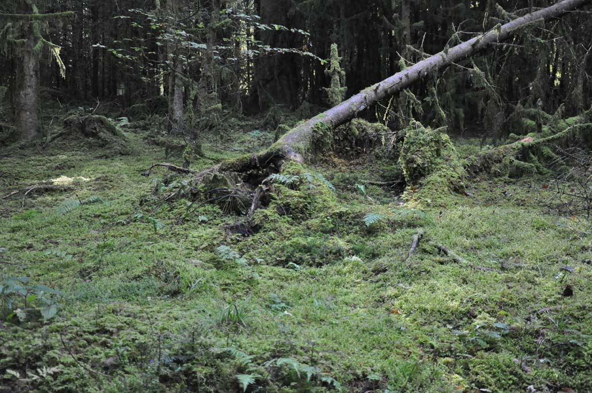

+++
title = "Pilze"
date = "2021-12-31"
draft = false
pinned = false
tags = ["Pilze", "Pilzfarm"]
image = "pilz_web.jpg"
description = "Bereits seit einigen Monaten läuft unser Pilzfarmprojekt."
+++
Bereits seit einigen Monaten läuft unser Pilzfarmprojekt. Gut, was heisst laufen? Die ersten Treffen beinhalteten viel Koordinations, Abklärungs- und Organisationsarbeit. Irgendwann war der Zeitpunkt da, um zu entscheiden ob wir richtig loslegen oder.. . Egal, wie legten los und sind unterwegs. Es ist ein Startup, Lernprojekt und sicher noch vieles mehr, wenn man denn eine Definitionen braucht. Wenn wir gerade bei Definitionen sind: Wir sind Lernende und das ist wohl die einzige wirklich treffende Definition. Es gibt keine Hierarchie, keine feste Organisation, keine konkreten Rollen. Wir organisieren uns laufend und gemeinsam. Es scheint mir so, dass sich durch die Interessen, Stärken und Talenten vieles selbst organisiert. Also ganz natürlich, organisch und im Fluss. Das heisst nicht, dass es keine Koordination, keine Abstimmung und Organisation braucht, aber sie ist feiner. Während ich so darüber nachdenke, kommt mir ein Waldboden in den Sinn, in dessen Inneren, im Untergrund vieles Unsichtbar und ganz natürlich wächst, sicht zersetzt, neuen Nährboden bereitstellt, Bäume das erste Mal langsam ihren Kopf aus dem Boden strecken, die vielleicht einmal grosse starke Eichen, Buchen oder Tannen werden. Noch klein, kaum sichtbar und empfindlich, während sie sich mit genügend Nährstoffen, in der passenden Umgabung langsam wachsen, ihre Wurzeln ausbreiten und sich der Baum langsam aber sicher in Richtung Himmel bewegt. Da kommt mir auch gleich in den Sinn wie wichtig Wind und Stürme sein können. Dazu habe ich hier etwas gelesen <https://foerster-kreuz.com/stuerme-im-leben/>

PS: natürlich gibt es bei uns keine Fliegenpilze. Er ist für mich aber ein Symbol des Waldes, wirkt in seinem Kleid irgendwie frech. Mir gefällt er.