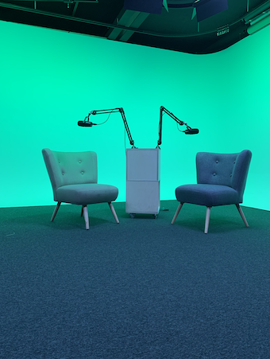
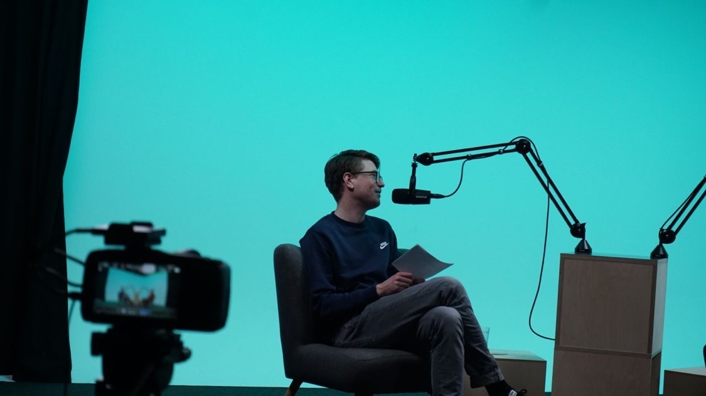
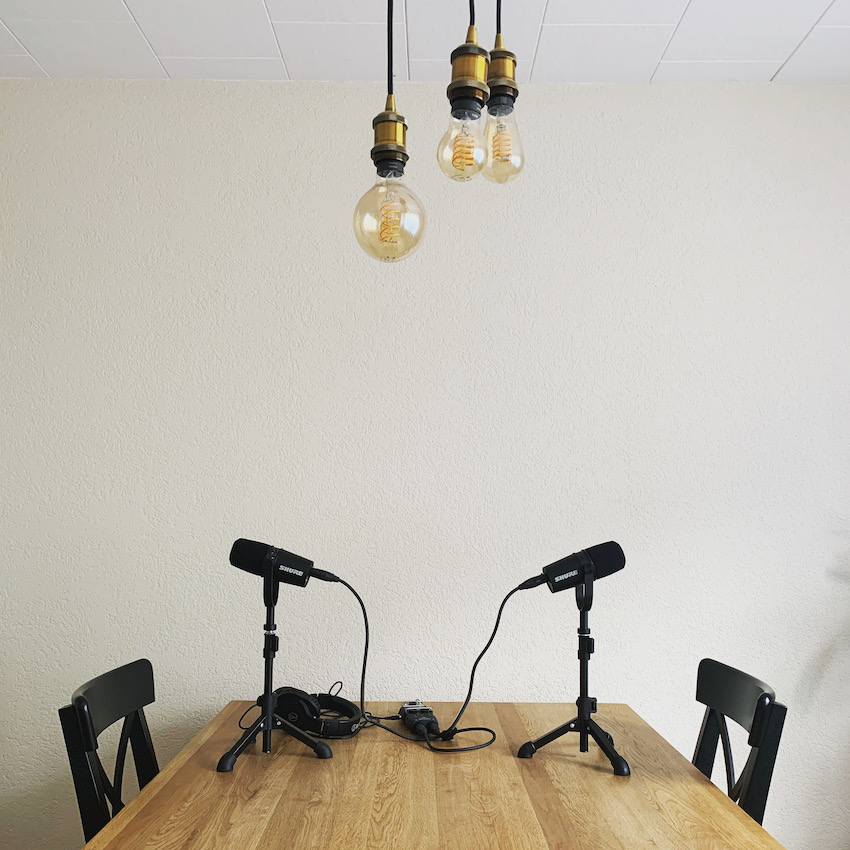
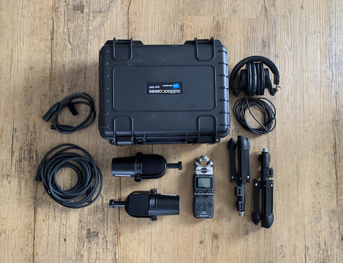

+++
title = "Erfahrungen aus zwei Jahren als Podcaster"
date = "2022-11-03"
draft = true
pinned = false
tags = ["Podcast"]
+++
### Erfahrungen aus mehr als zwei Jahren als Podcaster

Im April 2020 ging meine erste Podcastfolge online. In dieser Zeit habe ich einiges ausprobiert, umgesetzt und gelernt. Das wird mein dritter Blogbeitrag zu diesem Thema hier nach **[Wie startet man einen Podcast](https://www.bensblog.ch/wie-startet-man-einen-podcast/)** (21. Oktober 2021) und dem Update im Beitrag **[Podcast](https://www.bensblog.ch/podcast/)** (6. März 2022). 

Für mich ist nach wie vor wichtig, Podcasts aufzunehmen, die echt sind. Sie dürfen unperfekt sein. Sie sollen aber trotzdem gut rüberkommen. Alles andere kommt jetzt.

#### Meine Haltung

##### Das ist mir wichtig (auch oder gerade nach diesen etwas mehr als zwei Jahren)

* Eine möglichst gute und konstante Lautstärke. Vor allem bei Gesprächen sollen beide Stimmen etwa gleich laut sein. Ich selbst schalte bei Podcasts mit schlechter Audioqualität (ungleiche Lautstärke, zu viel Hall, zu leise, ...) schnell wieder ab. 
* Meine Gesprächspartner:innen sollen sich wohlfühlen. 

##### Das darf sein

* Umgebungsgeräusche, wenn sie dezent sind
* Aufnahmen über zoom o. Ä., ohne gutes Mikrofon beim Gegenüber 

#### Aufnahmeorte

##### Hier habe ich bisher aufgenommen

* Studio https://studio.effinger.ch
* Sitzungszimmer in unterschiedlichen Grössen, mit unterschiedlichen Ausstattungen, mit und ohne Umgebungsgeräusche
* in Wohnungen
* Zuhause in verschiedenen Räumen
* über zoom

##### Hier sind meine Gesprächsparner:innen, wenn wir über zoom aufnehmen

* Sitzen im Sessel oder Sofa
* in der Küche
* im Büro

##### Diese Mikrofone nutzen meine Gesprächspartner:innen

* Notebook Mikrofon
* Kopfhörer jeglicher Art inkl. Mikrofon
* Podcast Mikrofon

#### Mein aktuelles Equipment

In diesem Jahr verdiente ich das erste Mal Geld mit Auftragspodcasts. Weil ich unterwegs war und alles etwas stimmiger sein musste, passte ich mein Equipment noch einmal an. So bin ich heute unterwegs. 

1 Mikrofon [Shure MV7X](https://www.galaxus.ch/en/s1/product/shure-mv7x-dynamic-podcast-microphone-xlr-microphones-22671278)(nur XLR-Anschluss)

1 Mikrofon [Shure MV7](https://www.galaxus.ch/en/s1/product/shure-mv7-broadcast-podcasting-microphones-14356382)(nur USB- und XLR-Anschluss)

Kopfhörer [Audio Technica ATH-M30x](https://www.galaxus.ch/en/s1/product/audio-technica-ath-m30x-headphones-3827638?supplier=406802)

12 Tischstative [K&M 23150-3](*%20**K&M%2023150-3**)

2 XLR-Kabel (1x kurz & 1x lang)

[Zoom H5 Audiorecorder](https://www.galaxus.ch/en/s1/product/zoom-h5-handheld-audio-recorders-2752880?isSecondHand=true&shid=859802&gclid=CjwKCAjwzY2bBhB6EiwAPpUpZva_CiUtftB2qvH0eGWExtafrxemnRR1wxK7CtvZ_OIL05-MDwEjcxoC9rMQAvD_BwE&gclsrc=aw.ds) (mit 2 XLR-Anschlüssen)

1 Koffer [B+WOutdoor case type 3000 - SI](https://www.galaxus.ch/en/s1/product/bw-outdoor-case-type-3000-si-suitcase-camera-bag-7105761?supplier=406802) (Wasser- und Staubdicht)

#### Und jetzt?

So bin ich mittlerweile unterwegs und bin ganz zufrieden mit dem Material. Es hat eine gute Qualität und macht sich auch auf Bildern gut. Die Stative sind nicht ganz so stabil und fest wie ich es mir wünschen würde, sie erfüllen aber ihren Zweck. Den Koffer nutze ich vor allem bei längeren Reisen und bei schlechtem Wetter. Es lässt sich auch alles ganz gut im Rucksack verstauen. 

#### Podcast-Formate

Mittlerweile sind einige Formate zusammengekommen.