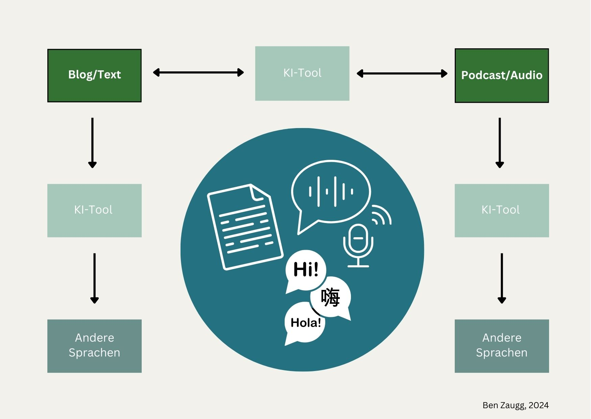
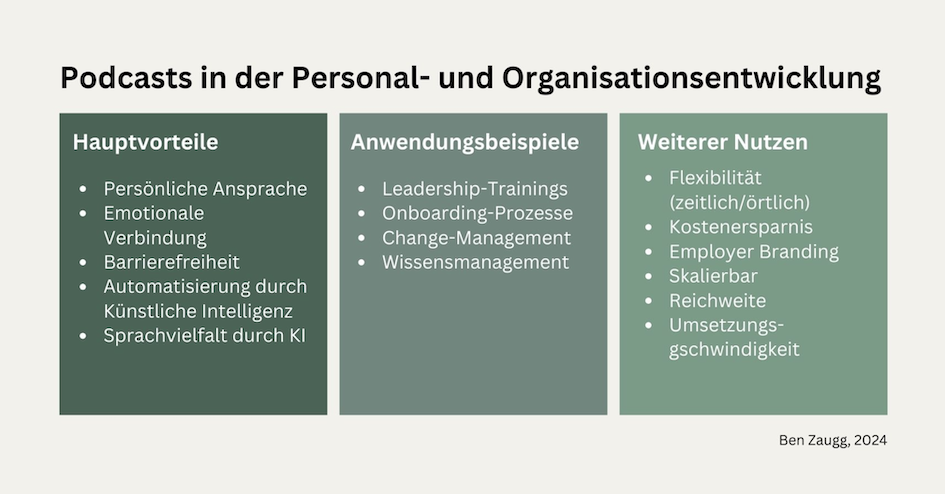
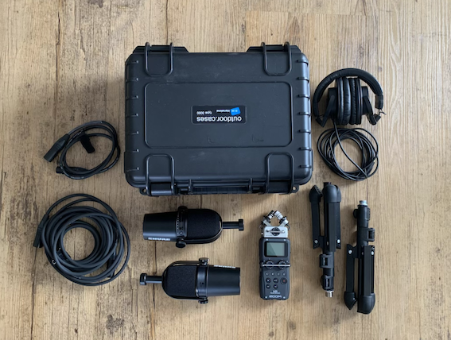

+++
title = "Podcasts: Eine wertvolle Ressource für die Personal- und Organisationsentwicklung"
date = "2024-11-17"
draft = false
pinned = false
tags = ["Podcast", "Personalentwicklung", "Organisationsentwicklung", "Kommunikation", "Lernen"]
image = "blogbilder-4.jpg"
description = "Podcasts sind mehr als nur ein Trend – sie bieten enorme Möglichkeiten für die Personal- und Organisationsentwicklung. Von emotionaler Ansprache bis hin zu barrierefreier Wissensvermittlung eröffnen sie neue Wege, um Mitarbeitende zu erreichen und zu begeistern. "
footnotes = "Etwas ältere Artikel in denen ich über (mein) Podcast-Equipment und meine Erfahrungen schreibe gibt es [hier](https://www.bensblog.ch/tags/podcast/).\n\n📸**Bildnachweise:**\n\nTitelbild: Canva, von Getty Images, littlehenrabi \n\nFoto Ben: Joscha Tschanz\n\nGrafiken: Erstelle von Ben Zaugg\n\nFoto Equipment: Ben Zaugg\n\n🎙️**Umsetzungsmöglichkeiten aus der Praxis**\n\n🎧[Zu meinen Podcast-Formaten gehts mit diesem Link.](https://www.benzaugg.ch)\n\n🎧[Hier hörst du meinen aktuellen Podcast rund um (mein) Lernen, Personal- und Organisationsentwicklungsthemen.](https://entwicklungsfreiraum-siebenminuten.podigee.io)\n\n🎧[Da gehts zu einem Podcast mit Video.](https://www.youtube.com/watch?v=0ChwbO_-2-Q)\n\n🎧[Wie Podcast-Interviews bei einem Projekt begleitend eingesetzt werden können siehst und hörst du hier.](https://www.muehlemattbelp.ch/tags/podcast/)"
+++
## Einleitende Gedanken

Vor über vier Jahren habe ich meine ersten [Podcastfolgen](https://www.bensblog.ch/tags/podcast/) aufgezeichnet. Zwischen der ersten Idee bis zur ersten Aufnahme ist einige Zeit vergangen. Dafür sind mittlerweile ein paar Stunden Audioaufnahmen online gegangen. In Podcasts sehe ich ein grosses Potenzial für die [Personal- und Organisationsentwicklung](https://www.bensblog.ch/tags/organisationsentwicklung/). Das heisst nicht, dass es die richtige Lösung für alle Organisationen ist, aber dazu mehr im Text. 

## Podcasts als Tool der modernen Personal- und Organisationsentwicklung

Podcasts haben sich in der Welt etabliert. Es gibt zu wohl fast allem etwas. Sie bieten eine ansprechende Möglichkeit, Wissen zu teilen und Mitarbeitende auf unterschiedlichen Ebenen zu erreichen. Für die [Personal- und Organisationsentwicklung](https://www.bensblog.ch/tags/organisationsentwicklung/) ergeben sich dadurch neue Chancen in der Kommunikation mit den Mitarbeitenden und im Bereich von Lernen und Entwicklung. 

## Die Vorteile von Podcasts für die Personal- und Organisationsentwicklung

### Persönlichere Ansprache: Die Stimme verbindet

Die Stimme einer Person aus der Personal- oder Organisationsentwicklung, dem HR oder von anderen Mitarbeitenden zu hören, schafft eine persönliche Verbindung. Emotionen werden spürbarer. So schafft ein Podcast Nähe. Es ist eine Möglichkeit, Authentizität und Persönlichkeit zu vermitteln. Nicht nur Personal- und Organisationsentwickler:innen können ihre Botschaften direkt und persönlich an die Menschen richten, sondern auch Führungspersonen oder externe Expert:innen. Zum Beispiel in Interviews. 

### Mehr Emotionen für tiefere Wirkung

In einer Arbeitswelt, in der sich die Menschen (in meiner Wahrnehmung aus Gesprächen und Beobachtungen) eher entfremden, können Emotionen eine noch zentralere Rolle spielen. Das kann in Lern- und Entwicklungsprozessen genauso sein, wie beim Teilen von Informationen. Podcasts schaffen die Möglichkeit, Geschichten, Erfahrungen, Ideen oder Visionen emotional und packend zu teilen. Hörer:innen (Mitarbeitende) fühlen sich stärker eingebunden und nehmen Inhalte nachhaltiger auf. Das kann gerade bei Themen wie [Change](https://www.bensblog.ch/tags/change/)-Management, [Kultur-](https://www.bensblog.ch/tags/organisationskultur/) oder [Führungsentwicklung](https://www.bensblog.ch/tags/leadership/) besonders wichtig sein. 

### Barrierefreiheit und Nachbereitung

Ein Podcast ermöglicht [Menschen mit Schwierigkeiten beim Lesen und Schreiben](https://www.lesen-schreiben-schweiz.ch/grundkompetenzen/) eine einfachere Teilhabe. Mit [künstlicher Intelligenz](https://www.bensblog.ch/tags/ki/) können Podcasts zudem automatisch transkribiert werden. So können die Inhalte auch in schriftlicher Form geteilt und zum Beispiel durch Grafiken, Fotos, Checklisten etc. ergänzt werden. Das ermöglicht eine Archivierung oder Durchsuchbarkeit von Inhalten. Menschen mit Hörbeeinträchtigung steht so ebenfalls eine Alternative zur Verfügung. 

### Aus Text wird Podcast: Automatisierte Erstellung durch KI

Eine menschliche Stimme einer Person aus der Organisation schafft den persönlichen Bezug. Aus dem Foto oder der E-Mailadresse des Personalentwicklers, der Personalentwicklerin wird ein Mensch. Sollte diese Ressource nicht zur Verfügung stehen, dann können auch schriftliche Inhalte in Podcasts umgewandelt werden. Die künstliche Intelligenz kann hier einen wichtigen Beitrag leisten. So könnten schriftliche Inhalte (Anleitungen, Informationen für Mitarbeitende etc.) als Audio-Ergänzung zur Verfügung gestellt werden. Dies spart Zeit, Ressourcen und ermöglicht es Unternehmen, auch schriftliche Inhalte auf eine neue Art und Weise zugänglich zu machen.

### Vielfältige Sprachen: Inklusion und Teilhabe

Die künstliche Intelligenz bietet zudem Möglichkeiten, einen Podcast in verschiedenen Sprachen zur Verfügung zu stellen. Das ermöglicht eine (einfachere) Teilhabe in Organisationen in denen Mitarbeitende mit unterschiedlichen sprachlichen Hintergründen arbeiten. Die Mitarbeitenden können Inhalte so in ihrer Muttersprache hören. Das verstärkt die Teilhabe. Dies ist ein wichtiger Schritt zu mehr Diversität und Chancengleichheit.

### Zusätzliche Vorteile und Anwendungen

**Flexibilität:** Podcasts können jederzeit und überall gehört werden. Das kann je nach Job bei der Arbeit sein, auf dem Weg zur Arbeit oder nach Feierabend, auf Geschäftsreisen, beim Warten auf den Zug oder während dem Sport. 

**Kostenersparnis:** Im Vergleich zu ressourcenintensiven Präsenzveranstaltungen sind Podcasts eine kostengünstige Möglichkeit, Wissen zu teilen. Das kann anstatt einer (Online-)Veranstaltung sein oder als Ergänzung zur Vorbereitung oder Nachbearbeitung. Es kann ebenfalls ergänzend als Vertiefung oder Auffrischung eines Themas genutzt werden. 

**Employer Branding:** Podcasts können auch extern geteilt werden und so zur Attraktivität des Unternehmens gegenüber neuen potenziellen Mitarbeitenden beitragen. Hier ist wichtig zu definieren, was für interne und was allenfalls für externe Zwecke genutzt wird und werden kann. 

## Anwendungsbeispiele für die Personal- und Organisationsentwicklung

**Leadership-Entwicklung:** Externe oder interne Expert:innen teilen Wissen oder Erfahrungen. Diese können als Inspiration oder für ganz konkrete Schulungszwecke genutzt werden. 

**Onboarding-Prozesse:** Neue Mitarbeiter:innen erhalten wichtige Informationen (auch) als Audio. Hier wäre auch ein Podcast mit der Stimme der/des neuen Vorgesetzten oder von Teammitgliedern denkbar. Das schafft ein Gefühl von Zugehörigkeit und Vertrauen. 

**Change-Management/Transformation:** Podcasts können begleitend in Veränderungsprozessen eingesetzt werden. Hier sind Interviews und Gespräche über Vision, Erfolgsgeschichten aber auch über Widerstände und den Umgang damit denkbar. Das fördert Transparenz und trägt wesentlich zur Akzeptanz bei.

**Wissensmanagement:** Wissen von Expert:innen kann durch Podcasts geteilt werden. Wissen und Erfahrungen von austretenden Mitarbeiter:innen können mit Podcasts (z. B. gezielten Interviews) aufgefangen und archiviert werden. So wird Wissensmanagement- und ein Wissenstransfer sichergestellt. Das kann gerade dann hilfreich sein, wenn keine persönliche Übergabe mehr möglich ist.  

## Schlussgedanken: Podcasts als Teil einer modernen Organisations- und Lernkultur

Podcasts sind mehr als ein Trend. Sie haben sich in den letzten Jahren etabliert und haben eine hohe Akzeptanz. Sie sind ein wichtiges und wertvolles Werkzeug für die modere Personal- und Organisationsentwicklung. Podcasts unterstützen und fördern eine inklusive Kommunikation und schaffen durch Emotionen Verbindungen. Durch KI-Tools haben sich die (Erweiterungs-) Möglichkeiten noch einmal deutlich erweitert und vereinfacht. 

### Hinweis zum Schluss 

Auch wenn Podcasts eine tolle Möglichkeit sind, sind sie genauso wie alle anderen Tools und Technologien nicht die Lösung für jede Organisation. Konkrete Anwendungsfälle sollten geprüft und allenfalls in ersten Experimenten getestet werden. Für den Start eines Podcasts braucht es nicht viel. Trotzdem sind Professionalität und Qualität wichtig.  

