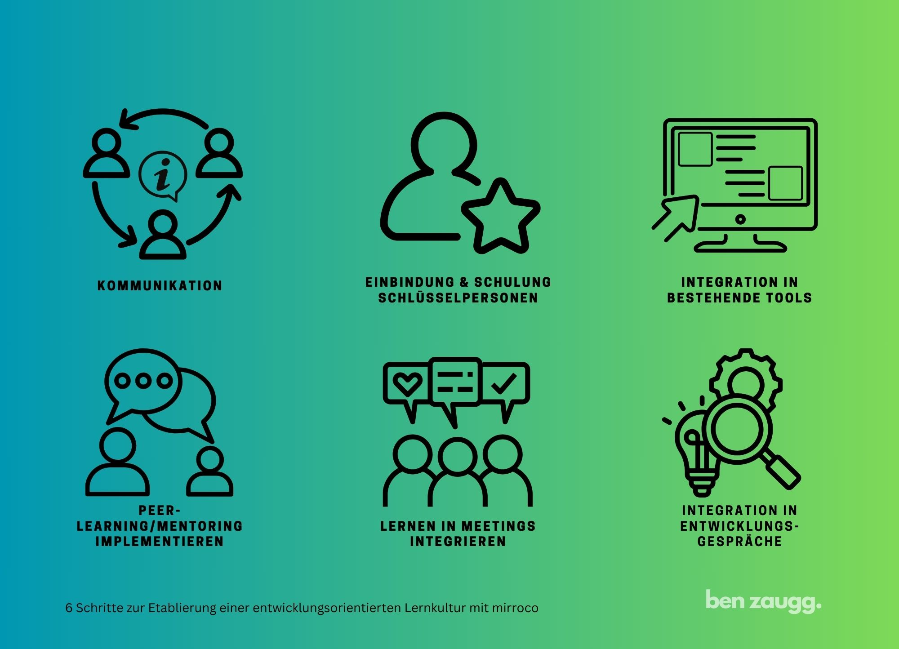
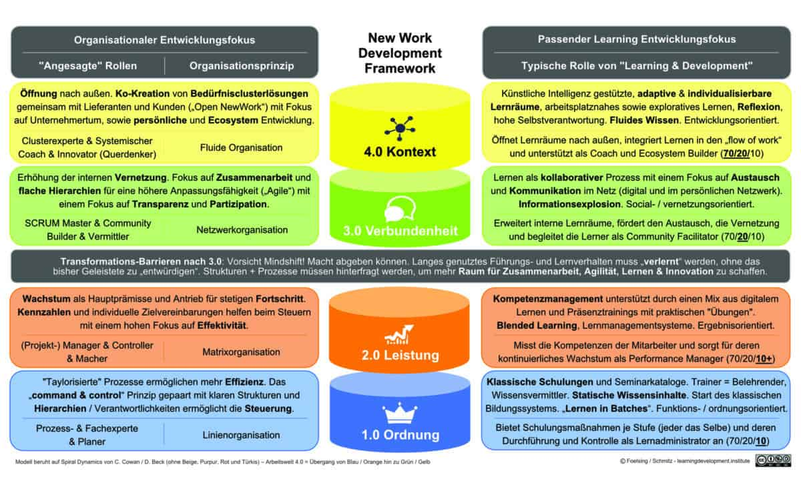
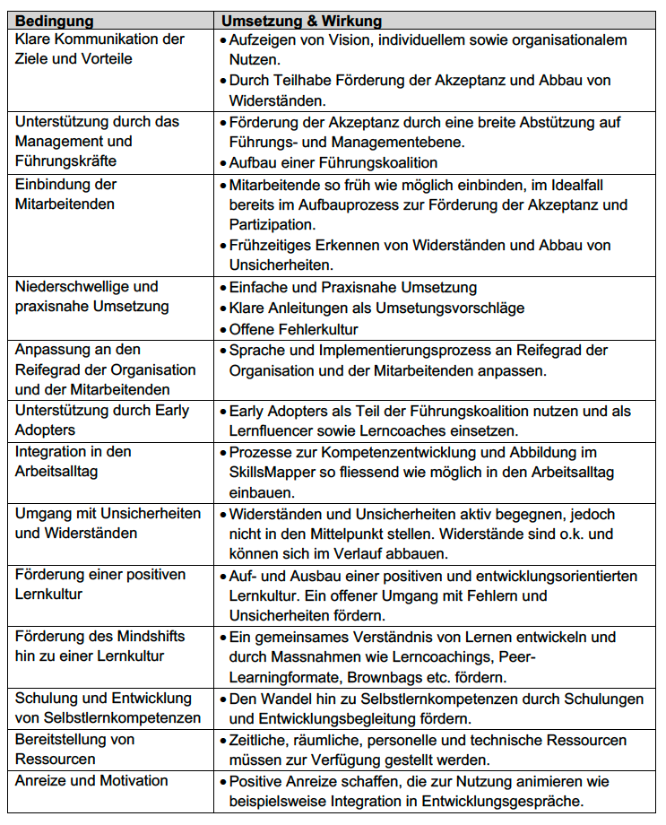
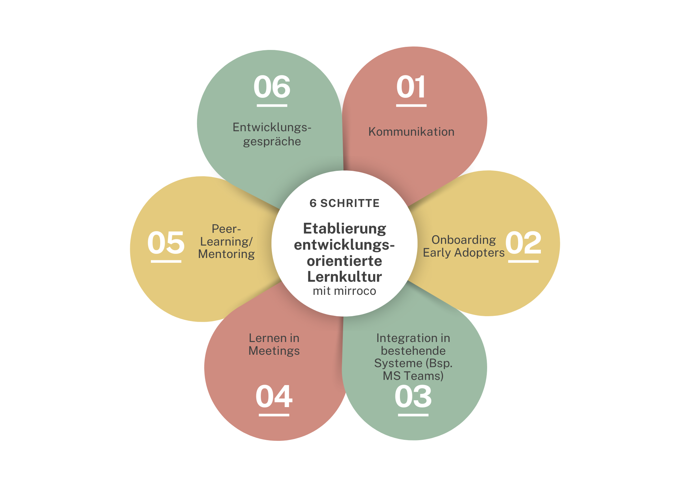
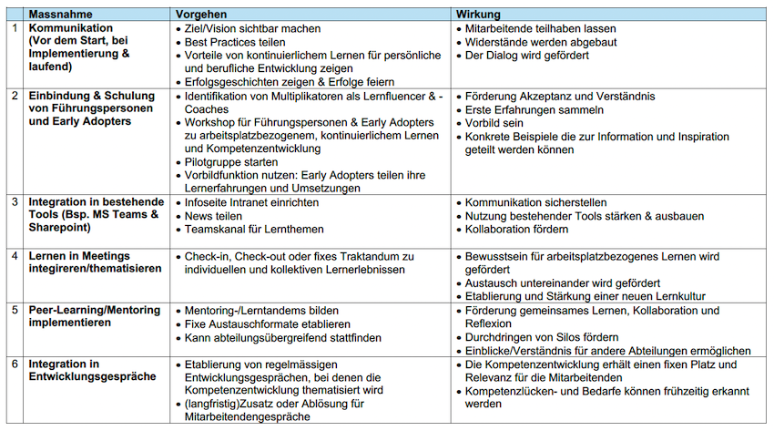

+++
title = "Praxisorientierte Kompetenzentwicklung auf dem Weg zu einer lernenden Organisation"
date = "2024-10-01"
draft = false
pinned = false
tags = ["Kompetenzentwicklung", "LernendeOrganisation", "Lernkultur", "CAS-BI", "CAS"]
image = "6-schritte_quer-4.jpg"
description = "Praxisorientierte Kompetenzentwicklung auf dem Weg zu einer lernenden Organisation: 6 Massnahmen zur Etablierung einer entwicklungsorientierten Lernkultur mit mirroco. \n"
footnotes = "\\[1] Die Schweizer Wirtschaft will die demografische Herausforderung anpacken, [https://www.economiesuisse.ch/de/artikel/die-schweizer-wirtschaft-will-die-demografische-herausforderung-anpacken#](https://www.economiesuisse.ch/de/artikel/die-schweizer-wirtschaft-will-die-demografische-herausforderung-anpacken) aufgerufen am 12.09.2021\n\n\\[2] Graf N., Edelkraut F., Whitepaper «Agiles Lernen», S. 6\n\n\\[3] <https://www.zukunftsinstitut.de/zukunftsthemen/zukunft-der-arbeit>, aufgerufen am 10.09.2024\n\n\\[4] Graf N., Gramss D., Edelkraut F. (2022), S. 21\n\n\\[5] Graf N., Gramss D., Edelkraut F. (2022), S. 249 \n\n\\[6] Senge P. (2006)\n\n\\[7] Graf N., Gramss D., Edelkraut F. (2022), S. 251\n\n\\[8] Arnold R. (2017) S. 149\n\n\\[9] Graf N., Gramss D., Edelkraut F. (2022), S. 47\n\n\\[10] Foelsing J., Schmitz A. (2021), S. 51\n\n\\[11] Foelsing J., Schmitz A. (2021), S. 187\n\n\\[12] Foelsing J., Schmitz A. (2021), S.189\n\n\\[13] Arnold R. (2017) S. 111\n\nDieser Blogbeitrag basiert auf Konzept, das im Herbst 2024 erstellt wurde."
+++
## 6 Massnahmen zur Etablierung einer entwicklungsorientierten Lernkultur mit mirroco.

## 1.0 Ausgangslage Marktumfeld

Die Arbeitswelt ist im Wandel. Was früher längerfristig plan- und umsetzbar war, wird heute von schnelleren und kürzeren Zyklen der Veränderung abgelöst. Wir leben in einer VUKA-Welt, die von Unbeständigkeit, Unsicherheit, Komplexität und Mehrdeutigkeit geprägt ist. Da sind zum Beispiel die geopolitischen Veränderungen (Krieg in Europa), der demografische Wandel (Prognostizierter Mangel an Arbeitskräften in der Schweiz im Jahr 2040 = 431'000 Personen)\[1] oder die rasanten technologischen Veränderungen u. a. durch die KI, deren Auswirkungen heute nur geschätzt werden können. Mitarbeitende benötigen in den nächsten Jahren neue Kompetenzen. Dazu gehörten neben Fachkompetenzen auch Metakompetenzen (u.a. Selbstorganisation, Kommunikationskompetenz, Digitale Grundkompetenzen, Resilienz, Lernkompetenzen), die gem. Studien immer wichtiger werden.\[2] Insbesondere im Zusammenhang mit der fortschreitenden Digitalisierung weist das Zukunftsinstitut darauf hin, dass der Verschmelzung von Technologie und sozialen Systemen besondere Beachtung als aktuelles Handlungsfeld geschenkt werden sollte.\[3] Sie identifizieren die Entwicklung von Future Skills als entscheidend, um den Anforderungen in der Zukunft gerecht zu werden. Diese sollten gezielt und laufend ausgebaut werden. Da dieses Lernen zunehmend informell und im «Moment of Need» stattfindet, braucht es neue Möglichkeiten der Kompetenzentwicklung und Kompetenzabbildung. 

> «Egal wie wir Veränderung wahrnehmen, jede ist ein Lernprozess.»
>
> *\[4]*

### 1.1 Ausgangslage mirroco

Unternehmen möchten ihren Mitarbeitenden mehr Möglichkeiten bieten, sich direkt am Arbeitsplatz weiterzubilden und ihre Kompenzen abzubilden. Sie sollen dabei ihre Kompetenzentwicklung sicht- und nachvollziehbar machen. Die Einführung der Software von mirroco als Tool zur Abbildung von Kompetenzen und Lernerlebnissen eröffnet neue Wege. Die Herausforderung besteht darin, dieses Potenzial effektiv zu nutzen und eine Kultur des kontinuierlichen Lernens zu etablieren.

## 2.0 Konzeptziel

Dieses Konzept zielt auf die Erarbeitung eines Entwurfs für ein Massnahmeprogramm ab, um den die Software von mirroco in Organisationen einzuführen und zu etablieren. Dabei sollen erste Schritte, um arbeitsplatzbezogenes, kontinuierliches Lernen und Kompetenzentwicklung zu fördern definiert werden. Dadurch soll eine moderne Lernkultur entstehen, die sowohl die persönliche sowie fachliche Entwicklung der Mitarbeitenden als auch die Ziele des Unternehmens unterstützt. Dies als Basis einer anpassungsfähigen Organisation im Sinne einer lernenden Organisation. 

## **3.0 Zielgruppe** 

Alle Mitarbeitenden von Unternehmen, die Software von mirroco nutzen, mit besonderem Fokus auf Führungspersonen sowie Early Adopters als Lernfluencer und Lerncoaches.

## 4.0 Theoretische Grundlagen

### 4.1 Lernende Organisation

Diese Aussagekräftige Definition stammt von den Autorinnen und Autoren von «Agiles Lernen»: «Als lernende Organisation kann ein Unternehmen bezeichnet werden, das in der Lage ist, den sich ständig verändernden Umweltanforderungen durch geeignete Anpassungen im Inneren der Organisation zu begegnen. In einer lernenden Organisation sind die Menschen in der Lage, sich ständig weiterzuentwickeln. Insbesondere sind Formen der Arbeitsorganisation nicht starr und endgültig, sondern so flexibel, dass die angebotenen Produkte oder Dienstleistungen ständig optimiert werden können. Die lernende Organisation ist geprägt durch Informations- und Wissensmanagement.»\[5] Stark geprägt wurde das Konzept der lernenden Organisation von Peter Senge\[6]. Er definiert dabei fünf Disziplinen, die einen lernende Organisation ausmachen.

**Personal Mastery:** Mitarbeitende sollen gefördert und gefordert werden, ihre eigenen Kompetenzen (weiter-) zu entwickeln.

**Teamlernen:** Teams müssen nicht nur in der Lage sein, gemeinsam zu arbeiten, sondern auch gemeinsam zu lernen. Dabei geht es nicht nur darum, innerhalb des Teams zu lernen, sondern auch mit anderen Teams. 

**Mentale Modelle:** (Unbewusste) Denkmuster, Verhaltensmuster und Grundannahmen müssen hinterfragt werden (können). Dazu braucht es eine individuelle und kollektive Reflexionsfähigkeit.

**Gemeinsame Vision:** Die gemeinsame Vision dient als Orientierung, als Polarstern oder Anker. Wo wollen die Menschen in der Organisation gemeinsam hin. Daran orientiert sich ihre Tätigkeit. Wichtig ist dabei ein gemeinsames Verständnis der Vision, resp. das gegenseitige Verstehen der Einzelsichten auf die Vision. 

**Systemdenken:** Es braucht ein ganzheitliches Denken, einen systemischen Blick auf die Organisation. Wir müssen die Komplexität der Organisation (an-)erkennen und verstehen können. 

#### 4.1.1 Vorteile einer lernenden Organisation\[7]

* Steigende Arbeitszufriedenheit
* Reduktion von Risiken bei Entscheidungsprozessen
* Erhöhte Wahrnehmungsoberfläche
* Erhöhte Problemlösekompetenz
* Wertsteigerung des Humankapitals
* Bessere Proaktivität

> *«Kompetenzentwicklung braucht die Führung zu lernenden Organisationen.»*
>
> *\[8]*

### 4.2 Lernen 4.0, New Learning, Agiles Lernen: Eine Klärung

Weniger abstrakt als die lernende Organisation sind neuere Ansätze, die sich an neuer Arbeit und der Arbeit der Zukunft ausrichten. Diese finden sich unter den Begriffen Lernen 4.0, New Learning und Agiles Lernen. Sie werden wie folgt charakterisiert\[9]:

 **Lernen 4.0**

* digitale & technologische Vernetzung
* Ziel: Performance-Steigerung
* smartes Lernumfeld
* Ausgerichtet auf Kollaboration Mensch & Maschine

**New Learning**

* Ziel: Selbst- und Potenzialentfaltung
* Lernprozesse die von Lernenden als sinnhaft erlebt werden
* Geprägt von Selbstbestimmung und Autonomie

 **Agiles Lernen**

* Zielt auf lebenslange Anpassungs- und Innovationsfähigkeit von Menschen und Organisationen
* kurze, klar strukturierte Abläufe
* Geprägt von Zielorientierung, Kollaboration, Selbststeuerung & Reflexion

Die Anwendung der mirroco Software bewegt sich in den Bereichen New Learning und Agiles Lernen, wobei diese am ehesten beim agilen Lernen zu verorten ist. 

### 4.3 Reifegrad der Organisation

Im Zusammenhang mit der Einführung der Software sowie der nachhaltigen Etablierung ist der aktuelle und der Zielreifegrad der Organisation sowie der Mitarbeitenden zu berücksichtigen. Auch wenn die Software für alle Formen von Organisationen einsetzbar ist, so orientiert sich der Grundgedanke von mirroco auf der grün/gelben Ebene des New Work Development Frameworks\[10]. Es ist davon auszugehen, dass eine Einführung und Nutzung auf diesen Ebenen einfacher ist, d. h. weniger Widerstände oder Erklärungs-, Schulungs und Unterstützungsbedarf zu erwarten ist. 

### 4.4 Organisations- und Lernkultur: Begriffsdefinition

Für Organisationsentwicklung gibt es keine einheitliche Definition. Eine Beschreibung könnte lauten: Es geht um die (systematische, strategische, langfristige) Planung und Umsetzung von Veränderungen in einer Organisation. Diese verfolgt Ziele wie die Steigerung der Leistungsfähigkeit des Unternehmens oder die Verbesserung der Arbeit der Menschen im Unternehmen. Ein Teil der Organisationskultur ist die Lernkultur. Diese kann nicht losgelöst von der Unternehmenskultur betrachtet werden.\[11]

«Die Lernkultur einer Organisation besteht aus den grundlegenden lernbezogenen Über-zeugungen, Werten, Normen und Einstellungen sowie den dazugehörigen Verhaltenser-wartungen. Sie beeinflusst die mit dem Lernen in der Organisation verbundenen Wahrneh-mungen, Gedanken, Handlungen und Gefühle und verdeutlicht die Bewertung und damit einhergehend den Stellenwert des Lernens in der Organisation. Lernkultur manifestiert sich in beobachtbarem Verhalten und Artefakten.»\[12]

Die Organisationskultur hat also immer einen Einfluss auf die Lernkultur und umgekehrt. Auch wenn in diesem Konzept der Fokus auf die Lernkultur gelegt wird ist zu beachten, dass sie immer im Wechselspiel mit der Organisationskultur ist. 

## 5.0 Etablierung einer Lernkultur

Bei der Etablierung der Lernkultur in Richtung lernende Organisation steht die Praxisorientierung im Zentrum. Die Einführung und Nutzung der Software zur Kompetenzentwicklung- und Abbildung bedingt die Arbeit an Elementen der fünften Disziplin wie: Personal Mastery, Teamlernen und Mentale Modelle. Eine gemeinsame Vision liegt dem Gelingen zu Grunde und die Berücksichtigung des bestehenden Organisations- und Lernkultur sowie dem Reifegrad der Organisation (New Development Framework) sind dabei entscheidende Faktoren. 

### 5.1 Gelingensbedingungen

Die folgenden Aspekte unterstützen eine gelingende Einführung sowie die Etablierung von Kompetenzentwicklung im Arbeitskontext. 

### 5.2 6 Schritte zur Etablierung einer entwicklungsorientierten Lernkultur mit mirroco

Aufgrund der identifizierten Gelingensbedingungen ergeben sich praxisorientierte und schnell umzusetzende Massnahmen, welche die Nutzung der Software sowie die Etablierung einer neuen Lernkultur fördern. Im Vorgehen wird nicht auf die Integration und Schulung der Software selbst eingegangen. Diese findet teilweise vorgängig und parallel statt. Die Massnahmen zielen auf den Aufbau einer entwicklungsorientierten Lernkultur ab. Diese sind auf einen Zeitraum von ca. zwei Jahren ausgelegt.

> «Selbstlernkompetenzen sind die eigentlichen Schlüsselfähigkeiten im Wandel.»
>
> *\[13]*

### \
5.2.1 Massnahmen zur Etablierung einer entwicklungsorientierten Lernkultur mit der mirroco Software

### 5.3 Mögliche Risiken

Die Etablierung einer entwicklungsorientierten Lernkultur ist ein Change- oder sogar ein Transformationsprozess. Je nachdem, wo die Organisation in Bezug auf Führung, Lernen und Zusammenarbeit steht. Bei der Implementierung ist darauf zu achten, diese Schritte passend zur bestehenden und zur angestrebten Organisationsstruktur zu gehen. Die Massnahmen können sich in der Umsetzungsdauer, Intensität und Tiefe unterscheiden. 

#### 5.3.1 Umgang mit Widerständen

Bei Change- und Transformationsprozessen ist mit Widerständen zu rechnen. Eine neue Software ist oft zuerst mit einem Mehraufwand verbunden. Zudem wird der Vorteil der Software von mirroco nicht für alle Mitarbeitenden nachvollziehbar sein. In diesem Konzept wird bewusst nicht auf die Widerstände fokussiert. Stattdessen liegt der Fokus auf den Early Adopters, welche Rollen wie Lernfluencer und Lerncoaches einnehmen sollen. Diese nehmen eine Vorbildrolle ein, sind Ansprechpartner für andere Mitarbeitende und sind aktiv an der Kommunikation beteiligt. Widerstände sollen so auf natürlichem Weg reduziert werden. 

#### 5.3.2 Veränderte Rollen

Die Rollen von Personalentwicklung (falls vorhanden), Führungspersonen sowie der Mitarbeitenden, insbesondere in Bezug auf Lernen und Entwicklung verändern sich. Lernprozesse werden transparenter, der Umgang mit Fehlern offener und zu entwickelnde Kompetenzen sichtbar. Die Massnahmen stellen neue Anforderungen an Führungspersonen sowie an die Organisationsstruktur. Je nach Reifegrad der Organisation sowie der Mitarbeitenden verschieben sich die Rollen sowie das Rollenverständnis deutlich, so, dass dies wiederum zu Widerständen und Unsicherheiten führen kann. Gerade bei blau/orangen Organisationen (Ordnung & Leistung) kann dieser Effekt gross sein. Dies sollte im Auge behalten werden. 

## 6.0 Ausblick: Mögliche Entwicklungen

Insbesondere die schnelle Entwicklung der künstlichen Intelligenz bietet neue Möglichkeiten, die Mitarbeitenden in persönlichen und fachlichen Entwicklungsprozessen automatisierter zu begleiten. Die Möglichkeiten von personalisieren und digitalen Lerncoaches sind zu prüfen und allenfalls in Zukunft in die Massnahmen einzubeziehen. 

## 7.0 Fazit

Die Implementierung einer entwicklungsorientierten Lernkultur ist für die Einführung und langfristige Nutzung der mirroco Software ein wichtiges Element. Es sind alle fünf Disziplinen einer lernenden Organisation zu berücksichtigen. Das heisst den Blick sowohl auf die individuelle sowie auf die Teamebene zu legen, ein Mindshift anzustreben und das gesamte System zu berücksichtigen. Dieses Konzept legt den Fokus auf eine praxis- und lösungsorientierte Implementierung mit schnell sichtbaren kleinen Erfolgen. Dabei stehen die Menschen und der Bezug zu ihrer Arbeit im Zentrum.