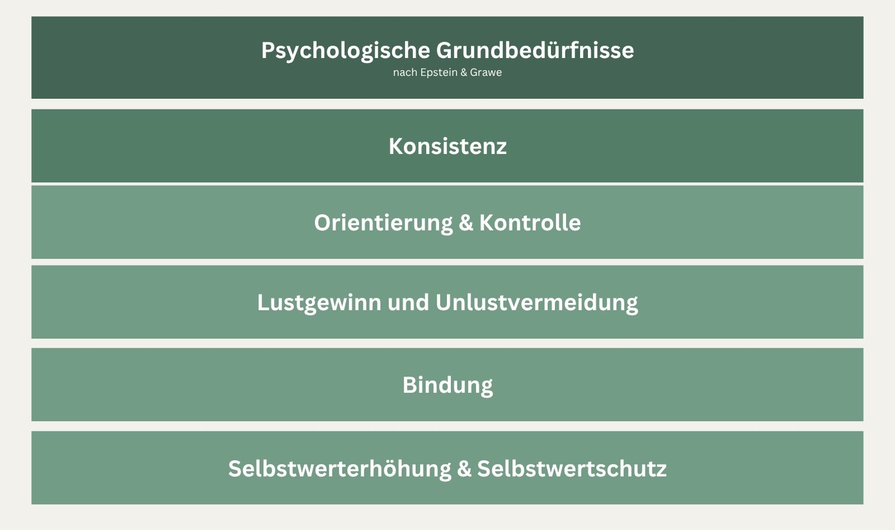
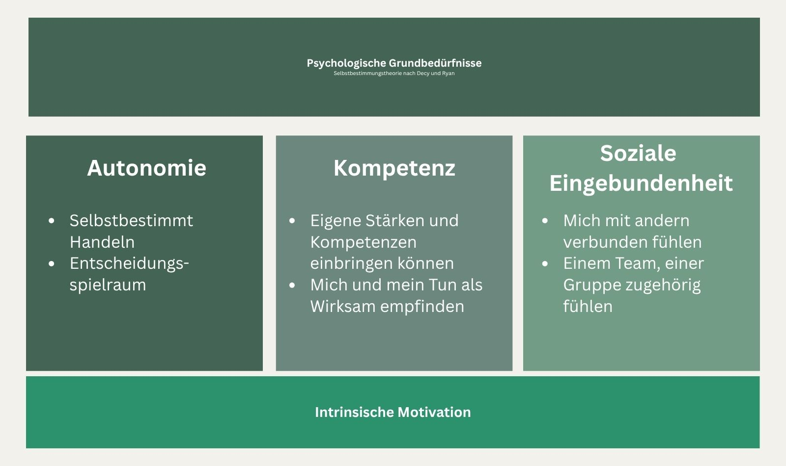
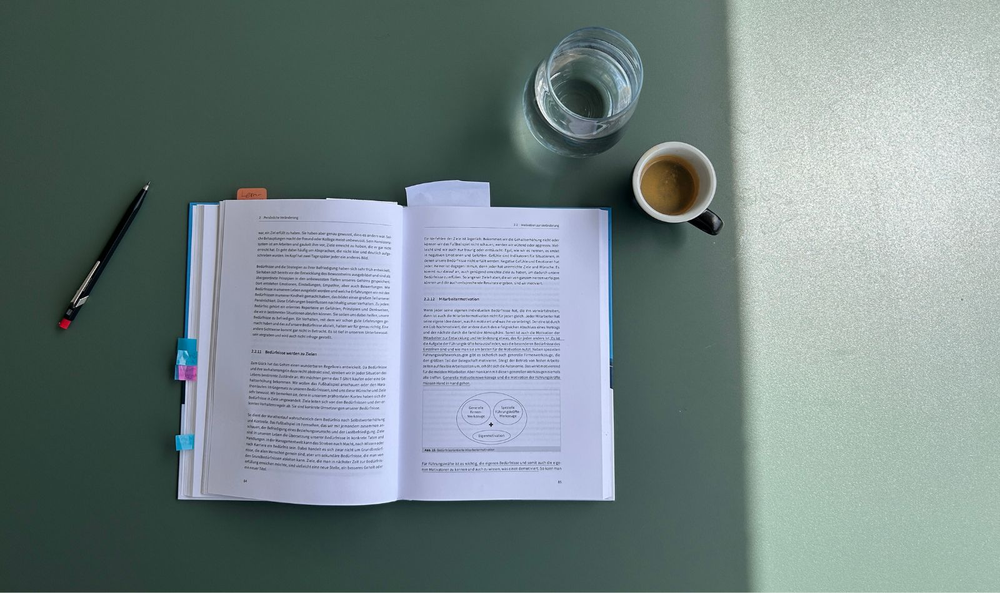
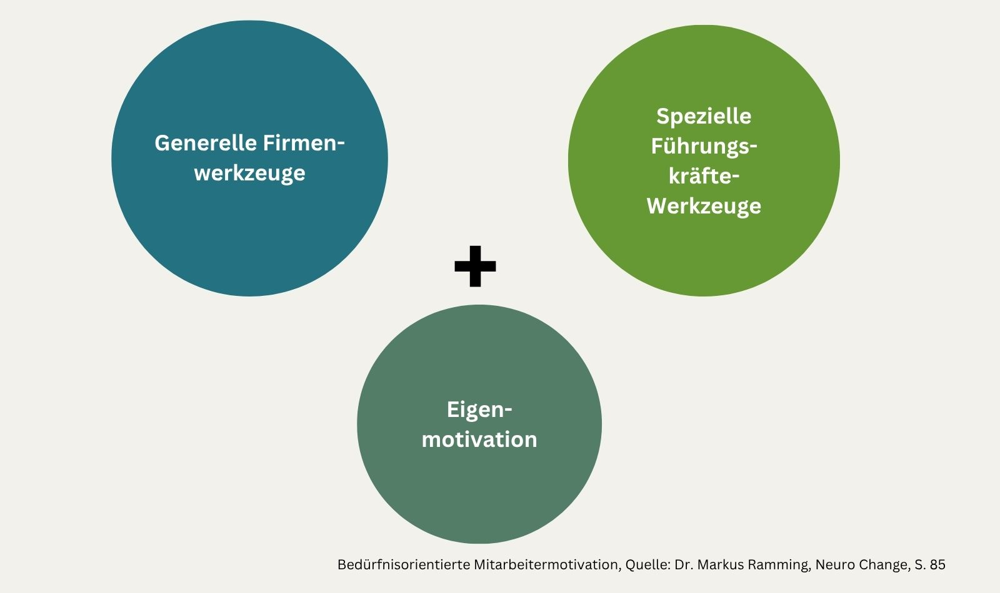
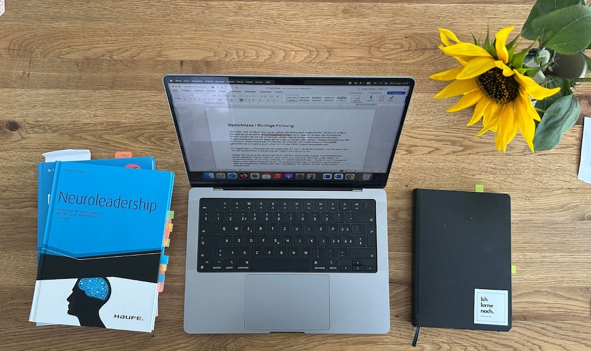

+++
title = "Bedürfnisse verstehen, Führung gestalten und was unser Gehirn damit zu tun hat"
date = "2025-08-04"
draft = false
pinned = false
tags = ["Neuro", "Lernen", "Lernblog", "Leadership", "Personalentwicklung", "Organisationsentwicklung"]
image = "gehirn.jpg"
description = "Was haben unsere psychologischen Grundbedürfnisse mit Führung zu tun? Und warum kommen Führungskräfte nicht darum herum, zuerst bei sich selbst hinzuschauen? Eine Momentaufnahme aus meinem Lernprozess."
footnotes = "Elger E. (2013), Neuroleadership, Erkenntisse aus der Hirnforschung für die Führung von Mitarbeitenden, 2. Auflage, Haufe Verlag\n\nRamming M. (2019), Neuro Change, Antworten der Hirnforschung auf den Wandel im Management, Haufe Verlag\n\n\\[1] Elger C. (2013), S. 96\n\n\\[2] vgl. Ramming M. (2019), S. 75\n\n\\[3] Ramming M. (2019), S. 73\n\n\\[4] Ramming M. (2019), S. 77\n\n\\[5] Ramming M. (2019), S. 78 \n\n\\[6] vgl. Ramming (2019), S. 79\n\n\\[7] Ramming M. (2019), S. 79\n\n\\[8] Ramming M. (2019), S. 80\n\n\\[9] Ramming M. (2019), S. 81\n\n\\[10] Ramming M. (2019), S. 82\n\n\\[11] Ramming M. (2019), S. 81\n\n\\[12] Ramming M. (2019), S. 83\n\n\\[13] Ramming M. (2019), S. 83\n\n\\[14] Ramming M. (2019), S. 74\n\n\\[15] Ramming M. (2019), S. 74\n\n\\[16] Elger C. (2013), S. 74"
+++
## Einleitende Gedanken

Über das, was richtige oder gute Führung ist, gehen die Meinungen auseinander. Oft bin ich irritiert, wie überzeugt einzelne «Führungsexpert:innen» sind, dass ihr Ansatz der Richtige ist. Ähnlich scheint es mir bei «Change», einem meiner anderen aktuellen Kernthemen. Zusammenfassen tue ich diese gerne unter «Change Leadership». Dieses fokussiert auf die Führung in einer Arbeitswelt im Wandel, ein Wandel, der mittlerweile zur Normalität geworden ist und gerne auch unter VUCA oder BANI zusammengefasst wird. 

Im Gegensatz zu Management ist Leadership für mich menschenorientiert und hat auch viel mit der persönlichen Entwicklung der Person die «führt» zu tun. 

Dieser Text ist eine Momentaufnahme in meinem Lernprozess «Neuro im Arbeitskontext» (einen besseren Namen habe ich noch nicht) und wirft einen Blick auf unser Gehirn im Zusammenhang mit Führung, Change und unseren Bedürfnissen. Wobei ich auf Prozesse im Gehirn nicht weiter eingehen werde. Ich verstehe diese zwar zunehmend besser, denke jedoch, dass die detaillierten Abläufe, was wann wo passiert, für meinen (Arbeits-)Alltag wenig relevant sind. Das heisst, im Gehirn laufen ständig Prozesse ab, die einen Einfluss auf das hier Beschriebene haben. Diese laufen jedoch nicht nur im Gehirn ab, sondern in unserem gesamten Körper, der ebenfalls Emotionen und Reaktionen abgespeichert hat. Darüber habe ich u. a. hier geschrieben: Von Kopf bis Fuss in Bewegung: [Eine persönliche Annäherung an die Neurowissenschaft ](https://www.bensblog.ch/von-kopf-bis-fuss/)

## Bedürfnisse

Bedürfnisse spielen in unserem (Arbeits-)Leben eine wichtige Rolle. Nur ist das mit den Bedürfnissen so eine Sache. Wir müssen wissen, welche (Grund-)Bedürfnisse wir haben und wie wir ihnen gerecht werden könn(t)en. Hier steht «könnten», weil in einer Gruppe von Menschen (beispielsweise in einem Team) die unterschiedlichen Bedürfnisse gleichzeitig vorhanden sind. Diese Bedürfnisse, auch wenn sie bei jeder Person in unterschiedlicher Ausprägung vorhanden sind, haben wir gemeinsam. 

«Viele Führungspersonen sind der Überzeugung, dass ihre Mitarbeiter andere Dinge anstreben, als sie es selbst tun. Das ist jedoch ein Irrtum. Denn das würde bedeuten, dass es entweder zwei Arten von Menschen geben müsste, solche, die führen und solche, die geführt werden, oder dass es eine weitere Entwicklungsstufe gibt, nämlich die vom Menschen zur Führungskraft.» \[1]

Was die psychologischen Grundbedürfnisse sind, das ist (noch) nicht ganz klar. Die Ansätze unterscheiden sich jedoch nicht so sehr (vgl. Ramming, S. 74). Hier stelle ich einmal zwei vor, wobei ich detaillierter auf den Ansatz von Epstein/Grawe eingehen werden. 

Die Selbstbestimmungstheorie nach Deci und Ryan beschreibt, welche Bedürfnisse befriedigt sein müssen, damit Menschen besonders motiviert (intrinsische Motivation) sind.

Der Ansatz von Epstein und Grawe\[2] nennt ähnliche Grundbedürfnisse, wobei hier das Bedürfnis nach Konsistenz über den anderen stehe:

**Hinweis:** Die psychologischen Grundbedürfnisse sind nicht mit den biologischen Grundbedürfnissen zu verwechseln. Die biologischen Grundbedürfnisse sind für uns immer noch wichtiger und solange diese nicht erfüllt sind, spielen die psychologischen Grundbedürfnisse keine Rolle. Beide gehen jedoch m. E. Hand in Hand und oft vernachlässigen wir die biologischen Grundbedürfnisse, resp. tun gerade das Gegenteil von dem, was uns guttun würde. Ich denke da z. B. an (zu wenig) Bewegung oder (ungesunde) Ernährung. Beide haben auch einen wesentlichen Einfluss auf unser Gehirn. Mehr dazu ebenfalls im Beitrag Von Kopf bis Fuss in Bewegung: [Eine persönliche Annäherung an die Neurowissenschaft ](https://www.bensblog.ch/von-kopf-bis-fuss/)

>  «Was unser ganzes Handeln bestimmt und uns motiviert, ist die Befriedigung unserer Bedürfnisse»*\[3]*
>
>  *Dr. Markus Ramming*

## Orientierung und Kontrolle

Wir Menschen möchten unsere (Arbeits-)Situationen kontrollieren können. Das heisst auch, dass wir selbst (durch unsere Kompetenzen und Stärken) angestrebte Ziele erreichen oder Situationen bewältigen können. Damit verbunden sei auch das Bedürfnis nach Orientierung, schreibt Ramming. Dazu gehöre, die Welt zum uns herum zu verstehen, damit wir einschätzen können, in welcher Situation wir uns befinden. Nur so könnten wir auch entscheiden, wie wir mit einer Situation umgehen sollen und können.\[4]

**Handlungsfelder für Führungspersonen:** Stärkung der Selbstwirksamkeit der Mitarbeitenden sowie aktives Einbinden und Informieren über das, was läuft. Das heisst auch, dass ihnen etwas zugemutet (z. B. schwierige Informationen) und etwas zugetraut (neues Lernen, herausfordernde Situationen bewältigen sollen und können) werden. 

## Lustgewinn und Unlustvermeidung

Was wir vermutlich am besten kennen und am häufigsten wahrnehmen können, ist das Bedürfnis nach Lust und Unlustvermeidung. 

> «Wir alle streben danach, ein lustvolles Leben zu haben und Freude und Spass zu erleben. Wir vermeiden negative Situationen und streben nach angenehmen positiven Erlebnissen.»\[5]
>
> *Dr. Markus Ramming*

Verschiedene Bedürfnisbefriedigungen und Erfahrungen können wir in einer einzigen Situation erleben. So kann das Bedürfnis nach Bindung in einem Team, in dem ich mich zugehörig fühle, genauso befriedigt werden, wie das Bedürfnis nach Spass oder Freude, wenn wir lustige Momente haben. Ramming beschreibt Lust als etwas Kurzfristiges, das nicht lange anhält – was aber nicht heisst, dass es etwas weniger Wichtiges ist.\[6]

## Bindung

Bindung und das Bindungsbedürfnis scheinen mir etwas komplexer zu sein, insbesondere wenn wir im Arbeitskontext darauf achten wollen. Denn dieses «Bedürfnis und die darauf aufbauenden Verhaltensweisen entwickeln sich gleich nach der Geburt und in den folgenden Jahren».\[7] Je nachdem, wie wir geprägt sind, ist unser Bindungsverhalten als Erwachsene. Ramming schreibt von J. Bowlby, der das Bindungsverhalten von Personen in folgende drei Gruppen eingeteilt hat\[8]:

* Sicheres Bindungsverhalten
* Unsichere Bindung und vermeidendes Beziehungsverhalten
* Unsichere Bindung und ambivalentes Beziehungsverhalten
* Unsichere Bindung und desorganisiertes Beziehungsverhalten

Wichtig ist, dass man lernen kann, mit diesen Mustern umzugehen oder daraus auszusteigen. Das schreibt auch Dr. Markus Ramming: 

> «Wir können aus unvorteilhaften Bindungsverhaltensmustern aussteigen. Veränderung ist auch in sozialen Beziehungen möglich.»\[9]

Hier lohnt es sich auch, das Konzept der Schematherapie genauer anzusehen. Dafür eignet sich der Podcast [Beziehungskosmos](https://www.beziehungskosmos.com) oder das Buch *[Raus aus Schema F von Gitta Jacob](https://www.beltz.de/sachbuch_ratgeber/produkte/details/42913-raus-aus-schema-f.html)*.

## Selbstwerterhöhung und Selbstwertschutz

Um überhaupt das Bedürfnis nach Selbstwerterhöhung oder Selbstschutz zu haben, braucht es zuerst überhaupt das «Selbst», wobei diese Entwicklung einige Jahre dauert und sich erst nach der Ausbildung der anderen Bedürfnisse entwickelt, schreibt Ramming.\[10]  Weiter führt er aus, dass es dafür Regeln und Prinzipien der anderen Bedürfnisse nutzt. 

Je nachdem, welchen Bezug wir also zum Beispiel zu Sicherheit haben, bilden wir unser Bedürfnis nach Selbstwertschutz aus. Denken wir an unsichere Bindungen in der Kindheit sowie fehlende Orientierung und Kontrolle. Womöglich meinen wir dadurch, uns selbst, unseren Wert stark schützen zu müssen und/oder unseren Selbstwert durch Status oder Macht zu steigern. Beides könnte in der Rolle als Führungsperson fatal sein. Passend dazu finde ich im Abschnitt «Beziehung» bei Dr. Markus Ramming folgendes:

> «Erwachsene, die ein unsicheres, vermeidendes Beziehungsverhalten zeigen, tendieren dazu, sich auf ihre eigene Stärke zu verlassen und ihre Unabhängigkeit zu betonen. \[…] Weil sie sehr unabhängig sind und sich auf ihre Stärke verlassen, werden Mitglieder dieser Gruppe überproportional häufig Chefs oder Führungskräfte. Sie lassen jedoch eine ausgeprägte Empathie und eine hohe Sozialkompetenz vermissen. Sie haben gelernt, sich emotional nicht zu involvieren. Denn eine Enttäuschung würde Schmerzen verursachen. Und das vermeiden sie lieber.»\[11]

Es ist also wichtig, sich als Führungsperson den eigenen Bedürfnissen und denen der Mitarbeitenden bewusst zu werden. Vieles davon läuft automatisch im Gehirn ab und ist durch Prägung entstanden. Da fehlt noch das Bedürfnis nach Konsistenz. 

## Konsistenz

Ramming schreibt, dieses Bedürfnis stehe über allen anderen Bedürfnissen. Es bezeichne «die Vereinbarkeit gleichzeitig ablaufender neuronaler und psychischer Prozesse.»\[12] Es geht also um eine Balance, um eine Stimmigkeit, bei der «alle Wünsche, Erfahrungen, Ziele und Bedürfnisse in die gleiche Richtung gehen und der positiven Bedürfnisbefriedigung dienen.»\[13]

Das ist m. E. bereits für eine Person allein eine (grosse) Herausforderung und fällt wohl vielen bereits (sehr) schwer. Es sind unbewusste, über Jahre hinweg entstandene Muster, die «funktionieren». Wer diese Art der (Selbst-)Führung also ernst nimmt, wird nicht darum herumkommen, bei sich selbst hinzuschauen. Erst dann wird es möglich sein, diese auch in der Führung zu nutzen. Andererseits bin ich immer auch der Meinung, dass diese Lernprozesse parallel verlaufen können und sollten. Das heisst die Beobachtung, das Erkennen und Ernstnehmen der Bedürfnisse der Mitarbeitenden sowie das Wahrnehmen der eigenen Bedürfnisse, Muster und Prägungen gehen Hand in Hand. Für mich ist es ausser Frage, dass dieser Weg (egal welcher Führungstheorie man anhängt) eine wichtige Basis ist. 

> «Man ist sich auch einige über die Tatsache, dass die Nichtbefriedigung der Bedürfnisse zu einer Schädigung der Gesundheit und des Wohlbefindens führt.»\[14]
>
> *Dr. Markus Ramming*

## Wie motiviert man denn nun Mitarbeitende?

Aktiv motivieren ist schwierig und von der Idee, andere zu motivieren, sollten wir wegkommen. Vielmehr sollten wir Umgebungen schaffen, in denen sich (individuelle) Motivation entwickeln und entfalten kann. Dabei sind Organisationen und Führungspersonen gleichermassen gefragt. Ramming spricht in diesem Fall von «Firmenwerkzeugen und «Führungskräftewerkzeugen». 

> «Generelle Motivationswerkzeuge und die Motivation der Führungskräfte müssen Hand in Hand gehen.»\[15]
>
> *Dr. Markus Ramming*

Da kommen wir zu Christian E. Elger der in seinem Buch *Neuroleadership, Erkenntnisse der Hirnforschung für die Führung von Mitarbeitenden,* schreibt: 

>  «Auch die empirische Organisationsforschung hat diese vier Elemente in Unternehmen identifiziert.»\[16] 

Wobei bei ihm die vier Grundbedürfnisse folgende sind:

* Soziale Beziehungen
* Die Welt zu verstehen, also lernen
* Bestehendes zu erhalten und Verluste zu vermeiden
* Sich zu entwickeln und zu wachsen

Sie sind wieder sehr ähnlich oder je nach Auslegung fast identisch. 

Wichtiger finde ich jedoch den Blick darauf, was für Organisationen wichtig ist (oder wie Ramming sie nennt, «generelle Firmenwerkzeuge», um diesen Bedürfnissen gerecht zu werden: 

* Funktionierende Unternehmenskultur 
* Optimale Gestaltung der Arbeitsinhalte
* Ein gerechtes Vergütungssystem
* Langfristige Arbeitsplatzsicherheit

 Wobei ich hier die «funktionierende Unternehmenskultur» kritisch betrachte. Über das, was eine (funktionierende) Unternehmenskultur ist und wie man sie gestaltet oder eben nicht, gäbe es noch viel zu denken und zu schreiben.

Diese Erkenntnisse über unsere Grundbedürfnisse werfen natürlich die Frage auf: Wie können Führungspersonen und Organisationen damit konkret arbeiten? Wenn wir verstehen, dass Konsistenz über allen anderen Bedürfnissen steht und gleichzeitig jeder Mensch seine individuellen Ausprägungen und Prägungen mitbringt, dann wird klar: Es braucht einen differenzierten, reflektierten Ansatz. Einer, der bei der eigenen Person beginnt und sich dann auf die Führung anderer überträgt.

## **Was heisst das nun konkret für meine Arbeit?** 

Für meine Arbeit ergeben sich aus den psychologischen Grundbedürfnissen etliche Ansatzpunkte, wobei ich hier ein paar zusammenfasse. Viele davon greifen ineinander und entfalten ihre Wirkung erst im Zusammenspiel. Im Zentrum steht für mich die Einladung zur Auseinandersetzung mit sich selbst: mit den eigenen Bedürfnissen, inneren Mustern und Prägungen. Ich verstehe meine Rolle dabei nicht als die des Experten mit den Antworten, sondern als jemand, der Räume schafft, diese hält und Impulse zur Reflexion bietet. Auch dieser Blog ist ein Teil davon – als Ort, an dem ich persönliche Lernprozesse teile und zur Auseinandersetzung einlade.

In Begleitungen, Coachings und Workshops gehört es für mich ebenso dazu, auf mögliche Stolpersteine oder wiederkehrende Muster hinzuweisen. Insbesondere bei Führungspersonen, die selbst Verantwortung für andere tragen. Solche Hinweise verstehe ich nicht als Kritik, sondern als wertschätzende Konfrontation: ein Angebot, genau hinzuschauen und sich selbst im Spiegel der eigenen Wirkung zu erkennen. Manchmal komme ich mir dabei wie eine Art «Hofnarr» vor.

Ein weiterer Teil meiner Arbeit besteht darin, individuelle Verhaltensweisen, konkrete Situationen oder Lösungsansätze in Beziehung zur (angestrebten oder bestehenden) Organisationskultur zu setzen. Gerade hier entstehen oft wertvolle Klärung und die Chance, gewohnte Denkmuster zu hinterfragen.

Diese Perspektive kann ich auch in Prozesse der kulturellen Weiterentwicklung einbringen. Zum Beispiel wenn es um das Führungsverständnis geht, in Veränderungsprozessen oder in der Arbeit mit Teams. Es geht mir dabei nicht um die Anwendung eines bestimmten Modells, sondern um das gemeinsame Nachdenken darüber, was in der Organisation stimmig, wirksam und entwicklungsfördernd ist.

Dabei ist mir wichtig, Führungspersonen dabei zu begleiten, die Bedürfnisse ihrer Mitarbeitenden besser wahrzunehmen und Wege zu finden, wie sie diesen gerecht werden können, ohne sich dabei selbst zu verlieren. Ja, dabei sogar ihre eigenen Bedürfnisse und allfällige Widersprüche zu denen der Teammitglieder (besser) kennenzulernen.

Oft zeigen sich Spannungen, Konflikte oder Widerstände nicht als Ausdruck von «Nicht-Wollen», sondern als Hinweis auf unerfüllte psychologische Grundbedürfnisse. Wenn diese sichtbar werden, entsteht ein anderer Zugang, der weniger defizitorientiert ist und sich mehr auf Verbindung, Verständnis und Entwicklung ausrichtet.