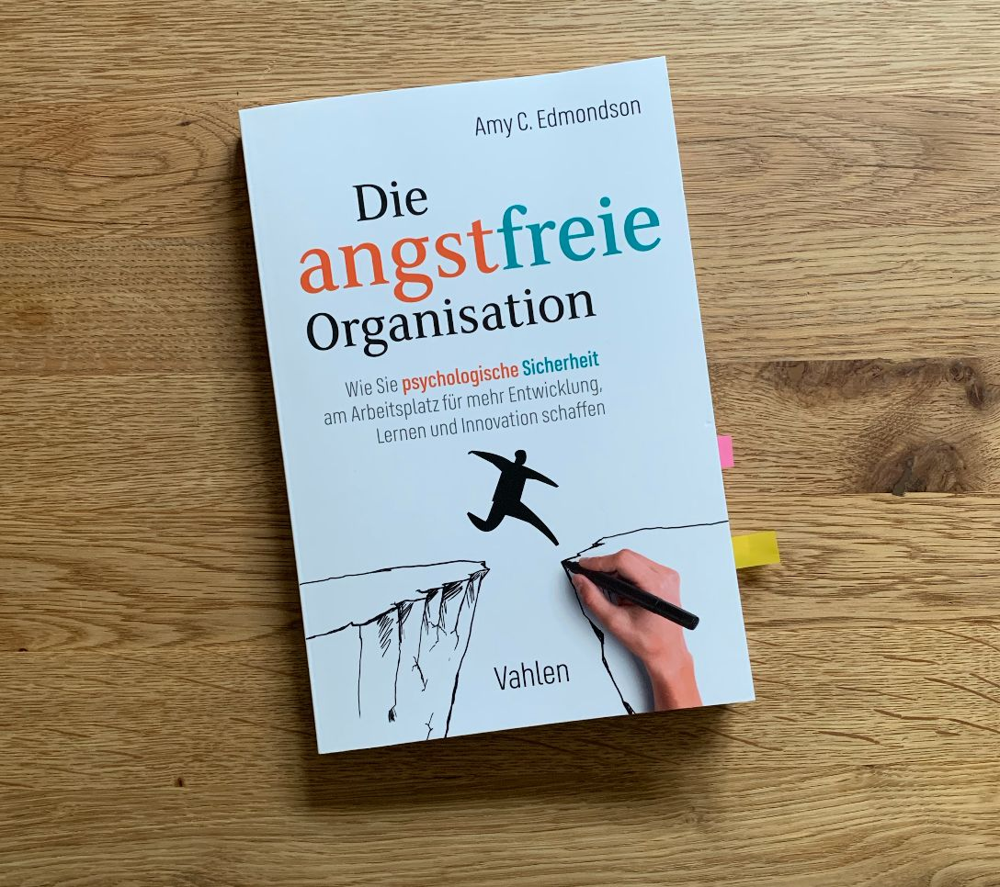

+++
title = "Psychologische Sicherheit"
date = "2022-11-08"
draft = false
pinned = false
tags = ["Arbeit", "NewWork", "Selbstmanagement", "Leadership"]
image = "pexels-antonio-florentini-3253786.jpg"
description = "Menschen tragen bei der Arbeit eine Maske. Das schreibt Frederic Laloux. Amy Edmondson spricht von psychologischer Sicherheit, damit Menschen bei der Arbeit sich selbst sein können. Warum ändert sich so wenig, wenn wir so viel darüber wissen? "
footnotes = "[Das Buch Reinventing Organizations gibt es übrigens auch in etwas vereinfachter und visualisierter Form](https://www.exlibris.ch/de/buecher-buch/deutschsprachige-buecher/frederic-laloux/reinventing-organizations-visuell/id/9783800652853/)\\\n\\\nTitelbild: Pexels, Foto von [Antonio Florentini ](https://www.pexels.com/de-de/foto/hockender-mann-der-nachts-schwarzen-kapuzenpulli-tragt-3253786/)"
+++
## Psychologische Sicherheit

\
Psychologische was? Psychologische Sicherheit ist wahrscheinlich etwas, das sich alle wünschen. Möchten wir nicht alle bei der Arbeit uns selbst sein können? Keine Maske tragen, keine Spielchen spielen. Was wäre, wenn wir uns einfach ganz einbringen können?  

Warum bringen wir uns nicht als ganze Menschen ein? Ein kurzer Ausschnitt aus dem [Buch Reinventing Organizations von Frederic Laloux](https://www.exlibris.ch/de/buecher-buch/deutschsprachige-buecher/frederic-laloux/reinventing-organizations/id/9783800649136/): 

*“Warum lassen wir so viele Aspekte unseres Seins zurück, wenn wir zur Arbeit gehen? Es sind Ängste, die hier zusammenwirken, wobei die Mitarbeiter und die Organisation in gleicher Weise diese Angst aufrechterhalten. Die Organisationen haben Angst, dass die Dinge ausser Kontrolle geraten könnten, wenn die Mitarbeiter ihr ganzes Selbst in die Arbeit bringen – ihre Stimmungen, Eigenarten und Alltagskleider. In Armeen weiss man seit Langem, dass die Menschen leichter zu kontrollieren sind, wenn sie austauschbar werden. Die Mitarbeiter hingegeben haben Angst, dass sie Kritik und Spott ernten, wenn sie sich vollkommen zeigen und als eigenartig und fehl am Platz wahrgenommen werden. Man wird besser anerkannt, wenn man auf Nummer sicher geht und sein Selbst hinter einer professionellen Maske verbirgt.” (Laloux, Reinventing Organizations,  S. 144)* 

Wir tragen also eine «professionelle» Maske. Wer professionell ist, der oder die sollte keine Fehler machen und nicht eigenartig sein. Kreativ, wäre gut. Individuell, ja, aber nicht zu viel davon. Innovativ, ja, wenn es gerade gefragt ist. Fehler? Bitte nicht. Unangepasst? Naja, du kennst die Antwort.  

## **Perspektivenwechse**l 

### \
 \
**Fehler sind voll o.k.** 

Wie ist deine Haltung gegenüber Fehlern? Darfst du Fehler machen? Erlaubst du anderen Fehler zu machen? Gemeint sind hier nicht nur falsche Resultate, sondern auch «falsche» Aussagen und Gedanken. Erlaubst du dir deine Eigenarten? Erlaubst du anderen ihre Eigenarten? Viele schweigen lieber, anstatt etwas «Falsches» zu sagen. Oft halten wir uns zurück und unterdrücken unsere Individualität. 

Es passiert jeden Tag. Menschen teilen ihre Gedanken oder Ideen nicht, weil sie Angst vor negativen Konsequenzen haben. Mitarbeitende sehen Risiken oder Probleme und teilen es ihren Vorgesetzten nicht mit. Warum ist das so? 

Auch wenn oft von neuer Arbeit, von Innovation, von flachen Hierarchien oder einer offenen Kultur die Rede ist, sind wir noch sehr geprägt von der Vergangenheit. Die Arbeitskultur, in der Befehlen und Kontrollieren an der Tagesordnung war (ist), ist nicht nur noch stark in unseren Köpfen, sie ist Realität. Bereits in der Schule lernen wir, nach Möglichkeit keine falschen Antworten zu geben, weil diese gleich bewertet werden. Das hat Einfluss auf die Benotung, auf das Ansehen, auf mögliche Übertritte in andere Schulstufen. In der Arbeitswelt ist es nicht viel anders. Unsere Leistung (oder die gefühlte, interpretierte Leistung) hat Einfluss auf die Bewertung durch die Vorgesetzten, auf mögliche Beförderungen, auf den Lohn, … .  

Viele Mitarbeitende arbeiten (immer noch) mit einer Angst im Nacken etwas Falsches zu sagen, zu machen oder zu denken.  

Laloux schreibt, die Angst werde von beiden Seiten aufrechterhalten. Es haben also alle die Möglichkeit dazu beizutragen, der Angst weniger Raum zu geben. Du möchtest deinen Teil dazu beitragen? Dann findest du im Buch von Amy Edmondson Impulse.  

> «Psychologische Sicherheit wird im allgemeinen als eine Arbeitsatmosphäre bezeichnet, in der sich die Menschen ausdrücken und sich selbst sein können.»
>
>  *(Edmondson 2020)* 

Amy Edmondson beschreibt in ihrem [Buch «Die angstfreie Organisation»](https://www.exlibris.ch/de/buecher-buch/deutschsprachige-buecher/amy-c-edmondson/die-angstfreie-organisation/id/9783800660674/), welche positiven Auswirkungen psychologische Sicherheit auf die Arbeitsleistung und das Wohlbefinden der Mitarbeitenden hat.  

