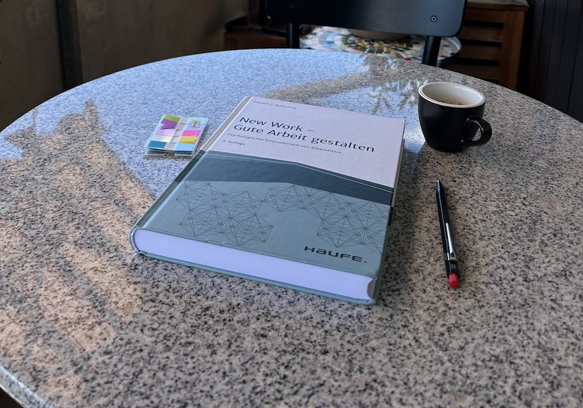
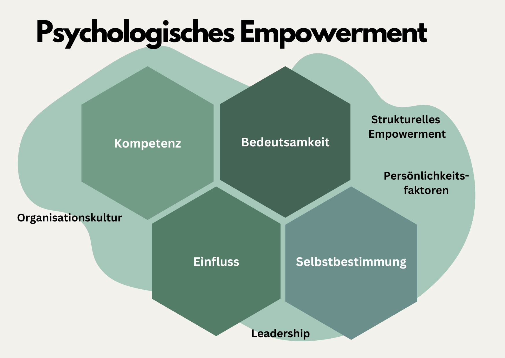

+++
title = "Neue Arbeit gestalten: Psychologisches Empowerment"
date = "2024-07-16"
draft = false
pinned = false
tags = ["CAS", "NewWork", "Organisationsentwicklung"]
image = "img_0095.jpg"
description = "Gedanken zu neuer Arbeit (New Work) und psychologischem Empowerment."
footnotes = "[📘New Work - Gute Arbeit gestalten, Psychologisches Empowerment von Mitarbeitern, Carsten Schermuly](https://www.exlibris.ch/de/buecher-buch/deutschsprachige-buecher/carsten-c-schermuly/new-work-gute-arbeit-gestalten/id/9783648150023/)\n\n[📘](https://www.exlibris.ch/de/buecher-buch/deutschsprachige-buecher/carsten-c-schermuly/new-work-gute-arbeit-gestalten/id/9783648150023/)[Work Survive Balance, Warum die Zukunft der Arbeit die Zukunft unserer Erde ist, Hans Rusinek](https://www.exlibris.ch/de/buecher-buch/deutschsprachige-buecher/hans-rusinek/work-survive-balance/id/9783451399657/)\n\n[📘](https://www.exlibris.ch/de/buecher-buch/deutschsprachige-buecher/carsten-c-schermuly/new-work-gute-arbeit-gestalten/id/9783648150023/)[Psychologie des Lebenssinns, Tatjana Schnell](https://www.exlibris.ch/de/buecher-buch/e-books-deutsch/tatjana-schnell/psychologie-des-lebenssinns/id/9783662489222/)\n\n📺[Work Awsome '23: New Work Dystopia](<Work Awesome '23: New Work Dystopia>)\n\nTitelbild: Sandra Zaugg"
+++
## Einleitende Gedanken

Gute Arbeit beschäftigt mich wohl bereits, seit ich ein Kind oder Jugendlicher war. Menschen in meiner Familie hatten ihren Arbeitsplatz oder einen Teil davon dort, wo ich wohnte. Zudem waren immer Bauernhöfe um mich herum. Arbeit war immer ein Bestandteil meines Lebens (wenn damals auch nur als Beobachter) und somit auch die schlechten oder weniger hilfreichen Themen. Dann kam mein eigener Einstieg in die Arbeitswelt und ich erlebte früh, wie sich eine schlechte Arbeits- und Führungskultur auf Menschen auswirken können. Irgendwann begann ich, selbst nach Lösungen zu suchen. Auf diesem Weg, der andauert, begegnete mir auch New Work. Mit diesem Trendbegriff habe ich bereits verschiedene Beziehungsphasen durchlebt. 

Was ist New Work? Sind es die Gedanken von Frithjof Bergmann? Sind es Homeoffice und Coworking Spaces oder neue Formen der Zusammenarbeit wie zum Beispiel Holokratie? Unter New Work wird vieles verstanden und umgesetzt. Manchmal ist die Beschreibung «New Work» nichts anderes als eine schöne Schleife oder Verpackung, um alte oder wenig sinnvolle und schlecht durchdachte Massnahmen und Gedanken. 

## **Neue Arbeit** 

Unter neuer Arbeit wird viel verstanden. Veränderungen lassen sich vermutlich unter «New Work» besonders gut verkaufen oder einfordern. Dabei, so denke ich zumindest, sind neue Formen der (Zusammen-) Arbeit kein Luxus, sondern nötig. 

Man fokussiert in diesem Zusammenhang oft auf die «Wissensarbeiter». Diese sitzen meistens in Büros und arbeiten vor allem mit dem Kopf. Ich habe den Eindruck, dass auch New Work Massnahmen ganz oft auf diese Menschen abzielen. Dabei ist es wichtig, gute Arbeit für alle zu gestalten. Ich schweife etwas vom Thema ab, ergänze noch ein paar Worte aus dem Buch von Hans Rusinek (vielleicht etwas aus dem Kontext gerissen und für mich doch passend), bevor ich auf das eigentliche Thema komme. 

> «Manchmal scheint es mir, als würden wir nur Kopfarbeit als wirklich tolle Arbeit ansehen, und die, die mit Hand oder Herz arbeiten, wären einfach nur solche Menschen, bei denen es vom Kopf her nicht gereicht hat. Wir verdrängen – wenn nicht gerade Pandemie ist -, wie aufgeschmissen wir ohne sie wären. Betreiben also Wissensvermeidungsarbeit.» 
>
> *Hans Rusinek, Work Survice Balance, S. 125*

## Psychologisches Empowerment

In seinem Buch New Work – Gute Arbeit gestalten, schreibt Carsten Schermuly über psychologisches Empowerment. Diese Thematik beschäftigt mich bereits länger und im Rahmen meines CAS Organisationsentwicklung und Change Leadership habe ich mich vertiefter damit auseinandergesetzt. Hier gebe ich einen sehr kurzen Einblick. Für eine umfassende Auseinandersetzung empfehle ich das Buch. 

> «Die Organisationsstrukturen und das strukturelle Empowerment kann man als die Hardware eines Unternehmens bezeichnen. Die Psychologie und das psychologische Empowerment sind die Software, die auf der Hardware laufen. Sie kennen das selbst: Die Hardware ist wichtig, aber ohne Software oder mit einer nicht passenden Software können Sie nicht arbeiten»  
>
> *Carsten Schermuly, New Work – Gute Arbeit gestalten, S. 59*

 Um das Bild etwas umfassender zu zeichnen, schauen wir noch kurz auf das strukturelle Empowerment.

## Strukturelles Empowerment

Beim strukturellen Empowerment geht es darum, den Fokus auf die Organisation und die Organisationsstrukturen zu legen. Es geht also (noch) nicht wirklich um die Menschen. In der Vergangenheit wurde vor allem auf die Veränderung dieser Strukturen und weniger auf die Menschen in diesen Strukturen fokussiert. Hier kommt das psychologische Empowerment ins Spiel und darum geht es eigentlich in diesem Beitrag. 

## Psychologisches Empowerment

Hier geht es um die Menschen. Es geht um ihr subjektives Erleben und Bewerten ihrer Arbeit. Dieses kann man anhand von vier Elementen beschreiben und messen(!). Psychologisches Empowerment ist messbar (dazu mehr im Buch). 

### Die vier Facetten 

* Kompetenz
* Bedeutsamkeit
* Einfluss
* Selbstbestimmung

### Kompetenz

Passen die eigenen Kompetenzen zu den Anforderungen im Beruf? Sind sie zu hoch oder fehlen sie? Das Erleben von Kompetenz ist eine dieser vier Facetten. Hier geht es nicht nur um fachliche, sondern auch um soziale, methodische und personale Kompetenzen (Schermuly 2021).

### **Bedeutsamkeit**

>  «In der Arbeit erkenne ich mich in dem, was ich mache, die Arbeit wird zu einem stützenden Teil meiner Identität, die Arbeit baut eine Beziehung zwischen mir und der Welt auf, die mir das Gefühl gibt, nicht grundlos zu existieren.» 
>
> *Hans Rusinek, Work Survice Balance, S. 123*

Fühlt sich das, was du tust, bedeutsam an? Empfindest du bei dem, was du tust Sinn? Die Frage ist sicher nicht immer einfach zu beantworten. Bei der Wahrnehmung von Bedeutsamkeit habe die Arbeit über alle Kulturen und Altersstufen hinweg einen Einfluss auf die Lebenszufriedenheit (Schermuly 2021).

Vor vier Jahren habe ich mich intensiv mit dem Sinnerleben in der Arbeit beschäftigt. Auch dort spielt das Empfinden von Bedeutsamkeit eine wichtige Rolle. In der Sinnforschung spricht man bei der Sinnerfüllung von der Erfahrung von Sinnhaftigkeit. Diese ist eine «\[…](meist unbewusste) Bewertung des eigenen Lebens als kohärent, bedeutsam, orientiert und zugehörig» (Schnell 2016). 

### Einfluss

Hast du das Gefühl, du hast einen Einfluss auf deine Arbeit? Hast du den Eindruck, dass du deine Arbeit und die Resultate beeinflussen kannst? Hier geht es ebenfalls (wie bei allen vier Facetten) um die eigene Wahrnehmung. Menschen haben dann den Eindruck, viel Einfluss zu haben, wenn sie denken, dass sie Ergebnisse (strategische, operative, administrative) beeinflussen können (Schermuly 2021).

### Selbstbestimmung

Wann und in welcher Reihenfolge kannst du deine Arbeit machen? Selbstbestimmung erleben Menschen dann, wenn sie Autonomie beim Ausführen ihrer Arbeit erleben (Schermuly 2021)

### Abschliessende Gedanken

Dies ist nur ein kurzer und einfacher Einblick in das psychologische Empowerment. Er soll und darf inspirieren, sich vertieft mit dieser Thematik und den Möglichkeiten, neue und gute Arbeit zu gestalten, auseinanderzusetzen oder das eigene Empfinden von Empowerment bei der Arbeit zu reflektieren. Was ich hier nicht beschrieben habe, sind die positiven Auswirkungen auf die Mitarbeitenden (u. a. Flow, Wohlbefinden) und die Organisation (u. a. Mitarbeiterbindung, Innovation). Beim psychologischen Empowerment geht es um das Empfinden der Mitarbeitenden. Das heisst, zwei Personen im selben Unternehmen, im selben Beruf können eine (ganz) unterschiedliche Wahrnehmung haben. Auf dieses Erleben haben die Persönlichkeit, Haltung etc. der Person einen wesentlichen Einfluss. Damit dieses Erleben aber überhaupt möglich und spürbar wird, sind Rahmenbedingungen wie die Organisationskultur, strukturelles Empowerment, Führung etc. nötig. So habe ich das zumindest verstanden. 

In der folgenden Grafik habe ich versucht, das zu visualisieren.  

