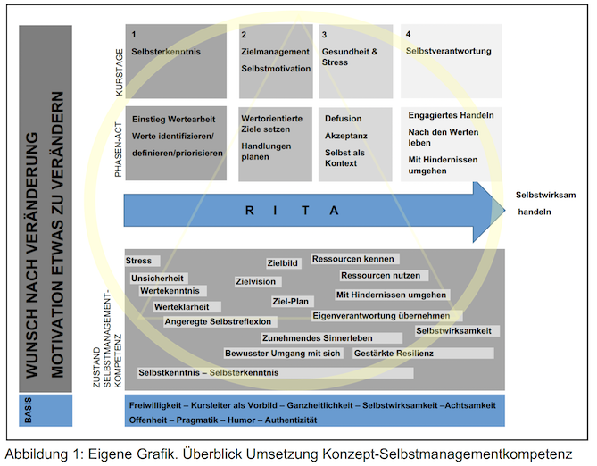

+++
title = "Selbstmanagement"
date = "2022-01-24"
draft = false
pinned = false
image = "bildschirmfoto-2022-01-24-um-08.54.06.png"
description = "Wenn Selbstmanagement ein Thema ist, dann oft sehr eng verbunden mit Zeitmanagement, Arbeitstechnik und Selbstorganisation. Es ist für mich, wie bei so vielen Themen, etwas Ärgerliches. Denn Selbstmanagement ist so viel mehr als das. Vor einiger Zeit habe ich ein Bildungskonzept über Selbstmanagement geschrieben, mit dem Titel: Selbstmanagement - Eine Kernkompetenz der Zukunft. Mit Orientierung und Gelassenheit die eigene berufliche Zukunft gestalten."
footnotes = "Schubiger A. (2016) S 35-44\n\nGraf A. (2012) Selbstmanagement-Kompetenz in Organisationenst rken. Leistung, Wohlbefinden und Balance als Herausforderung, 2. überarbeitete Auflage 2019, Springer Gabler, Wiesbaden\n\nFrankl V. E. (1977), Das Leiden am sinnlosen Leben: Psychotherapie für heute, überarbeitete Neuausgabe 2013, Kreuz Verlag, Freiburg im Breisgau\n\nHarris Russ (2011), ACT leicht gemacht: Ein grundlegender Leitfaden für die Praxis der Akzeptanz- und Commitment-Therapie, Arbor Verlag GmbH, Freiburg \n\nLöhmer C., Standhardt R. (2015), Die Kunst, sich selbst und eine Gruppe zu leiten, Einführung in die Themenzentrierte Interaktion, 2. Auflage 2018, Klett-Cotta, Stuttgart"
+++
Wenn Selbstmanagement ein Thema ist, dann oft sehr eng verbunden mit Zeitmanagement, Arbeitstechnik und Selbstorganisation. Es ist für mich, wie bei so vielen Themen, etwas Ärgerliches. Denn Selbstmanagement ist so viel mehr als das. Vor einiger Zeit habe ich ein Bildungskonzept über Selbstmanagement geschrieben, mit dem Titel: *Selbstmanagement - Eine Kernkompetenz der Zukunft. Mit Orientierung und Gelassenheit die eigene berufliche Zukunft gestalten.* Sehr oft oder meistens werden auch in der Erwachsenenbildung Lernziele vorgegeben, die «Tiefe» des Lernstoffes in Taxonomiestufen angegeben und alles darauf ausgerichtet. Es geht dann darum, das Lernen so zu verpacken, dass es am Ende zum gewünschte Resultat führt, also zu einem guten Abschluss. Auch kleine und einfache Kurse sind oft so strukturiert, dass eine\\*r spricht und die anderen zuhören. Natürlich ums modern zu machen, die Teilnehmer\\*innen-Orientierung in der Vordergrund zu stellen, macht man noch ein paar Gruppenarbeiten, vielleicht ein, zwei Reflexionen und gut. Natürlich, das mag kritisch klingen und auch etwas abwertend. Die Realität sieht nur leider ganz oft so aus. So auch dann, wenn es um Selbstmanagement (klingt irgendwie auch leistungsorientiert) geht.

Setzt man sich aber vertieft damit auseinander, dann findet man zum Beispiel das [Selbstmanagement-Kompetenzmodell mit 8 Bausteinen von Anita Graf](https://www.weka.ch/themen/fuehrung-kompetenzen/selbstmanagement/selbst-und-zeitmanagement/article/selbstmanagement-kompetenz-modell-mit-8-bausteinen-im-ueberblick/). Dort finden sich mit Selbsterkenntnis, Beziehungsmanagement oder Selbstentwicklung Themen, die man nicht oft im Zusammenhang mit Weiterbildungen unter dem Deckel von Selbstmanagement findet. 

Natürlich hat mein Bildungskonzept auch viel mit mir und meiner Tätigkeit zu tun, lebt von meien Überzeugungen, Interpretiationen und Erfahrungen. In dieser Grafik findet sich der Kern des Konzepts und anhand dieser teile ich einige Gedanken dazu. Ist starte von unten nach oben. 

Als Basis dient die Wertehaltung von (damals noch unter dem Dach von entwicklungsfreiraum) mir. Ich sehe den oder die Kursleiter*innen immer als etwas Entscheidendes. Das trifft übrigens nicht nur auf Kursleitende, sondern auch auf Therapeutinnen, Ärzte, Coaches etc. zu. Um es mit dem Zitatausschnitt von Carl R. Rogers zu sagen: «Kein Ansatz, der sich auf Wissen, auf Training, auf die Annahme irgendeiner Lehre verlässt, kann auf Dauer von Nutzen sein. Haltung ist entscheidend, nicht Worte.»

Wenn man sich mir sich selbst auseinandersetzt, dann geht es um einen Prozess. Für diesen Prozess kann der Rahmen gegeben werden und mit Inhalten werden u. a. das Denken angeregt. Es geht um eine Auseinandersetzung mit sich. Die Theorie dient hier ledigtlich als Hilfe. Das funktioniert aber nur mit Motivation und Lust. Klar. Die Motivation und die Lust sind übrigens auch bei allen anderen Vorhaben enorm wichtig, nur blendet man das in der Bildung gerne aus. 

Weil eine «korrekte» Kursplanung auch eine Strukturierung braucht (sagen sie), kommt hier zur Kursstrukturierung das Modell RITA von *Schubiger* mit den vier Phasen zur Anwendung. 

**R** Ressourcen aktivieren

**I** Information verarbeiten

**T** Transfer anbahnen

**A** Auswerten

### **Kurstage**

Für diesen Kurs habe ich mich für vier Kurstage mit je einem Modul entschieden. Diese decken m. E. die wichtigen Elemente der Selbstmanagementkompetenz ab. Diese sind als Teil des Prozesses zu verstehen, denn persönliche Entwicklung ist immer genau das. Ein Prozess. Es geht dabei um das Anregen, allenfalls vertiefte Auseinandersetzen und Bilden einer Basis. Dabei spielt die Gruppe eine wesentliche Rolle. 

### Phasen der Akzeptanz- und Commitmenttherapie

Nun könnte man sich fragen, was denn eine Therapieform hier zu suchen hat. Für mich (und nicht nur mich), ist die ACT mehr als eine Therapieform, sondern lässt sich inder Abfolge (die nicht linear ist oder sein muss) als lebenspraktischer Ansatz nutzen. Dabei geht es um die (Er-)Kenntnis der eigenen Werte, sowie deren Priorisierung. Diese wiederum sollen für die eigenen Zieldefinition sowie deren Umsetzung (Engagiertes Handeln) genutzt werden. Dabei wird immer auch akzeptiert und ein Bewusstsein geschaffen, dass Hindernisse, unangenehme Gefühle etc. dazugehören. Hier möchte ich noch anmerken, dass zwischen vielen Konzepten so viele Ähnlichkeiten bestehen. Die ACT ist für mich das naheliegendste, beinhaltet aber doch auch so viele andere Anteile wie zum Beispiel Sinntheorie, -arbeit und Achtsamkeit. Es sind nicht nur die Verbindungen zwischen diesen Konzepten sondern auch die Widersprüche, in denen ich so viel Erkenntnis- und Entwicklungspotenzial sehe. Das gehört aber eigentlich gar nicht hier dazu. Es ist mir nur sehr wichtig. 

### **Persönlichkeitsentwicklung am Erleben in der Gruppe**

In leichtem Gelb findest du einen Kreis sowie ein Dreieck, welches zur Themenzentrierten Interaktion (TZI) von Ruth Cohn gehört. 

Dabei orientiere ich mich in dieser Planung an den Axiomen der Themenzentrierten Interaktion von Ruth Cohn. Da wir uns in der Arbeitswelt immer in einem System bewegen und immer auch abhängig von äusseren Einflüssen sind, wird auf das persönliche Lernen und Erleben an und in der Gruppe ein Fokus gelegt.

**Autonomie:** Der Mensch ist eine psycho-biologische Einheit. Er ist auch Teil des Universums. Er ist darum autonom und voneinander abhängig. Die Autonomie des Einzelnen ist umso grösser, je mehr er sich seiner Interdependenz mit allen und allem bewusst ist.

**Wertschätzung:** Achtung gebührt allem Lebendigem und seinem Wachstum und Vergehen. Respekt vor dem Wachstum bedingt bewertende Entscheidungen. Das Humane ist wertvoll, Inhumanes ist wertbedrohend.

**Grenzen erweitern:** Freie Entscheidungen geschehen innerhalb bedingender innerer und äusserer Grenzen. Eine Erweiterung dieser Grenzen ist möglich. 

### Ganzheitlichkeit

Damit dieses Lernen möglich wird, ist auf die dynamische Balance zwischen den vier Perspektiven Ich, Wir, Es, Globe zu achten.

**Ich:** subjektiv, pers nlich

**Es:** die Aufgabe, das Ziel

**Wir:** die Interaktion in der Gruppe

**Globe:** das Umfeld

Menschen und Organisationen halten sich gerne an konkrete Konzepte, Theorien, Ansätze und oft am liebsten an die Einfachen. So bleiben z. B. Selbstmanagement-Kurse ein Werkzeug zur Optimierung von leistungsbewussten Arbeiter*innen anstatt das zu werden, was sie sein könnten: Entwicklungsfreiräume für Menschen. Lesen wir Bücher von Frankl, Rogers, Cohn, Bergmann und vielen mehr, dann wissen wir, wie wir die (Arbeits- und Lern-) Welt menschlicher gestalten könnten. Man (wer auch immer das ist) will nur nicht. Denn so zu arbeiten würde auch immer heissen, sich vertieft mit sich, seiner Wertehaltung und dem Schmerz auseinanderzusetzen. Es würde heissen, Hierarchien lösen sich auf, wir könnten einander auf Augenhöhe begegnen und uns gegenseitig Entwicklung ermöglichen. Wäre langweilig. Oder?