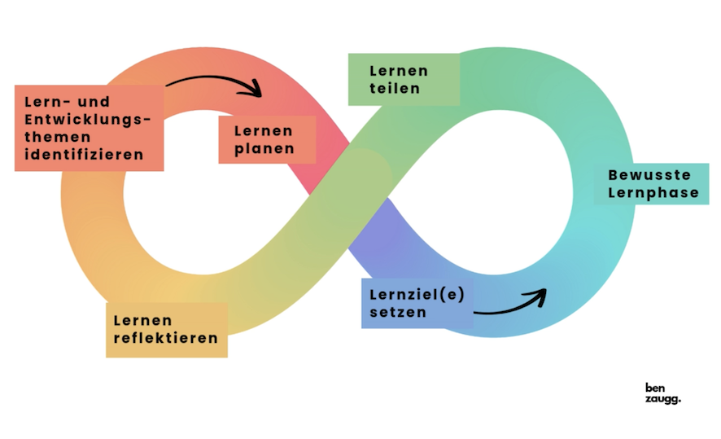
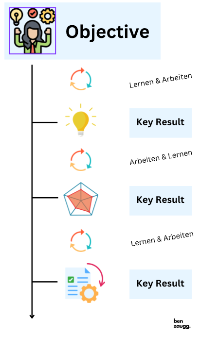
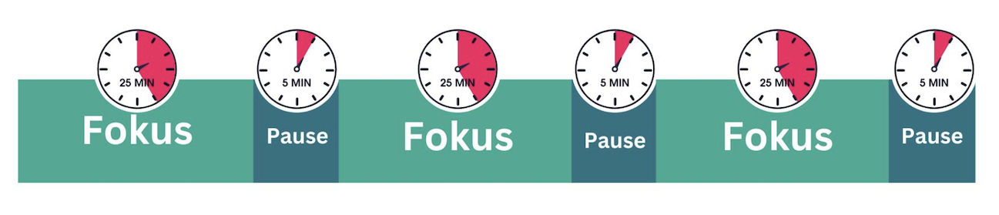
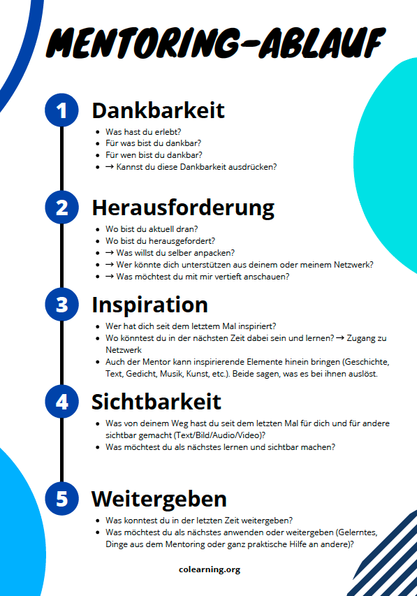

+++
title = "Selbstorganisiertes Lernen gestalten"
date = "2024-10-18"
draft = false
pinned = false
tags = ["CAS", "CAS-BI", "Personalentwicklung", "Lernen", "Bildung"]
image = "selbstorganisiertes-lernen.jpg"
description = "Hier findest du Tipps und Tricks, wie du dein Lernen für dich selbst und gemeinsam mit deinem Team gestalten kannst. Es geht darum, dein lebenslanges Lernen mit und bei der Arbeit zu gestalten."
footnotes = "Die Inhalte in diesem Beitrag sind Teil eines Konzepts, welches im Rahmen eines CAS-Moduls erstellt wurde. Die hier abgeblideten Inhalte wurden als Einstieg und Basis für eine Wissensmanagement und -Austausch Plattform (Confluence) erstellt, welche sich bei einer möglichen Praxisanwendung laufend kollaborativ mit Best Practices entwickeln kann und soll."
+++
## Einführung: Selbstorganisiertes Lernen gestalten

Hier findest du Tipps und Tricks, wie du dein Lernen für dich selbst und gemeinsam mit deinem Team gestalten kannst. Es geht darum, dein lebenslanges Lernen mit und bei der Arbeit zu gestalten. Du lernst, während du arbeitest «Learning by Doing» und im «Moment of Need», also dann, wenn du vor oder in einer (neuen) Herausforderung stehst. Du findest folgende Themen:



Vielleicht denkst du dir beim Thema Lernen, alles nur das nicht! Bei diesem Lernen hier geht es aber nicht darum, etwas tun zu müssen. Hier kannst du deine Lernprozesse selbst bestimmen, steuern und gestalten. Das ist zwar auch nicht immer einfach (vor allem weil uns die Erfahrung damit fehlt), aber es ist lernbar. Alles wichtige und nötige, um zu starten findest du hier. Lass dir Zeit, experimentiere und sei mutig. 

#### Selbstlernkompetenzen

Selbstgesteuertes Lernen braucht auch neue Kompetenzen, von denen wir viele nur wieder entdecken müssen und ausbauen können. Die Nutzung und Aneignung dieser Lernkompetenzen ist als Prozess zu verstehen. Zudem ist die Liste weder verbindlich noch abschliessend.

* Lernfelder identifizieren & priorisieren
* Lernthemen planen
* Lernen gemeinsam mit anderen (Teamlernen, Peer-Learning, Social Learning)
* Lernprozesse reflektieren
* (Eigene) Kompetenzen einschätzen können
* Lernprozess, Erkenntnisse und Transferthemen für andere aufbereiten können.

#### Lernprozess

Ein geplanter selbstorganisierter Kompetenzentwicklungs- und Lernprozess folgt diesem Ablauf: 

1. Lern- und Entwicklungsthemen identifizieren
2. Lernen planen
3. Lernziel(e) setzen
4. Bewusste Lernphase
5. Lernen reflektieren
6. Lernen teilen

ℹ️Am besten geht selbstgesteuertes Lernen übrigens gemeinsam mit anderen!

Selbstgesteuertes Lernen heisst nicht, dass du alleine unterwegs bist. Es geht vielmehr darum, dass dein Lernen zu dir, deinen Zielen und deiner Arbeit passt. Suche passende Lernpartner in deinem Team oder deiner Organisation.





Den eigenen Lernbedarf zu erkennen und klar zu benennen, ist oft nicht leicht. Ein vorausschauender Blick kann dabei sehr hilfreich sein. Du kannst dich an aktuellen Anforderungen deiner Arbeit orientieren oder längerfristige Ziele ins Auge fassen – beides ist möglich und schliesst sich nicht aus. Die folgenden Fragen können dir dabei helfen, deinen Lernbedarf besser einzuordnen. Es ist nicht nötig, alle zu beantworten – wähle die Fragen, die für dich am relevantesten sind:

* Welche Projekte/Themen stehen in den nächsten Wochen/Monaten an? Welche Kompetenzen benötige ich dort?
* Wie hat sich meine Rolle in den letzten Jahren entwickelt? Wohin könnte sie sich entwickeln? Welche Kompetenzen benötige ich dafür?
* Wo sind meine Stärken und Kompetenzen? Welche möchte oder sollte ich ausbauen?
* Welche Schwächen möchte ich angehen?
* Wohin möchte ich mich (ganz grundsätzlich) entwickeln?
* In welche Rollen kann/sollte ich mich entwickeln?
* Wie verändert sich mein Arbeitsumfeld? Was passiert draussen auf dem Markt?

ℹ️ Zusammen gehts besser. Bei der Beantwortung dieser Fragen können dir Menschen in deinem Umfeld helfen. Sprich mit deiner/deinem Vorgesetzten, Teamkolleginnen und -kollegen, der Personalentwicklung oder einem Coach.





Unsere Arbeit bietet eine Menge an Lerngelegenheiten und wir lernen sogar, dabei nehmen dies meistens nur nicht bewusst wahr. Deshalb lohnt es sich, zu Beginn eines Lernzyklus dein Lernen bewusst zu planen. Dazu gehören nicht nur die Lernzeiten, sondern auch Lernorte, Lernmaterialien etc. Folgende Fragen können dir helfen, einen Überblick zu verschaffen und diese Themen in deine Planung einzubeziehen. 

* Wo gibt es in meinem Arbeitsalltag Lerngelegenheiten?
* Wie sieht für mich die ideale Lernumgebung aus?
* Mit welchen «Materialien» (Bücher, Videos, Menschen, Podcasts, Artikeln, …) lerne ich am liebsten?
* Welche Tageszeiten/Wochentage passen für mich gut als Lernzeit?
* Wie viel Zeit kann ich pro Tag/Woche/Monat investieren (realistisch)?
* Welches Lernziel motiviert mich? Wie bleibe ich fokussiert? Wie bleibe ich motiviert?
* Was kann ich allein? Wo will oder benötige ich Hilfe/Inspiration?
* Wo finde ich diese Hilfe/Inspiration?
* Wann plane ich meine Lernzeiten? 
* Wie und wen informiere ich über meine Lernzeiten?

#### Lernzeiten planen

In unserem (Arbeits-)Alltag gehen geplante Lernzeiten gerne unter. Gerade wenn wir bei der Arbeit viel zu tun haben, streichen wir die geplanten Lernzeiten schnell raus, da sie im ersten Moment nicht so wichtig und wenig produktiv scheinen. Diese konsequent zu nutzen ist jedoch für selbstorganisiertes Lernen wichtig.

ℹ️ Wenn du für dich allein lernst, plane Lernzeiten in deinem Kalender ein und blockiere diese verbindlich. Am besten informierst du deine:n Vorgesetzte:n und dein Team darüber.

#### Lernenzeiten im und als Team

Es kann hilfreich sein, als oder im Team gemeinsame Lernzeiten zu definieren. Das heisst nicht, dass alle gemeinsam das gleiche lernen oder am selben Ort sein müssen. Ihr könnt euch gemeinsam ein Sitzungszimmer reservieren und jede:r arbeitet ohne Ablenkung an seinem/ihrem Lernthema. Eine andere Möglichkeit ist, dass ihr euch in einem virtuellen Raum trefft und ebenfalls jede:r am eigenen Thema arbeitet. So entsteht eine Verbindlichkeit und ein Gefühl gemeinsam unterwegs zu sein.  

⚠️ Achte darauf, die Lernzeiten wirklich als Lernzeiten zu nutzen. Schalte alle Ablenkungen für diese Zeit aus.





Ziele sind wichtig. Sie bieten Orientierung, helfen uns dranzubleiben und machen das, was wir tun, messbar. Die eigenen Ziele festzulegen ist manchmal herausfordernder, als sie von aussen vorgesetzt zu bekommen. Diese Methoden können dir helfen, deine Ziele festzulegen. Probiere aus, was für dich am besten passt. 

#### **SMART-Zielformulierung**

Eine Möglichkeit deine Ziele zu definieren ist die Smart-Methode. Dabei formulierst du das Ziel so genau wie möglich. Die Wahrscheinlichkeit dein Ziel zu erreichen, erhöht sich so und du kannst das Erreichen überprüfen. Smart steht für: 

Spezifisch - Messbar - Attraktiv - Realitstisch – Terminiert

* Spezifisch = Du beschreibst dein Ziel konkret und detailliert.
* Messbar = Die Erreichung des Ziels kann gemessen oder beurteilt werden. Qualitative und/oder quantitative Kriterien. 
* Attraktiv = Es ist ein für dich attraktives Ziel und es ist angemessen in Grösse und Umfang. 
* Realistisch = Du kannst das Ziel mit eigener Kraft und deinen Ressourcen (Umfeld, Materialien, Finanzen, Zeit, …) erreichen.
* Terminiert = Du legst einen genauen Zeitrahmen fest, bis wann du dein Ziel erreichen willst.  

#### **Zielsetzung mit OKR**

Eine andere Möglichkeit ist die Zieldefinition mit der OKR. Die detaillierte Beschreibung hierzu liefert ChatGPT: «OKR (Objectives and Key Results) ist eine Managementmethode zur Zielsetzung, die Unternehmen und Teams hilft, ihre Ziele klar zu definieren und diese mit messbaren Ergebnissen zu verknüpfen. OKR besteht aus zwei Hauptkomponenten:

1. **Objective (Ziel)**: Ein qualitativ formuliertes, inspirierendes Ziel, das den gewünschten Zustand in der Zukunft beschreibt. Es ist ehrgeizig, motivierend und gibt die Richtung vor, in die sich das Team oder die Organisation bewegen will. Ein Objective beantwortet die Frage: *Was wollen wir erreichen?*
2. **Key Results (Schlüsselergebnisse)**: Diese sind quantitativ messbare Ergebnisse, die zeigen, ob das Objective erreicht wird. Sie beschreiben die konkreten, überprüfbaren Schritte, die notwendig sind, um das Ziel zu erreichen. Key Results beantworten die Frage: *Wie wissen wir, dass wir unser Ziel erreicht haben?*

Typischerweise setzt sich ein OKR aus einem Objective und etwa 3 bis 5 Key Results zusammen. Die Methode fördert Transparenz und Fokus, da die Ziele und Fortschritte für alle im Team oder der Organisation sichtbar gemacht werden. Dadurch wird die Zusammenarbeit gefördert und alle arbeiten auf gemeinsame Prioritäten hin. OKRs werden häufig in Quartalszyklen definiert und evaluiert, was eine schnelle Anpassung an Veränderungen ermöglicht. Die Methode wurde von Intel in den 1970er Jahren entwickelt und später von Unternehmen wie Google populär gemacht, um strategische Ziele in dynamischen Umfeldern besser verfolgen und umsetzen zu können.»

Weitere Informationen und Anleitungen wie du deine OKR definieren kannst, findest du auf diesen Seiten:

[OKRs: Der ultimative Leitfaden zu Objectives and Key Results](https://www.atlassian.com/de/agile/agile-at-scale/okr#:~:text=OKR%20ist%20eine%20g%C3%A4ngige%20Managementstrategie,in%20Bezug%20auf%20messbare%20Ziele), bei atlassian.com       

[Objectives and Key Results Methode (OKR),](https://miro.com/de/strategische-planung/was-ist-ein-okr/?utm_source=google&utm_medium=cpc&utm_campaign=S%7CGOO%7CNB%7CCH%7CDE-DE%7CPareto-DSA&utm_adgroup=&adgroupid=134940308334&utm_custom=17125979244&utm_content=596042282300&utm_term=&matchtype=&device=c&location=9187847&gad_source=1&gbraid=0AAAAACtKBmm6A_-Yu4u2iuDcwmD69-ocQ&gclid=CjwKCAjwmaO4BhAhEiwA5p4YL8_1c33sezAJLdUBRP0Yh4QoziDWZpytiO55blPWyZc5mbJEzfq2GBoC6j4QAvD_BwE) bei miro.com 

⚠️ Die Arbeit mit OKR kann inspirierender sein. Durch die Definition zum gewünschten Zielzustand setzt du dir einen Orientierungspunkt und arbeitest Schritt für Schritt in diese Richtung. Erfolge werden schneller sichtbar.





Die Reflexion deiner Lern- und Entwicklungsprozesse ist ein zentraler Bestandteil des selbstorganisierten Lernens. Sie hilft dir dabei, deinen aktuellen Stand zu erkennen, dir deine Lernerfahrungen bewusst zu machen und Erfolge zu feiern. Dies kann am Ende oder zu Beginn eines Arbeitstages, nach einem Lernzyklus oder einem bestimmten Ereignis stattfinden. Wichtig ist, dass du deine Erkenntnisse regelmässig schriftlich festhältst, beispielsweise in einem Lerntagebuch. So behältst du den Überblick über deinen Fortschritt und kannst deine Lernprozesse langfristig weiterentwickeln. Um dich bei der Reflexion zu unterstützen, können dir die folgenden Fragen als Leitfaden dienen:

* Was habe ich heute/diese Woche gelernt?
* Was kann oder weiss ich, was ich vor 24h oder 5 Tagen noch nicht konnte/wusste?
* Konnte ich jemandem mit meinem Wissen/Können helfen? 
* Was war es? Wie habe ich das gemacht? 
* Welche Kompetenzen habe ich dabei eingesetzt? 
* Habe ich dabei selbst etwas gelernt?
* Habe ich selbst Hilfe benötigt? Bei was?
* Wie und wo habe ich mir Hilfe gesucht? 
* Was kann oder weiss ich jetzt mehr? 
* Ist etwas anders?
* Gibt es Dinge/Themen, die ich jetzt besser verstehe, klarer sehe oder vom Wissen zum Anwenden gekommen bin oder umgekehrt?
* Woher kommt das Gelernte? Hat es einen direkten Arbeitsbezug oder kommt es aus einer Weiterbildung?





Die Reflexion deiner Lern- und Entwicklungsprozesse ist ein wichtiger Bestandteil des selbstorganisierten Lernens. Sie hilft dir, deinen aktuellen Stand zu überprüfen, dir deine Lernerlebnisse bewusst zu machen und Erfolge zu feiern. Dies kann am Ende oder zu Beginn eines Arbeitstages, nach einem Lernzyklus oder einer bestimmten Lernphase stattfinden. Idealerweise hältst du deine Gedanken regelmässig schriftlich fest, zum Beispiel in einem Lerntagebuch. Wenn du dein Lernen sichtbar machst, lässt du andere an deinen Lernprozessen teilhaben und ermöglichst es ihnen, mit und von dir zu lernen. Gleichzeitig kannst du von den Fragen und Erkenntnissen anderer profitieren und möglicherweise neue Lernpartner finden, die an ähnlichen Themen arbeiten. Auf diese Weise leistest du nicht nur einen Beitrag zu deiner persönlichen Entwicklung, sondern trägst auch zum organisationalen Wissensmanagement bei. Im Laufe der Zeit entsteht so ein wertvolles Lern- und Kompetenzportfolio, das sowohl dir als auch der Organisation zugutekommt.

#### Möglichkeiten, dein Lernen sichtbar zu machen

Es gibt viele verschiedene Möglichkeiten dein Lernen sichtbar zu machen. Im Folgenden findest du eine Auswahl.

**Lernblog:** Du schreibst einen Blog. Du kannst Fachwissen weitergeben, Einblicke in deinen Lernprozess geben oder Fragen teilen. Dieser ist Reflexion, Lernportfolio und Wissensmanagement gleichzeitig. 

**Podcast:** Du machst einen Podcast. Du kannst Fachwissen weitergeben, Einblicke in deinen Lernprozess geben, Fragen teilen oder Interviews (z. B. mit Expertinnen) führen.

**Miro Board:** Du kannst zum Beispiel ein Mindmap erstellen, welches du öffentlich machst und so dein Lernen mit anderen Teilen. Zudem gibts dort etliche andere Möglichkeiten, wie das Teilen von Links, Videos, Bildern etc.

**Padlet:** padlet.com bietet dir eine digitale Pinnwand, auf der du deine Lernthemen, Erkenntnisse, Fragen und Lernmaterial abbilden kannst. 

**Social Media:** Du schreibst regelmässig Linkedin-Posts oder machst Videos/Fotos z. B. für Instagram oder TikTok.

Die folgenden Fragen, die du für dich beliebig ergänzen kannst, helfen dir beim sichtbar machen deines Lernens. Du kannst alle oder nur die für dich passenden beantworten. 

* Was von dem, was ich gelernt habe, möchte ich aufschreiben, zeichnen, aufzeichnen (Audio/Video)?
* Woran möchte ich mich erinnern?
* Was könnte anderen helfen? Was könnte für andere interessant sein?
* Worauf will ich in Zukunft achten? Was mache ich (nun) anders?
* Was von dem, was ich gelernt habe, passt du meinen Jahreszielen/Lernzielen?
* Worauf bin ich besonders Stolz oder habe besonders Freude?

**Dein Lernprozess strukturiert teilen: Ein Leitfaden für den Anfang**

Diese Struktur kann eine erste Hilfe sein, dein Lernen zum Teilen aufzubereiten. Du kannst sie zum Beginn nutzen, für dich anpassen oder eine ganz andere wählen. 

1. Das war meine Herausforderung.
2. Das weiss/kann ich jetzt besser.
3. Diese Fragen sind noch offen.
4. Mit diesem Thema/Problem will ich mich als nächstes beschäftigen. 

ℹ️Das eigene Lernen sichtbar zu machen kann zu Beginn eine Herausforderung sein, da wir sonst meistens im Stillen lernen. Auch das kann Teil deines Lern- und Entwicklungsprozesses sein. Probier dich aus, experimentiere und finde heraus, was für dich am besten passt.

#### Lernen im Team sichtbar machen: Lernboard, Lernbox, Lernglas

Ein erster Schritt um die Lernkultur im Team zu fördern und sich die kleinen und alltäglichen Lernerlebnisse bewusst zu machen, ist das Erkennen, Benennen und Teilen von Lernen. 

**Lernen im Team sichtbar machen: Schritt-für-Schritt Anleitung und positive Effekte**

1. Für euer Team stellt ihr irgendwo eine Box oder ein Glas auf und dort sammelt ihr eure Lernerlebnisse. Ihr könnte das auch mit einer physischen oder [digitalen Pinnwand](https://newlearning4work.atlassian.net/wiki/spaces/Kompetenze/pages/2949170 "https\://newlearning4work.atlassian.net/wiki/spaces/Kompetenze/pages/2949170") machen. 
2. Du wirst oder machst dir bewusst, was du gerade gelernt hast. Das kann und darf etwas ganz kleines und Alltägliches sein. 
3. Du schreibst dein Lernerlebnis, deine Erkenntnis, dein gelöstes Problem etc. auf einen Zettel und platzierst es im Glas, der Box oder der Pinnwand. 

**Positive Auswirkungen auf das Team und die Lernkultur:** 

* Ihr schafft ein (gemeinsames) Bewusstsein für euer Lernen im «Moment of Need» / «Learning by Doing».
* Es wird sichtbar, wie viel und wie oft im Arbeitsalltag und nebenbei gelernt wird.
* Ihr teilt eure (Lern-) Erfolge mit dem Team = Erfolge feiern im Alltag. 
* Lernen wird ein Teil euer (Zusammen-) Arbeit. 
* Die Lernkultur wird positiv beeinflusst. 

ℹ️Ihr könnte diese Lernmomente auch in eure Team-Meetings einbauen. Das kann bei einem Check-in/Check-out sein oder fix in den Traktanden stehen. Dabei muss es sich nicht um ein abgeschlossenes Lernen handeln. Es kann auch eine aktuelle Herausforderung oder Fragestellung sein.





Es gibt etliche Tools, die dein Lernen unterstützen können. Hier findest du eine Auswahl an Tools und Möglichkeiten, sie anzuwenden. 

* [miro Board](https://newlearning4work.atlassian.net/wiki/home#miro-Board)
* [padlet.com](https://newlearning4work.atlassian.net/wiki/home#padlet.com)

**[miro Board](http://miro.com/ "http\://miro.com")**

Vom Mindmap über Kanban-Boards bis zu deinem eigenen Lernboard kannst du hier deine Ideen, Gedanken, Lernprozesse und Kompetenzentwicklung planen, durchführen und abbilden. Das kannst du für dich alleine tun, mit anderen Teilen oder ihr arbeitet als Team daran. 

**Beispiel 1: Mindmap und Lerninhalten zu einem CAS im Bereich Personal- und Organisationsentwicklung.**

<iframe width="768" height="432" src="https://miro.com/app/live-embed/uXjVKs2y8Fs=/?moveToViewport=-7105,-4030,12632,6434&embedId=58733007276" frameborder="0" scrolling="no" allow="fullscreen; clipboard-read; clipboard-write" allowfullscreen></iframe>

**Beispiel 2: Eine Lernboard-Vorlage als Inspiration**

<iframe width="768" height="432" src="https://miro.com/app/live-embed/uXjVLU6-uTg=/?moveToViewport=-3299,-431,7935,4042&embedId=129550988990" frameborder="0" scrolling="no" allow="fullscreen; clipboard-read; clipboard-write" allowfullscreen></iframe>

**[padlet.com](https://www.padlet.com/ "https\://www.padlet.com")**

Erstellen von digitalen Pinnwänden in unterschiedlichen Stilen. Zum Beispiel als Timeline zur Planung von Lernschritten oder -Themen, als Ort der Sammlung von Links, Ideen und Inspirationen. Am besten probierst du es aus.

ℹ️In Organisationen wird oft mit Microsoft gearbeitet. Dort findest du viele ähnliche Tools, so kannst du deine Lernthemen und Lernplanung fliessend in deine Arbeit integrieren. Das gilt ebenfalls für Mac-Tools.





Hier findest du ein paar Methoden die dir helfen können, dein Lernen zu gestalten und zu strukturieren. Nicht jede Methode wird zu dir und nicht zu jeder Lernsituation passen. Probier dich aus, passe die Methoden für dich und deine Bedürfnisse an. 

#### **Pomodoro-Technik zur Planung von Lerneinheiten**

Diese Technik kann dir helfen, deinen Fokus und deine Konzentration auf ein bestimmtes Lernthema zu lenken. Dabei konzentrierst du dich während einer definierten Zeit voll auf dein Lernen und machst anschliessend Pause. Am besten schaltest du dein Handy aus oder schaltest auf Flugmodus, wenn du es als Timer benutzt. Falls du am PC lernst, schliesse alle Fenster die nicht mit dem Lernen zu tun haben und schalte Push-Nachrichten aus. 

ℹ️Der Name dieser Technik kommt von einer Küchenuhr in Tomatenform. Mehr über die Pomodorotechnik und den Original-Ablauf findest du [hier](https://de.wikipedia.org/wiki/Pomodoro-Technik "https\://de.wikipedia.org/wiki/Pomodoro-Technik").

**Ablauf:** Definiere ein konkretes Lernziel oder ein konkretes Lern-Thema, welches du in dieser Zeit bearbeiten möchtest. 

* Stelle den Timer auf 25 Minuten.
* Arbeite nur an diesem Thema.
* Mach 5 Minuten Pause.
* Wiederhole diesen Ablauf noch ein- oder zwei Mal und mach dann eine längere Pause von 25-30 Minuten. 
* Starte wieder von vorne

ℹ️Dieses Vorgehen eignet sich auch gut für “nur” eine konzentrierte Lernphase von 25 Minuten in deinem Arbeitsalltag, um dich voll und ganz auf dein Lernen zu fokussieren.

#### **Mentoring**

Mentoring bietet die Möglichkeit, regelmässige Reflexion und gegenseitige Unterstützung zu fördern, indem ihr eure Arbeits- und Lernprozesse gemeinsam reflektiert. Es schafft Verbindlichkeit, stärkt das Vertrauen und unterstützt die kontinuierliche Entwicklung durch konstruktives Feedback und neue Perspektiven. Beim Peer- oder Colearning-Mentoring triffst du dich einmal oder alle zwei Wochen zu einem kurzen Mentoring. Entlang der Fünf Fragen begleitet ihr euch gegenseitig und reflektiert eure Arbeits- und Lernprozesse. Der Zeitaufwand pro Person beträgt ca. 15 Minuten. 

