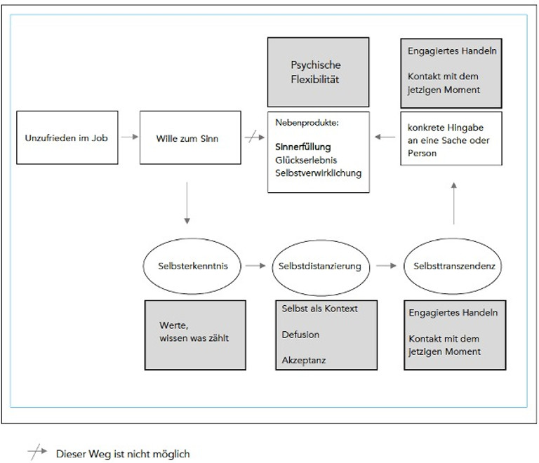

+++
title = "Sinn in der Arbeit finden"
date = "2022-01-12"
draft = false
pinned = false
tags = ["Sinn", "Gedanken"]
image = "fac9d2_175b021c68874656a09af2f20c4c7e66~mv2.jpeg"
description = "Arbeit nimmt einen grossen Teil unserer Lebenszeit ein. Wir nennen sie aber lieber Arbeitszeit und sehen diese ganz oft auch als etwas vom Leben getrenntes. Also Arbeitszeit und Freizeit. Wenn wir aber schauen, wie viele Stunden wir bei der Arbeit verbringen, dann ist es mehr als schade, wenn die Arbeitszeit auch Leidenszeit ist. Ein Ort, an dem wir es gerade so aushalten oder eine Tätigkeit die wir halt tun, um Geld zu erhalten."
+++
## Sinn in der Arbeit finden

Arbeit nimmt einen grossen Teil unserer Lebenszeit ein. Wir nennen sie aber lieber Arbeitszeit und sehen diese ganz oft auch als etwas vom Leben getrenntes. Also Arbeitszeit und Freizeit. Wenn wir aber schauen, wie viele Stunden wir bei der Arbeit verbringen, dann ist es mehr als schade, wenn die Arbeitszeit auch Leidenszeit ist. Ein Ort, an dem wir es gerade so aushalten oder eine Tätigkeit die wir halt tun, um Geld zu erhalten.

Eines vorweg: Niemand muss Sinn in der Arbeit finden und man darf Arbeit einfach als Arbeit sehen.

Ich möchte jedoch meine Lebenszeit nicht damit ver(sch)wenden, Dinge zu tun und an Orten zu sein, an denen ich mich nicht wohlfühle. Hier sei noch gesagt, dass es wahrscheinlich nicht DEN Sinn gibt. Sowieso ist Sinn ein Nebenprodukt.

Sinn scheint aber etwas zu sein, dass die Menschen beschäftigt. Es gibt etliche Konzepte, die in diese Richtung gehen und oft die Lösung versprechen. Da sind:

* Ikigai
* das WHY
* die Big Five
* und noch etliche andere Konzepte

Viele gehen in die Richtung von Sinn, sind dem Sinn nahe, greifen aber aus meiner Sicht zu kurz. Das heisst, zu kurzfristig und zu oberflächlich, um nachhaltig Wirkung zu zeigen.

Wie kann ich also meinen «Sinn» finden? Ein Weg führt über die Werteidentifikation zum Sinnerleben in der Arbeit. Damit habe ich mich während fast zwei Jahren intensiv befasst und möchte einige Ideen und Gedanken teilen.

Die Sinnerfüllung (auch das Glückserlebnis, die Selbstverwirklichung) wird in der Sinntheorie als Nebenprodukt gesehen. Das heisst, dass vom «Willen zum Sinn» kein direkter Weg zur Sinnerfüllung führt, sondern über «Umwege». Sehr ähnlich stellt sich der Weg zur «psychischen Flexibilität» auch in der [Akzeptanz- und Commitmenttherapie ACT](https://dgkv.info/act-co/akzeptanz-und-commitment-therapie-act/) dar.

Diese eigene Visualisierung, angelehnt an den Prozess zur Sinnerfüllung (Forschelen (2017), S. 465), zeigt den Prozess über die Wertearbeit bis hin zum Sinnerleben. In *weiss* der Weg zum Sinn und in *grau* die Elemente der Akzeptanz- und Commitmenttherpie.

So sehe ich bei dieser Verbidung die ACT als sehr lebenspraktischen Ansatz auf dem Weg zum Sinn.

#### Selbsterkenntnis

Wenn wir Sinn finden wollen, dann müssen wir uns zuerst einmal selbst kennen. Da sind Fragen wie:

* Was ist mir wichtig?
* Was für ein Mensch möchte ich sein?
* Wofür möchte ich stehen? Was möchte ich in dieser Welt hinterlassen?

Diese Fragen lassen sich, wie alles andere auch, nicht von heute auf morgen klären. Es ist vielmehr ein Prozess, den du ganz bewusst anstossen kannst.

**Selbstdistanzierung**

Wenn du dich auf den Weg machst, dann begegnen dir ziemlich sicher Hindernisse, Ängste, Sorgen, Schwierigkeiten, ... . Da hilft es eine Distanz zu sich und der Situation zu schaffen. Da hilft die Akzeptanz und die [Defusion](https://www.mbsr-coaching-tuebingen.de/wp-content/uploads/2017/11/Abstand-zu-Gedanken-die-kognitive-Defusion-31.5.2016.pdf). So kannst du auch mit diesen Gefühlen und Gedanken weitermachen.

\
Es geht dann weiter über die **Selbsttranszendenz** und weiter zum **engagierten Handeln** oder eben die **konkrete Hingabe an eine Sache oder Person**. In der ACT nennt man das «Resultat» dann psychische Flexibilität. So können wir Sinn erleben, kommen Glücksgefühlen näher und tun das, was uns wirklich wichtig ist.

Das heisst, dass es nicht den Traumjob oder die Erfüllung gibt oder geben muss. Es ist vielmehr so, dass uns jeder Tag und jeder Moment die Möglichkeit bietet, in diese (unsere) Richtung zu gehen. Dabei geht es auch nicht nur um eine Verbesserung im Job, sondern lässt sich überall im Leben anwenden. Jeder kleine Schritt ist ein Schritt zu sich selbst.