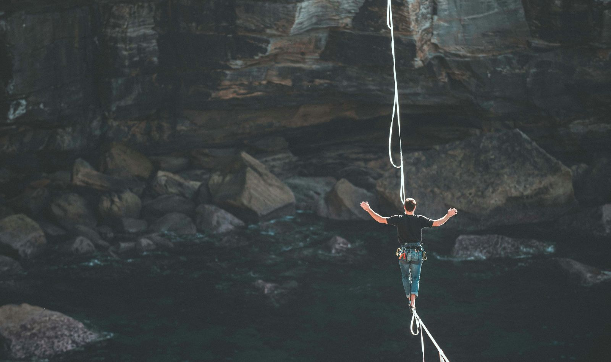

+++
title = "Stabilität in bewegten Zeiten: Warum wir lernen sollten, mit Instabilität zu leben. Teil 1"
date = "2025-07-27"
draft = false
pinned = false
tags = ["Organisationsentwicklung", "VUCA", "Leadership", "Agilität"]
image = "balancieren_2.jpg"
description = "Menschen sehnen sich nach Stabilität und Ordnung in der Arbeitswelt. Doch was ist, wenn es diese gewünschte Stabilität nicht mehr gibt? (M)ein Plädoyer für neue Haltungen im Umgang mit Dynamik, Unsicherheit und Veränderung."
footnotes = "Titelbild: [Loic Leray, Unsplash](https://unsplash.com/de/@loicleray)"
+++
#### Teil 1: Zwischen Wunsch und Wirklichkeit

## Einleitende Gedanken: Zwischen Wunsch und Wirklichkeit

Bei meiner Arbeit begegne ich immer wieder einem ähnlichen Thema: Der Wunsch nach Stabilität ist gross. Menschen wünschen sich einen konstante(re)n Zustand, in dem Dinge berechenbar(er) sind, Pläne linear umgesetzt werden und Konflikte oder Widerstände bestenfalls gar nicht erst entstehen. Man sucht nach Wegen, wie Widerstände verhindert oder zumindest schnell aufgelöst werden können. Spannungen soll(t)en vermieden und Veränderungen so gestaltet werden können, dass sie nicht stören. 

Und ich verstehe das gut. Wir Menschen, unsere Gehirne, unsere Systeme – wir alle sind auf Sicherheit und Ordnung ausgelegt. Wir mögen Verlässlichkeit, wir streben nach Orientierung. Aber ich glaube, genau hier liegt ein Denkfehler, wobei es kein Fehler im klassischen Sinn ist, sondern Prägungen und natürliche Prozesse, die einen Denk-, Haltungs- und Handlungswandel brauchen. 

## Realität: Dynamik ist kein Ausnahmezustand (mehr)

Die Welt, in der wir arbeiten und leben, ist nicht (mehr) stabil. Vielleicht war sie das nie. Sie ist komplex, sie ist dynamisch, manchmal sogar hochdynamisch. Natürlich in unterschiedlichen Ausprägungen, je nach Branche, Region, Aufgabe oder Organisation. Aber sie ist eben nicht statisch. Veränderung ist kein Sonderfall oder Projekt mehr, sondern der Normalzustand. 

Trotzdem verhalten sich viele Organisationen oder Führungspersonen so, als müssten sie zur «Stabilität zurückkehren», als könnte man die Komplexität reduzieren. Als wäre Wandel oder die Unsicherheiten etwas, das man anhalten oder abschliessen könnte. Es ist, als ginge es darum, die Wellen im Meer anzuhalten. Das klappt nicht und für das Meer (den ganzen Planeten) wäre es wohl auch nicht gut. Also «müssen» alle, die im und mit dem Meer «arbeiten» ihren Umgang mit den Wellen finden. Wer sich dagegen wehren will, verliert wohl über kurz oder lang. 

## Ein Perspektivwechsel: Widerstand als natürlicher Teil von Veränderungen

Vielleicht sollten wir nicht versuchen, Widerstände zu vermeiden, sondern lernen, mit ihnen besser umzugehen, sie zu verstehen und einzuordnen. Konflikte sollten nicht um jeden Preis verhindert oder verschleiert, sondern bewusst benannt und ausgetragen werden. Dafür braucht es jedoch Räume. Auch Spannungen sind (eigentlich) keine Störungen. Spannungen sind eine natürliche Reaktion. Sie geben Hinweise auf Klärungsbedarf, auf nicht wahrgenommene Bedürfnisse und Handlungsalternativen. 

Das heisst nicht, dass alles immer chaotisch sein muss oder soll. Es heisst auch nicht, dass der Wunsch nach Harmonie, Ordnung oder Struktur falsch wäre. Ganz im Gegenteil: Gerade in bewegten Zeiten brauchen wir Halt. Aber dieser Halt entsteht nicht dadurch, dass wir das Unvermeidliche verdrängen, sondern dadurch, dass wir unsere Fähigkeit stärken, mit Unsicherheit und Schwierigkeiten umzugehen. Individuell und kollektiv.

## Individuelle Entwicklung: Persönlichkeitsarbeit statt Selbstoptimierung

Diese Art des Umgangs mit Instabilität ist nicht nur eine Frage der Kultur, sondern auch eine persönliche. Es braucht Menschen, die ihre Muster (er-)kennen und damit arbeiten. Menschen, die verstehen, was in ihnen selbst Widerstand auslöst, wie sie auf Widerstand reagieren, was Stabilität für sie bedeutet und wie sie sich selbst stabilisieren können. 

Das ist kein Aufruf zur Selbstoptimierung. Sondern eine Einladung zur Selbstbegegnung. Wer bin ich, wenn es um mich herum wankt? Was gibt mir Halt, jenseits von Kontrolle? Wo ist mein sicherer Hafen?

## Organisationen als Möglichkeitsräume (nicht nur als Leistungssysteme)

Neben der individuellen Entwicklung braucht es auch Organisationen, die diesen Wandel aktiv ermöglichen. Es reicht nicht, von Mitarbeitenden den Umgang mit Unsicherheit zu erwarten, ohne dafür entsprechende Räume zu schaffen. Bewusste Kulturarbeit ist nicht Nice-to-have. Sie schafft den Rahmen, in dem Entwicklung stattfindet. Und dieser Rahmen ist gestaltbar. Ja, Kultur ist ein komplexes Konstrukt und sie entsteht u. a. im Handeln und wird im Handeln (oder nicht Handeln) sichtbar. 

### Organisationen tragen Verantwortung dafür,

* psychologische Sicherheit nicht nur zu fordern, sondern zu ermöglichen,
* Fehlertoleranz nicht zu predigen, sondern in ihren Prozessen zu verankern,
* Lernräume zu schaffen (in Form von Dialogen, Reflexionszeiten, Experimentierfeldern)
* und Strukturen so zu gestalten, dass in all den Veränderungen Orientierung und Halt möglich sind.

(alles gar nicht so einfach!)

Wer Stabilität durch Kontrolle erzeugt oder erzeugen will, wird in dynamischen Kontexten (und die sind fast überall) langfristig verlieren. Wer jedoch Stabilität durch Gestaltungsräume, Klarheit und Vertrauen fördert, kann auch im Sturm Orientierung geben.

Organisationen werden so zu Möglichkeitsräumen für Lernen, für Entwicklung und für echte Zusammenarbeit. Das ermöglicht exzellente Arbeitsergebnisse.

## Stabilität finden, auch inmitten der Wellen

Es gibt sie, die Inseln der Stabilität. Oft mehr, als wir denken. Die Gefahr besteht darin, dass wir den Blick zu sehr auf das richten, was instabil ist und dabei das übersehen, was trägt.

### Deshalb lohnt sich der Blick auf Ressourcen:

* Was ist bereits da?
* Was bleibt stabil?
* Worauf können wir aufbauen?
* Wo haben wir gute Erfahrungen gemacht?
* Wer oder was gibt uns Orientierung?

Diese Anker können uns helfen, nicht zu erstarren oder von den Wellen hin und her gerissen zu werden, sondern beweglich zu bleiben, uns von den Wellen tragen zu lassen, sie zu beobachten oder unter ihnen durch zu tauchen.

## Schlussgedanke: Entwicklung statt Rückkehr zur «Normalität» 

Ich denke, es geht nicht darum, zurück zur Stabilität zu finden.\
Es ist wichtiger, eine neue Sicht auf die Art wie wir arbeiten, zu entwickeln. Eine, die Veränderung integriert. Eine, die uns erlaubt, in Bewegung zu bleiben, ohne uns dabei zu erschöpfen.