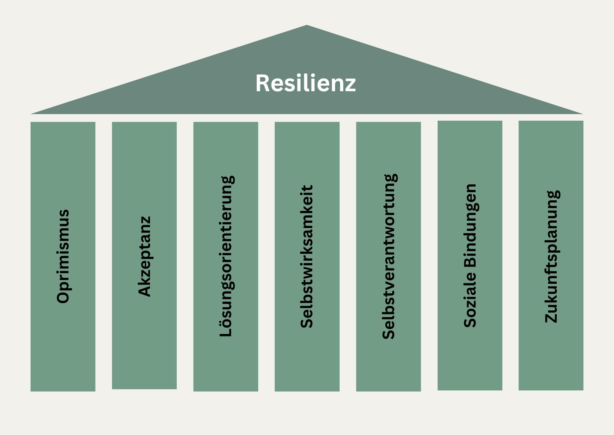

+++
title = "Stark durch den Wandel: Veränderungen im Arbeitsumfeld meistern"
date = "2024-11-24"
draft = true
pinned = false
tags = ["Change", "Leadership", "Personalentwicklung", "Organisationsentwicklung", "Transformation"]
image = "beach-1853549_1280.jpg"
description = "Veränderungen am Arbeitsplatz sind allgegenwärtig und oft herausfordernd. Doch mit der richtigen Perspektive und Strategien können sie eine Chance für persönliches und berufliches Wachstum sein."
footnotes = "Titelbild von [Pexels](https://pixabay.com/de/users/pexels-2286921/?utm_source=link-attribution&utm_medium=referral&utm_campaign=image&utm_content=1853549) auf [Pixabay](https://pixabay.com/de//?utm_source=link-attribution&utm_medium=referral&utm_campaign=image&utm_content=1853549)"
+++
## Einleitung

Veränderungen am Arbeitsplatz sind für viele Menschen an der Tagesordnung oder sie werden in regelmässigen und oft kurzen Abständen damit konfrontiert. Viele Angestellte fühlen sich durch diese Change-Prozesse (neue Technologien, Digitalisierung, organisatorische Umstrukturierungen etc.) überfordert oder verunsichert. Darum, wie man als Betroffene:r diesen Veränderungen begegnen kann, geht es in diesem Text. 

> «Egal wie wir Veränderungen wahrnehmen, jede ist ein Lernprozess.»
>
> *[Agiles Lernen](https://www.bensblog.ch/agiles-lernen-buch/) S. 21*

## Veränderung am Arbeitsplatz – Ein ständiger Begleiter

Geopolitische Veränderungen, Naturereignisse, neue Technologien – sie alle haben einen Einfluss auf unsere Arbeitswelt. Menschen erleben häufig, wie sich Prozesse verändern, sich Teams neu zusammensetzen, Führungspositionen oder Führungspannen wechseln und Regeln (aktuell rund um Remote Work oder KI) sich verändern. Dazu kommen der Fachkräftemangel oder zusätzlicher Kostendruck. Wie können Menschen mit diesen Unsicherheiten umgehen? 

## Emotionale Reaktionen auf Veränderungen im Job

> Es sind nicht die Dinge selbst, die uns beunruhigen, sondern die Meinung, die wir über diese Dinge haben.
>
> *Epiktet*

Oft sind es nicht die Veränderungen selbst, die uns Menschen verunsichern, sondern unsere Gedanken und Gewohnheiten. Da ist die Angst vor dem Unbekannten, die Sorge um den Verlust von Stabilität oder um den eigenen Arbeitsplatz. Diese Reaktionen sind normal und bei Menschen unterschiedlich ausgeprägt. Sie haben einen Einfluss auf die Motivation und die Leistung. Es hilft und ist wichtig, diese Reaktionsmuster zu kennen und auch anzuerkennen. 

> «Je mehr ich einfach gewillt bin, inmitten dieser ganzen Komplexität des Lebens ich selbst zu sein, und je mehr ich gewillt bin, die Realitäten in mir selbst und im anderen zu verstehen und zu akzeptieren, desto mehr Veränderung scheint in Gang zu kommen.» 
>
> *Rogers Carl (1973), S. 37*

## Veränderung als berufliche Chance erkennen

Veränderungen als Change erkennen – dieser Ratschlag hilft eben wenig, wenn man im Tunnel steckt und die negativen oder nicht hilfreichen Emotionen und Gedanken überhandnehmen. Trotzdem hilft es, eine andere Perspektive einzunehmen und zu schauen, was eine Veränderung denn bringen kann. Denn der Wandel ist, wenn er einmal läuft, kaum mehr aufzuhalten. Es gibt viele Beispiele, wie Menschen gerade auch durch Veränderungen neue Karrierewege einschlagen konnten, sich neu orientierten oder daran wuchsen. Manchmal helfen diese Geschichten, sich inspirieren zu lassen und neuen Mut zu fassen. 

Im [ZUKUNFTSHELDEN-Podcast](https://zukunftshelden.podigee.io) sprechen Menschen genau darüber. 

> «Du kannst die Wellen nicht stoppen, aber du kannst lernen sie zu surfen.»
>
> *Jon Kabat-Zinn (ich bin mir bis heute nicht ganz sicher, ob es wirklich von ihm stammt)*

## Strategien für den Umgang mit Veränderungen im Job

**Offenheit:** Auch wenn es schwierig ist offenzubleiben und eine gewisse Veränderungsmüdigkeit einsetzen kann, hilft es dir, dem Neuen mit Offenheit zu begegnen. 

**Klarheit schaffen:** Wenn die Klarheit oder Kommunikation in der Organisation fehlt, kannst du versuchen diese durch selbst zu beschaffen oder Unsicherheiten bei Vorgesetzten anzusprechen. Nicht selten sind die Führungspersonen in solchen Change-Prozessen selbst Betroffene und möglicherweise unsicher. 

**Netzwerken:** Es kann dem persönlichen und beruflichen Wachstum und der Change-Kompetenz dienen, sich Unterstützung ausserhalb der Organisation zu suchen. Das können Coaches, Supervisor:innen, Psychotherapeut:innen etc. sein. 

**Planen:** Wenn im Aussen die Orientierung fehlt oder für das eigene Bedürfnis zu wenig ist, kann man selbst planen und sich so gut wie möglich organisieren. [Es hilft, einen Plan und vielleicht auch einen Plan B zu haben. ](https://www.bensblog.ch/warum-plaene-helfen/)

## **Sich selbst kennen(-lernen)**

Sich selbst und die eigenen physischen und psychischen Reaktionen auf Stress, Veränderungen, Unsicherheiten etc. zu kennen kann enorm helfen, sich in Zeiten des Wandels zu orientieren. Das braucht natürlich Zeit und am besten (professionelle) Hilfe von aussen. Es gibt auch Dinge, die man selbst tun kann. Nachfolgende Möglichkeiten helfen, sich und die eigenen Reaktionen besser kennenzulernen oder einen anderen Umgang mit Stress und Unsicherheiten zu finden. 

**Achtsamkeit:** Ein bewusstes Wahrnehmen, Ruhe und Zeit für sich helfen, sich besser kennenzulernen. Das Beobachten des eigenen Atems, Zeit für sich und Momente der Ruhe spiele dabei eine wichtige Rolle. Links zu weiteren Informationen gibt es unter diesem Beitrag. 

**BERN-Modell**: Das Bern-Modell (**B**ehavior, **E**xercise, **R**elaxation, **N**utrition) von Prof. Dr. Tobias Esch zeigt, was man selbst für die eigene Gesundheit tun kann. Dabei geht es nicht nur um die physische, sondern auch um die psychische Gesundheit. [Weitere Informationen und Links gibt es im Beitrag **Gesundheitsförderung und Gesundheitserhaltung.**](https://www.bensblog.ch/gesundheitsfoerderung-in-der-arbeitswelt/)

## Die eigene Resilienz stärken

«Resilienz \[engl. resilience; lat. resiliere abprallen, sich zus.ziehen], \[GES, KLI, PER], bez. die Widerstandsfähigkeit eines Individuums, sich trotz ungünstiger Lebensumstände und kritischer Lebensereignisse (Life-Event, kritisches) erfolgreich zu entwickeln.» [Quelle Dorsch, Lexikon der Psychologie](< <https://dorsch.hogrefe.com/stichwort/resilienz>>)

### **7 Säulen der Resilienz** 

Die Resilienz wird oft mit 7 Säulen der Resilienz dargestellt. Diese Elemente dieser Säulen helfen uns auch, gesund und stark durch den Wandel zu kommen. Eine Investition in die Lebensbereiche und Haltungen, die im eigenen Leben wenig ausgeprägt sind, lohnt sich also. So kannst du dich ganz grundsätzlich und für den Wandel stärken.  

## Das führt zu mehr Schwierigkeiten

Reiner Widerstand, der keine Lösungsalternativen bietet, ist wenig sinnvoll. Klar, in einer ersten Phase kann Widerstand das vorherrschende Gefühl und möglicherweise auch die Reaktion sein. So schnell wie möglich solltest du jedoch einen Weg finden, für dich mit dieser Veränderung umzugehen. Allein ist das manchmal schwierig und es hilft, sich Unterstützung zu suchen, auch wenn das vielleicht Mut braucht. 

## Führungskräfte und Mitarbeiter – Gemeinsame Verantwortung für Wandel

Auch wenn Wandel meistens «von oben» kommt, so sind Organisationen und Führungspersonen nicht allein für den Wandel, Widerstände etc. verantwortlich. Am besten geht es gemeinsam. Wenn dir «von oben» etwas fehlt, kannst du in den Dialog gehen und den ersten Schritt machen. 

## Fazit: Veränderungen im Job als Teil der beruflichen Reise annehmen

Wandel ist unvermeidlich, aber er bietet eine Möglichkeit, persönlich und beruflich zu wachsen. Dabei hilft es, sich bewusst mit Veränderungen auseinandersetzen und selbst erste Schritte in die neue Richtung wagen. Auch oder gerade dann, wenn das Neue viele Unsicherheiten bietet. 

### Folgende Blogartikel eignen sich als Ergänzung und Erweiterung:

[Change-Leadership](https://www.bensblog.ch/change-leadership/)

[Change-Management](https://www.bensblog.ch/change-management/)

[Psychische Flexibilität](https://www.bensblog.ch/psychische-flexibilitat/)

[Lean-Change-Management](https://www.bensblog.ch/lean-change-management/)