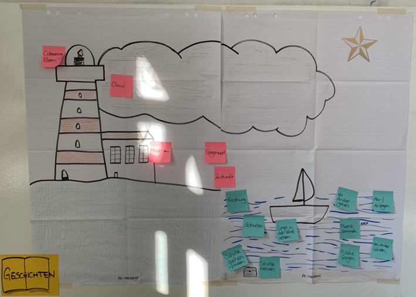

+++
title = "Start with Why - Teil 1"
date = "2022-03-10"
draft = false
pinned = false
tags = ["NewWork", "NewLearning", "colearning.org", "colearning", "Lernen", "Arbeit"]
image = "img_4792-2.jpg"
description = "Wenn viele Visionen, viel Passion und Menschen zusammenkommen, dann kann Grossartiges entstehen. Diesen Eindruck habe ich beim Aufbau von colearning.org. Noch immer ganz am Anfang, widmen wir uns unserem Warum. "
+++
### Das Warum freilegen - Teil 1

> Wenn eine Bewegung etwas bewegen soll, muss sie das Eigentum von allen sein, die ihr angehören, nicht nur von denen, die sie führen. 
>
> *aus Finde dein Warum, Sinek S., Mead D., Docker P., 2018*

Wenn viele Visionen, viel Passion und Menschen zusammenkommen, dann kann Grossartiges entstehen. Diesen Eindruck habe ich beim Aufbau von[ colearning.org](https://www.colearning.org). Im [Effinger Bern](https://www.effinger.ch) haben wir zusammengefunden und schaffen Neues. Was genau, das werden wir laufend herausfinden. Heute möchte ich dir einen Einblick geben, wie wir unser «Warum» freilegen. Wir haben zwar bereits erste konkrete Schritte gemacht, nehmen uns aber nun noch Zeit, uns unserem gemeinsamen Warum zu widmen. Dafür haben wir uns im Rosengarten im Effinger getroffen. Weil ich mich schon länger und auch intensiv mit dem Warum nach Simon Sinek sowie der Sinntheorie und so auseinandersetze habe ich hier den Lead übernommen, schildere dir also diesen Prozess aus der Moderatoren- und Teilnehmerperspektive. Wenn wir Glück haben, dann werden andere den Prozess in ihrem Lernblog aus ihrer Perspektive schildern. Dann werde ich diese hier verlinken. 

### Der Ablauf

Es war der Erste von 2 Halbtagen, den wir dafür nutzen. Wobei wir beim ersten Termin etwas mehr als 2h zur Verfügung hatten und beim 2. ca. 3h zur Verfügung haben werden. 

* Begrüssung, Verbindung zu den vorangehenden Gesprächen und Situngen sowie wiederaufnehmen der Bildsprache. 
* Ressourcenorientierter Einstieg mit Fotos. Die Teilnehmenden wählen ein Foto (aus einer Vielzahl an Fotos) und erzählen in der Gruppe, warum sie gerade dieses Bild angesprochen hat. Das gehört zwar nicht zum Prozess aber als Einstieg finde ich das ganz schön. 
* Kurze Präsentation zum «Goldenen Kreis» nach Simon Sinek, Infos dazu, was für den Freilegungsprozess wichtig ist sowie bereits ein Beispiel einer «Warum» Formulierung. 
* Einstieg mit einer Geschichte aus der Praxis, die ebenfalls im Buch (ab Seite 86) zu finden ist. Gem. Rückmeldungen der Teilnehmenden war diese hilfreich und wichtig. 
* Den Fragen rund um den Prozess des Warums widmen. Als Einzelperson oder in Gesprächen zu zweit, da wir (nur) vier Personen waren. 
* Ausstieg und Ausblick auf den 2. Termin

### So habe ich mich für die Moderation vorbereitet

Die Essenz von Menschen oder Gruppen freizulegen macht mir grossen Spass, falls man das überhaupt so sagen kann.. und deshalb habe ich mich «nur» noch einmal intensiver mit dem Prozess, wie er im Buch beschrieben ist, auseinandergesetzt. Obwohl ich Anleitungen eigentlich nicht mag, bin ich in dem Fall sehr froh um diese Vorgaben oder Wegweiser. Denn das «Warum» freizulegen ist etwas nicht alltägliches und eine Herausforderung. 

#### Warum eine Herausforderung?

* Ich hatte eine Doppelrolle, also Moderator und Teilnehmer. Ich will den Rollenwechsel geschickt und natürlich gestalten.
* Sehr schnell ist man (zumindest in unserem Fall) in der Zukunft, verbindet Erkenntnisse mit Ideen und Umsetzungsplänen. Das ist zwar nicht schlecht, jedoch für diesen Prozess nicht hilfreich. Deshalb ist es wichtig, immer wieder zurück zu den Geschichten zu gehen. 
* Für diesen Prozess ist eine Gruppengrösse von mehr als 10 Teilnehmenden vorgesehen. Siehe auch [Finde dein Warum](https://www.exlibris.ch/de/buecher-buch/deutschsprachige-buecher/simon-sinek/finde-dein-warum/id/9783868816747?gclid=CjwKCAiA4KaRBhBdEiwAZi1zziwl7_4VXoZk8ZZj5LRDKM4Exuv_XfqdAL53a16oY66FSOn3O-2czxoCJAUQAvD_BwE&gclsrc=aw.ds), Seite 91. Es sind also eigentlich wenig Geschichten oder Perspektiven, so sollte von allen genügend «Material» kommen. 
* Vom Raum (Ort und Art des Raumes) her hätte ich mir etwas anderes gewünscht, musste jedoch mit dem arbeiten, den wir hatten. 

Das Warum und auch das Wie! soll uns ab nächster Woche bei unseren Entscheidungen leiten und unsere Kommunikation unterstützen. 

### Bilder und «Anker»

Bilder und «Anker» spielen bei unseren Prozessen immer eine Rolle. Think Tank, Cloud, Maschinenraum, Myzel, Lernhaus, um nur ein paar zu nennen. Da ich irgendwie schon von Natur aus immer wieder Verbindungen zur Seefahrt und Orientierungspunkten mache, habe ich den Leuchtturm, Meer, ein Schiff, den Nautic Star und einen Kompass gewählt. Den Kompass hatte ich in echt dabei, da er mir und auch den anderen bei meinem Rollenwechsel helfen sollte. Ob das geklappt hat? Naja.. 

So sah das Plakat aus, dass die Ausgangslage und die ersten Besprechungen aufgriff. Ganz links unten ist der Teil zu sehen, um den es im Moment geht. Die Geschichten. Mit dem «Warum» wollen wir den «Polarstern» freilegen. Daran können wir uns immer orientieren. 

Das war Teil 1.

Da es bei uns ums Lernen geht, kommt das immer wieder ins Zentrum. Ich habe jedoch den Eindruck, dass da etwas tiefer noch etwas anderes liegt.