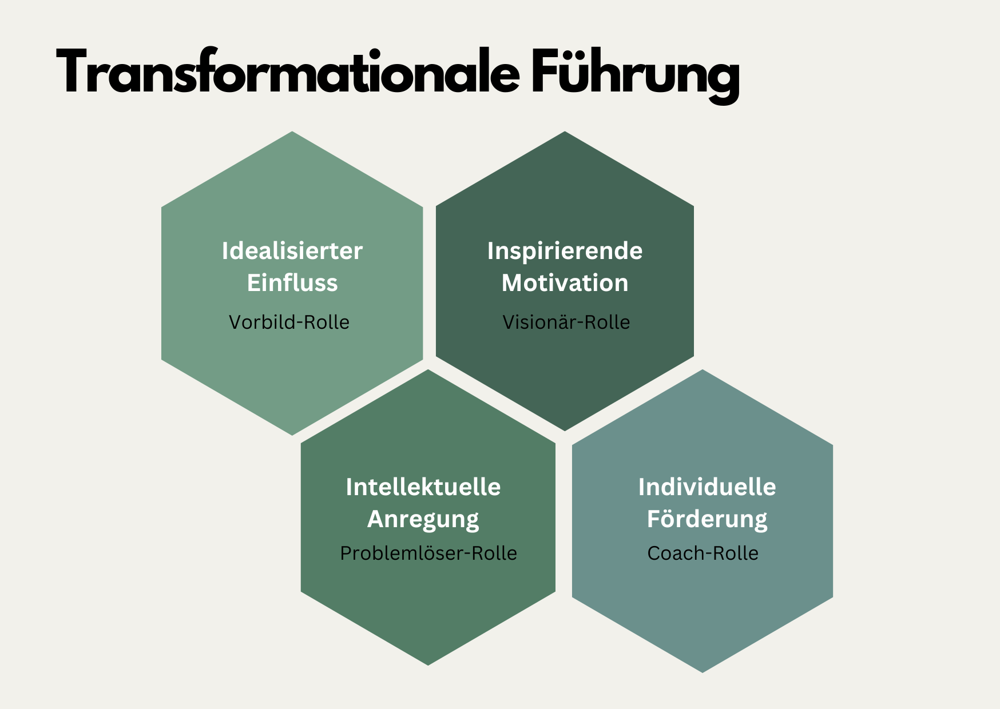

+++
title = "Transformationale Führung"
date = "2024-07-19"
draft = false
pinned = false
tags = ["CAS-OECL", "Organisationsentwicklung", "Personalentwicklung", "Leadership", "NewWork"]
image = "lighthouse-6702434_1280.jpg"
description = "Einblick in die transformationale Führung und Gedanken dazu."
footnotes = "[📘New Work - Gute Arbeit gestalten, Psychologisches Empowerment von Mitarbeitern, Carsten Schermuly](https://www.exlibris.ch/de/buecher-buch/deutschsprachige-buecher/carsten-c-schermuly/new-work-gute-arbeit-gestalten/id/9783648176290/)\n\n📘[New Work braucht New Learning, Eine Perspektivreise durch die Transformation unserer Organisations- und Lernwelten](https://www.exlibris.ch/de/buecher-buch/deutschsprachige-buecher/jan-foelsing/new-work-braucht-new-learning/id/9783658327576/)\n\nTitelbild: Bild von [Sabine Dirksen](https://pixabay.com/de/users/penphoto-22279946/?utm_source=link-attribution&utm_medium=referral&utm_campaign=image&utm_content=6702434) auf [Pixabay](https://pixabay.com/de//?utm_source=link-attribution&utm_medium=referral&utm_campaign=image&utm_content=6702434)"
+++
## Einleitende Gedanken

Im CAS und in einigen Büchern, mit denen ich mich beschäftige, kommt die transformationale Führung vor. Ein Führungsstil, der mir auf den ersten Blick zusagte und auch nach tieferer Betrachtung wirkungsvoll und zukunftsfähig scheint. Deshalb gebe ich hier einen Einblick in diese Form der Führung. 

## Darum geht’s

> Transformationale Führung ist darauf ausgerichtet in Zeiten kontinuierlicher und disruptiver Veränderung Sinn und Orientierung zu vermitteln, Mitarbeitende für die gemeinsame Vision zu begeistern und sie auf emotionaler Ebene anzusprechen, um ihr Engagement zu fördern. 
>
> *aus New Work braucht New Learning S. 212*

Die transformationale Führung zielt auf die intrinsische Motivation ab. Mitarbeitende erhalten also bei dieser Form der Führung Möglichkeiten und Räume (kreative) Lösungen zu entwickeln und die Zukunft zu gestalten. Die Führungsperson nimmt dabei verschiedene Rollen ein. Sie inspiriert die Menschen im Team selbst aktiv zu sein und sich einzubringen. Das heisst auch, dass die Führungsperson eine wichtige und zentrale Rolle spielt. Wenn sie inspirieren will, muss sie selbst für die Sache brennen.

### Die Rollen bei der transformationalen Führung: 

#### Idealisierter Einfluss / Idealized Influence – Rolle: Vorbild

Die Führungsperson soll Vorbild sein für das, was von den Mitarbeitenden erwartet wird. Das schafft Glaubwürdigkeit und Vertrauen. 

#### Inspirierende Motivation / Inspirational Motivation  - Rolle: Visionär 

Die Führungsperson hat eine klare Vision und vermittelt diese den Mitarbeitenden. Sie begeistert dadurch die Menschen. Sie äussert Zuversicht, dass Ziele auch in schwierigen Zeiten erreicht werden können (Schermuly 2023).

#### Intellektuelle Stimulation / Intellectual Stimulation – Rolle: Problemlöser 

Kreatives und eigenständiges Denken wird gefördert. Die Mitarbeitenden dürfen und sollen eigene Ideen und Lösungen oder Lösungsansätze einbringen. 

#### Individuelle Förderung / Individual Consideration – Rolle: Coach

Die Führungsperson achtet auf die individuellen Bedürfnisse, Kompetenzen und Entwicklungspotenziale der Mitarbeitenden und begleitet sie entsprechend. 

Bei den Rollen beziehe ich mich auf Schermuly (2021), New Work, Gute Arbeit gestalten.

## Gedanken dazu

Führungsstile gibt es viele, sehr viele. Es gibt nicht den Richtigen oder Falschen (auch wenn ich klare Präferenzen habe). Es gibt wohl eher den zum Unternehmen, zum Team und zur Führungskraft passenden. Die Zeit, in der wir leben und die Art, wie wir unsere Arbeit gestalten, spielt auch eine Rolle. Die transformationale Führung sagt mir persönlich sehr zu und es ist eine Möglichkeit der Führung, welche Mitarbeitende und Lösungen in den Vordergrund stellt. 

## Mögliche Kritik

Sie stellt jedoch auch (sehr) hohe Anforderung an Führungspersonen, diese Rollen auszufüllen. Sie kann auch für Mitarbeitende eine Herausforderung sein, da sich auch diese mit sich selbst auseinandersetzen und Verantwortung übernehmen müssen.

Passend dazu habe ich noch eine Podcast-Folge gefunden. [Murakamy Podcast: Warum funktioniert transformationale Führung nicht? mit Dr. Kai Matthiesen](https://open.spotify.com/episode/5M9pppSAQLRl0ZbBMam7zk) ab 1h 10 Min.