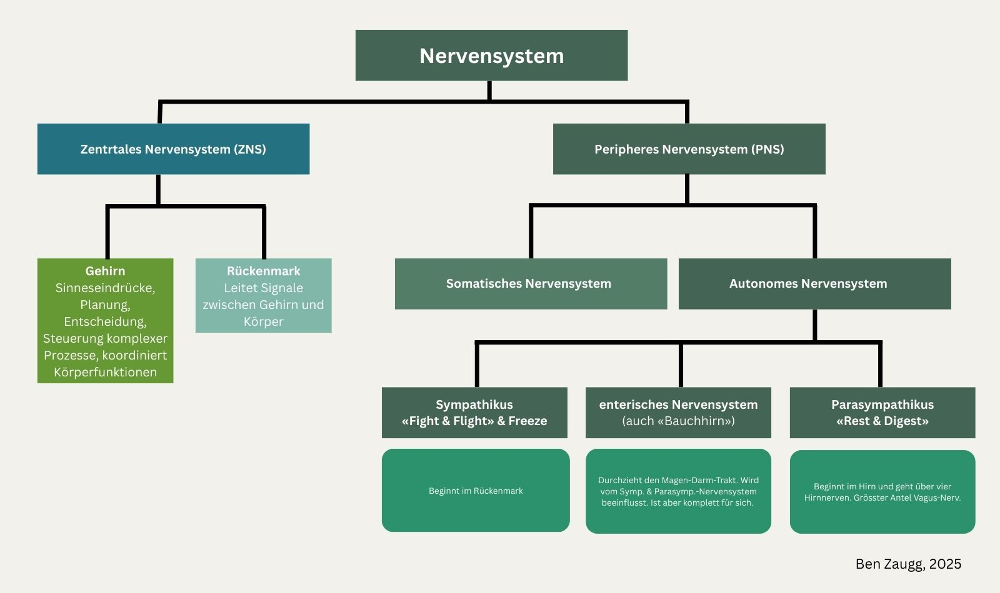

+++
title = "Veränderung, Lernen und das Nervensystem"
date = "2025-09-22"
draft = false
pinned = false
tags = ["Neuro", "Lernen", "Nervensystem", "Gehirn", "Organisationsentwicklung", "Personalentwicklung"]
image = "blog_titelbilder-4.jpg"
description = "In meinem «Neuronaut WorkLab» erforsche ich, wie Veränderung nachhaltig funktionieren kann: langsam, wiederholend, mit Unsicherheit und immer mit Blick auf das Gehirn, den Körper und den Weg des Lernens."
footnotes = "Titelbild: Erstellt mit KI (ChatGPT)"
+++
In meinem Lernprojekt **[«Neuronaut WorkLab»](https://www.bensblog.ch/tags/neuro/)** beschäftige ich mich immer wieder mit unserem Gehirn (und/oder Nervensystem) in Veränderungen, in der Führung und damit, wie Menschen lernen und sich entwickeln. Es ist ein Prozess, der nie wirklich abgeschlossen ist, und jedes Mal, wenn ich darüber nachdenke (und in der Praxis bin), wird mir klar, dass Veränderung selten einfach oder linear verläuft (manchmal fühlt es sich eher wie ein ständiges Anpassen, Beobachten und Ausprobieren an). Dafür wäre auch ein häufigeres Innehalten gut, was für viele im getakteten Arbeitsalltag kaum möglich scheint. Dabei wäre die dort «verlorene» Zeit so wertvoll und wird oder würde später vermutlich gespart. 

Veränderung ist kein Ereignis (mehr). Sie läuft, sie ist normal und Alltag. Sie braucht Zeit, Wiederholung und einen Raum, in dem Unsicherheit Platz haben darf. Nicht nur Fehler – auch das Nicht-Wissen, das Ausprobieren, das Stolpern. Es soll und darf gesehen werden, ohne dass jemand Angst vor Konsequenzen haben muss. Erst dann kann (gemeinsames) Lernen wirklich stattfinden. Kleine Schritte sind entscheidend, sowohl für Einzelpersonen als auch für Teams (man tastet sich langsam heran, wiederholt, reflektiert, passt an).

## Jede:r trägt einen Rucksack mit Erfahrungen und Prägungen

Jede:r von uns trägt einen Rucksack mit Erfahrungen, Prägungen und Gewohnheiten. In Teams summieren sich diese Rucksäcke, und jede Person reagiert ein wenig anders (auch das Nervensystem ist individuell, Reizverarbeitung, Stressreaktionen, Erholungsfähigkeit – alles unterschiedlich). Damit das alles Platz haben darf, braucht es einen sinnvollen Rahmen und einer scheint mir die psychologische Sicherheit zu sein. Sie wächst oft nicht von selbst. Sie entsteht im Wechselspiel zwischen Vertrauen, Ausprobieren und wiederholter Praxis. Sie ist sowohl Voraussetzung als auch Begleiterin von (nachhaltiger) Veränderung. Prozesse zur Stärkung dieser Sicherheit laufen oft parallel zu Veränderungsprozessen und werden durch Ausprobieren, Reflexion und kleine Erfolge genährt.

> «Jede Abweichung von den Routinen kann Reaktionen auslösen, die weitaus stärker sind als Gedanken, die zu einsichtigem und vernünftigem Handeln führen würden.»
>
> «Wer sich ändern soll, leistet unbewusst Widerstand, der so stark ist, dass er durch rationale Prozesse nicht zu kontrollieren ist.»
>
> *Neuroleadership, Christian E. Elger, S. 16*

Das Gehirn liebt Routinen und schützt sich vor Veränderung. Deshalb ist Wiederholung so entscheidend: neue Muster müssen mehrfach geübt, alte Muster verlernt werden. Vertrauen und psychologische Sicherheit ermöglichen, dass diese Schritte überhaupt gegangen werden können.

Und immer wieder zeigt sich: wir wissen zwar einiges über das Gehirn, aber eigentlich noch sehr vieles nicht. Auch der ganze Körper ist beteiligt, nicht nur das Gehirn. Zum Beispiel über die Darm-Hirn-Connection. Darm und Gehirn kommunizieren miteinander, beeinflussen Stress, Emotionen und Wohlbefinden. Veränderung betrifft also immer auch den ganzen Körper. Schauen wir also in den Körper und in das Gehirn:

## Nervensystem

Das Nervensystem ist die Basis für alles Erleben und Handeln. 

**Zentrales Nervensystem (ZNS)**\
Verarbeitet Informationen, steuert Bewegungen, Gedanken und Körperfunktionen.

* **Gehirn**: Integration von Sinneseindrücken, Planung, Entscheidungen, Steuerung komplexer Prozesse
* **Rückenmark**: leitet Signale zwischen Gehirn und Körper, reflektorische Reaktionen, Schutzmechanismen

**Peripheres Nervensystem (PNS)**\
Verbindet das ZNS mit dem Körper, überträgt Signale in beide Richtungen.

* **Somatisches Nervensystem**: bewusst steuerbare Bewegungen, Sinneswahrnehmung, Sensibilität der Haut, Muskeln und Organe
* **Vegetatives / autonomes Nervensystem**: unbewusste Steuerung lebenswichtiger Funktionen wie Herzschlag, Atmung, Verdauung
* * **Sympathikus**: Aktivierung, Alarmbereitschaft, Stressreaktionen
  * **Parasympathikus**: Erholung, Regeneration, Entspannung

Das Nervensystem reagiert individuell, und gerade in Teams zeigt sich, dass unterschiedliche Reizverarbeitungen, Wahrnehmungen und Stressreaktionen zusammenkommen. Dies macht Veränderungen komplex, aber auch spannend.

## Neuroplastizität und Verlernen

Das Gehirn bleibt lebenslang lernfähig. Neue Erfahrungen schaffen neue neuronale Verknüpfungen, Wiederholung stärkt sie. Lernen bedeutet aber auch Verlernen: alte Muster müssen abgeschwächt oder überschrieben werden. Ohne Vertrauen, ohne psychologische Sicherheit und ohne Raum für Unsicherheiten bleibt jede Erfahrung oberflächlich.

Deshalb sind kleine Schritte, Wiederholung, Reflexion und Ausprobieren entscheidend – individuell und im Team (immer wieder austesten, anpassen, reflektieren). Verlernen, Lernen und das Nervensystem stehen in ständiger Wechselwirkung.

## Gedanken zum Schluss

Und vielleicht ist es genau diese Mischung aus Lernen, Wiederholung, Vertrauen, Unsicherheiten zulassen und Reflexion, die (nachhaltige und gesunde) Veränderung möglich macht. Auch kleine spielerische Ansätze könnten hier in vielleicht helfen. Ein leichteres Herantasten, ohne die Tiefe des Prozesses zu verlieren (mal sehen, wohin mich diese Gedanken noch führen. Ein paar Ideen sind schon da).