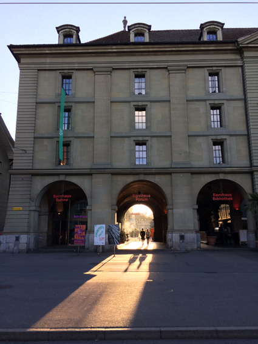

+++
title = "Ist Versöhnung der Weg zur inneren Freiheit?"
date = "2021-11-21"
draft = false
pinned = false
tags = ["Recovery", "Tagebuch", "Biografie"]
image = "vers.jpg"
description = "In dieser Woche habe ich in einem Podcast-Gespräch über meine Biografie gesprochen und dabei ist das Wort Versöhnung immer wieder aufgetaucht. Hier mache ich mir nun einige Gedanken darüber. "
footnotes = "Titelbild: Ben Zaugg\n\nFoto 2: Ben Zaugg, im Norden von Dänemark"
+++
Es ist Sonntagnachmittag, der Nebel hat die Sonne wieder versteckt und ich mache mir Gedanken über ein [Podcast-Gespräch](https://www.linkedin.com/posts/flowieser_derpossibilist-bemorepirate-podcast-activity-6867805367271858176-WNER), dass ich diese Woche hatte. Das Gespräch kam aufgrund eines [Linkedin-Posts](https://www.linkedin.com/feed/update/urn:li:activity:6861912469183459328/) mit diesem Text zustande:

𝗘𝗶𝗻𝗲 𝗕𝗶𝗼𝗴𝗿𝗮𝗳𝗶𝗲\
Ich war zu laut,\
ich war zu unruhig,\
ich war zu neugierig,\
𝗜𝗰𝗵 𝘄𝗮𝗿 𝗲𝗶𝗻 𝗸𝗹𝗲𝗶𝗻𝗲𝘀 𝗞𝗶𝗻𝗱.\
Es hiess: mit dem stimmt was nicht.\
Ich wurde anders,\
ich wurde unkonzentriert,\
ich wurde ausgeschlossen,\
ich wurde beobachtet,\
𝗜𝗰𝗵 𝘄𝗮𝗿 𝗻𝗼𝗰𝗵 𝗷𝘂𝗻𝗴.\
Meine Gedanken drehten,\
meine Gefühle spielten verrückt,\
ich wurde wütend,\
ich wurde traurig,\
ich wurde immer verzweifelter,\
𝗶𝗰𝗵 𝘄𝗮𝗿 𝗻𝗶𝗲𝗺𝗮𝗻𝗱 𝗺𝗲𝗵𝗿.\
Ich wurde krank,\
meine Gedanken schwarz,\
konnte kaum mehr essen,\
hatte Angst.\
Angst,\
vor den Menschen,\
vor dem Leben.\
𝗶𝗰𝗵 𝗳ü𝗵𝗹𝘁𝗲 𝗺𝗶𝗰𝗵 𝘁𝗼𝘁.\
Aber dann!\
Ich erwachte,\
ich kämpfte,\
ich trainierte,\
ich verzieh.\
Ich fand zu mir zurück,\
lernte mich neu kennen.\
𝗛𝗲𝘂𝘁𝗲 𝗯𝗶𝗻 𝗶𝗰𝗵\
wach.\
lebendig.\
frei.

Im Gespräch mit [Florian Wieser](https://florianwieser.com/), dem Possibilist, sprachen wir über Möglichkeiten und dieser Text wurde nicht nur zum Aufhänger sondern irgendwie auch zum Drehbuch. Während des Gesprächs sprach ich immer wieder über Versöhnung (ich denke zumindest, dass es dieses Wort war). Versöhnung könnte auch mit Vergebung oder Akzeptanz ergänzt werden. Aufgrund von Reaktionen auf diese Folge merke ich, dass dieses Thema wichtig ist und möchte hier darüber nachdenken und schreiben. 

Lange Zeit hatte ich Gefühle wie Wut, Unverständnis, Ungeduld, Traurigkeit und Einsamkeit. Diese Gefühle liessen sich sicher noch ergänzen oder detailliertet aufspalten. Ich fühlte mich nicht krank, falsch, gestört oder Ähnliches. Ich war, so meine ich mich zu erinnern, sehr interessiert und ein guter Beobachter. Das wollte ich nicht nur im tsillen tun, sondern meine Beobachtungen auch weitergeben. Dabei war ich keineswegs ein sehr extrovertierter Junge, sondern doch auch eher schüchtern und zurückhaltend. Irgendwann kam die Schule und die fand ich wahrscheinlich etwas langweilig oder nicht sonderlich sinnvoll. Vielleicht meine ich das heute auch nur.. auf jeden Fall möchte ich hier kurz den Schmerz und die Wut beschreiben, bevor es nachher um die Versöhnung geht. 

Wut und Einsamkeit. Das kenne ich nur zu gut. Wie oben beschrieben kam ich also in ein Schulhaus, in Schulräume, zu Menschen die wussten, was gut für mich ist und was mir hilft, eine gute Zukunft zu haben. Meine Interessen, Bedürfnisse und meine Individualität waren dann o.k., wenn sie in dieses Konstrukt passten. Da ich aber nicht zu passen schien, wurde ich mehr und mehr beobachtet, beurteilt (verurteilt?), dann abgeklärt, nochmal abgeklärt und nochmal, therapiert, geflickt, kontrolliert ob das denn auch hilft, wieder justiert, und.. Irgendwo unter diesem Berg war ICH. Irgendwann sollte ich ja dann selbst das Leben in die Hand nehmen und das klappe nicht so gut weil:

* ich mir nicht vertraute
* mein Selbstbild am Arsch war
* meine Ausgangslage (Schulzeugnisse) nicht sonderlich sexy waren
* ich mit Ängsten und Essproblemen zu kämpfen hatte
* ich als dünner, eher unsportlicher junger Mann auch noch aus dem Rollenbild fiel
* und kaum Kollegen oder Freunde hatte

#### Über Wege kam ich endlich zur richtigen Unterstützung und auf diesem Weg drehte ich mich immer wieder Themen wie:

* «warum musste es nur so kommen»
* «Dieser und Jener müsste doch anders..»
* «Lehrer, Chefs, ... müssten und hätten»
* «die Angst soll weg»
* «Ich will und ich kann nicht mehr»

Und hier hat mir immer wieder die Versöhnung geholfen. Das klingt sehr schön, war aber ein harter Weg! Interessanterweise gelang mir diese Versöhnung immer wieder im Stillen und nicht bewusst. So richtig bewusst wurde mir das erst in diesem Podcast-Gespräch. Weils nicht einfach ist, gibts hier eine Anleitung. Nein! Das ist nicht möglich. Aber ich hier gibts einige eigene Erfahrungen:

#### Rationalität

Bei vielen Dingen hat mir die Arbeit mit der Rational-Emotiven-Verhaltenstherapie (REVT) geholfen. So konnte ich immer wieder prüfen, wie rational Gedanken waren. Das war vielleicht meine Basis für das Folgende:

#### Akzeptanz

Die Akzeptanz findet man in verschiedenen Kontexten und so wie sie hier gemeint ist, gehts nicht um eine «*Scheissegal-Haltung*», sondern darum anzunehmen, was man nicht ändern kann. Es ist etwas, dass sich zum Beispiel im Yoga oder in Meditationen wiederfindet. Für mich ganz wesentlich war hier das Buch «Wer dem Glück hinterherrennt, rennt daran vorbei» von *Russ* Harris. Es ist ein sehr praktisches Selbsthilfebuch mit der Akzeptanz- und Commitmenttherapie. Hier geht es darum zu akzeptieren und wertorientiert zu handeln.

#### Achtsamkeit

Achtsamkeit *heisst*, aufmerksam zu sein für das, was in mir und um mich passiert. Das habe ich u. a. durch Meditation trainiert und eben auch durch die *REVT*. Achtsamkeit funktionierte vielleicht nicht immer im Moment, aber ich finde auch Momente der Reflexion passen da rein. Denn in Krisen und akuten Situationen braucht es einiges an Training, das zu merken.

Dieses Zitat von Frankl begleitet mich seither: 

> «Zwischen Reiz und Reaktion liegt ein Raum. In diesem Raum liegt die Macht unserer Wahl. In unserer Reaktion liegen unsere Entwicklung und unsere Freiheit.» 
>
> *Viktor E. Frankl*

#### Was wäre die Alternative?

Die Alternative wäre gewesen, mich von meinen Gedanken und Gefühlen auffressen zu lassen. Wenn ich wütend auf etwas oder jemand bin das bereits vorbei ist und ich nicht mehr ändern kann, dann sollte ich es loslassen. Weil ich gerne in Bildern und Geschichten denke habe ich mir dann vorgestellt, dass diese «bösen» Menschen sich ein kleines Wohnzimmer in meiner Kopf eingerichtet haben und das wollte ich natürlich nicht. 

#### Wie kann man sich versöhnen und vergeben?

Ich weiss es nicht. Für mich hat das viel mit der Haltung zu tun und es sollte oder kann nicht einfach als Methode angewandt werden, damits einem besser geht. Versöhnung heisst für mich, Frieden zu schliessen mit dem was war und offen zu sein für das was kommt. Ich kann Menschen und Situationen anbieten (wieder) in mein Leben zu kommen und dann schauen was passiert. Es kann übrigens auch sein, dass es eine erneute Enttäuschung mit sich bringt. Das ist der Preis, den ich für diese Freiheit zahle. 

> «Du kannst die Wellen nicht stoppen, aber du kannst lernen sie zu reiten.» 
>
> *Jon Kabat-Zinn oder Joseph Goldstein*

