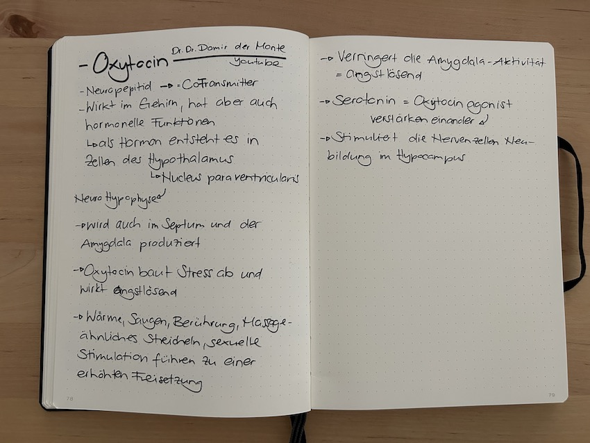
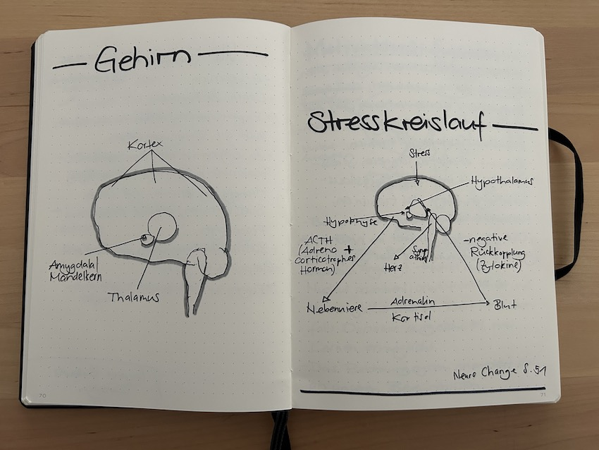

+++
title = "Vertrauen, Veränderung und das lernende Gehirn"
date = "2025-06-09"
draft = false
pinned = false
tags = ["Neuro", "Leadership", "Change", "Lernen"]
image = "img_3006.jpg"
description = "Wie reagieren unser Gehirn und Nervensystem auf Veränderung? Und welche Rolle spielt Vertrauen dabei? Ein paar Gedanken dazu. "
footnotes = ""
+++
Ein (weiterer) Versuch, das Zusammenspiel von innerer Sicherheit und organisationalem Wandel zu verstehen.

Veränderung braucht Vertrauen. Das sage ich oft und denke es noch öfter. Gleichzeitig weiss ich, es ist schnell gesagt. Aber was genau heisst das eigentlich und wie kann man Vertrauen herstellen? Während ich das schreibe sitze ich am Meer, schauen den Menschen beim Baden zu. Hier tauchen Bilder dazu auf, das Vertrauen nicht «etwas» ist, sondern viele Elemente enthält. Wenn ich im Meer schwimmen will, brauche ich Vertrauen in meine Einschätzung: «Ist die Situation sicher»? Es braucht Vertrauen in die Fähigkeiten als Schwimmer. Ich brauche Vertrauen in die Rettungsschwimmer die hier überall sind. «Schätzen Sie die Lage (grüne, gelbe, rote – die weht oft) richtig ein?». «Sind sie präsent, wenn man sie braucht?». Das könnte man auch aufs Rudern mit einer Gruppe oder aufs Segeln anpassen – dann hätten wir auch noch das Vertrauen in Führung, Umgang mit Unsicherheit und in die Teamarbeit.  

In einem Gespräch mit ChatGPT bin ich dieser Frage nach Veränderung und Vertrauen etwas näher gekommen. Dabei habe ich nicht nach einer Antwort gesucht, sondern ein Dialog mit einer Kollegin, die mir hilft, meine Gedanken zu sortieren. Ich merke auch hier, wenn ich das Thema aus einer neurobiologischen Perspektive betrachte, wird einiges klarer und gleichzeitig komplexer. Ja, wenn ich die üblichen Arbeits- und Bildungskontexte betrachte, wirkt die Idee von nachhaltigem Wandel (Change und so) auch irgendwie hoffnungslos. 

## Unser Gehirn ist nicht neutral gegenüber Veränderung.

Viele denken, dass Veränderung einfach ein Schritt oder Weg von A nach B ist. Vielleicht, weil sie selbst (auch persönlich) noch nie durch eine wirkliche (grosse, umfassende, krisenbehaftete) Veränderung sind. Von A nach B? Yes! So sieht es in unserem Gehirn definitiv nicht aus. Dort ist Veränderung erstmal ein Risiko. Das Alte ist vertraut, das Neue nicht. Das Alte ist energieeffizient (weil gewohnt und somit sicher), das Neue fordert Aufmerksamkeit und Energie (viel Unbekanntes und Unsicherheit). Im besten Fall fragt das Gehirn: «Bist du sicher, dass wir das jetzt wirklich brauchen?», wahrscheinlicher scheint mir jedoch eine (unbewusste) Abwehrhaltung. «Nein, das will ich nicht.»

Diese Reaktion ist kein Fehler unseres Gehirns, sondern ein Schutz (deshalb sind auch Widerstände in Change normal und okay). Das zeigt sich zum Beispiel in der sogenannten [Change-Kurve](https://www.bensblog.ch/change-management/). Das ist ein Modell, das beschreibt, wie Menschen typischerweise emotional auf Veränderung reagieren: erst Schock, dann Ablehnung, Verwirrung, bevor allmählich Akzeptanz und Integration möglich werden. Ein Prozess, der Zeit braucht und Räume, in denen Emotionen Platz haben dürfen.

Es ist ein eingebautes Warnsystem – man könnte sagen eine Art Immunsystem «ich lasse nicht alles mit mir machen» (Danke [Daniela Ogi ](https://www.3punkt-ogi.ch/)für dieses Bild!). Und genau deshalb reicht es oft nicht, wenn wir Menschen erklären, warum eine Veränderung sinnvoll ist. Ihr Nervensystem «muss» einbezogen werden, es «muss» die Möglichkeit haben, mitzukommen. Vertrauen kann dabei wie ein Puffer oder eine Schwimmhilfe wirken. Nur lässt sich dieses Vertrauen nicht von heute auf morgen herstellen. 

Wenn ich mich sicher fühle, kann ich mich auf Neues einlassen. Dann ist da Raum für Neugier, für Fragen, für das Zulassen von Nicht-Wissen. Neurobiologisch betrachtet könnte man sagen: Weniger Cortisol (Stresshormon), mehr Oxytocin (auch Kuschelhormon genannt, spielt eine wichtige Rolle bei der Förderung von Bindung, von positiven Emotionen). 



Ein kleiner Einblick in meine physischen und digitalen ([mirroco](https://www.mirroco.ch)) Notizen und Skizzen.

<iframe width="560" height="315" src="https://www.youtube.com/embed/Ikdq64kk1q0?si=i8eEXCOTkjjCHvWT" title="YouTube video player" frameborder="0" allow="accelerometer; autoplay; clipboard-write; encrypted-media; gyroscope; picture-in-picture; web-share" referrerpolicy="strict-origin-when-cross-origin" allowfullscreen></iframe>

### Gehirn: Stress & Stresskreislauf

* Wir lernen durch **Noradrenalin**, wie wir mit stressigen Situationen umgehen sollten. 
* **Kortisol** dagegen verhindert in grossen Konzentrationen den Aufbau und die Ausschüttung von **Nervenwachstumsfaktoren** im Gehirn. 
* Kommt es also zu längeren Stressepisoden mit intensiven Kortisolausschüttungen, fängt das Gehirn an, Netzwerke abzubauen. 
* Die **Amygdala** arbeitet im Wesentlichen so autonom, wie der **Sympathikus.**



Da kommt Führung ins Spiel. Nicht im Sinne von «alles im Griff haben» oder «steuern», sondern im Sinne von Orientierung geben, Beziehungen aufbauen, pflegen, gestalten. Dazu gehört es auch, Nicht-Wissen aushalten zu können und auch zuzugeben. Das ist eine Form von Ambiguitätstoleranz, also der Fähigkeit, Mehrdeutigkeit, Unsicherheit und vorläufige Antworten nicht als Bedrohung, sondern als Teil des gemeinsamen Suchens zu betrachten. 

Menschen und ihr System reagieren auf so vieles und auch auf das, was nicht gesagt wird. Auf die stillen Unsicherheiten, auf die eigenen Widerstände der Führungsperson. In diesem Prozess geht es neben der Führung auch um Resonanz und Stimmigkeit. Es geht auch um Beziehungsgestaltung.

Unsere Spiegelneuronen sorgen dafür, dass wir spüren, wie es anderen geht. Und das beeinflusst, ob wir uns öffnen oder schützen.

## Lernen ist möglich – aber nicht immer

Ja, unser Gehirn kann sich ein Leben lang verändern (Neuroplastizität). Neue Verbindungen knüpfen, alte Muster hinterfragen. Aber das passiert nicht auf Knopfdruck. Lernen braucht bestimmte Bedingungen: Sicherheit, Relevanz, Beziehung. Und auch ein gewisses Mass an Wiederholung. Ohne diese Voraussetzungen bleibt nachhaltige Veränderung Theorie und fördert nur Stress und Konflikte. 

Ich frage mich manchmal, ob wir in Organisationen nicht zu oft davon ausgehen, dass Lernen und Entwicklung einfach passiert, sobald ein Changeprozess angestossen wird. Aber vielleicht müssten wir zuerst Räume schaffen, in denen Menschen sich sicher genug fühlen, um überhaupt anders zu denken und zu handeln.

### So ein Raum könnte psychologische Sicherheit sein: 

<iframe width="560" height="315" src="https://www.youtube.com/embed/eP6guvRt0U0?si=BlNm-Q4C6CwrangL" title="YouTube video player" frameborder="0" allow="accelerometer; autoplay; clipboard-write; encrypted-media; gyroscope; picture-in-picture; web-share" referrerpolicy="strict-origin-when-cross-origin" allowfullscreen></iframe>

## Ein paar Fragen, die für mich bleiben:

Wie gestalten wir Führung gehirngerecht? So, dass sie Sicherheit gibt? Und vor allem, wie kommen Führungspersonen gemeinsam mit den Mitarbeitenden dorthin? Denn es geht nur zusammen. Zudem stellt das grosse persönliche Anforderungen an Führungspersonen. 

Wie können wir Veränderung als etwas (fürs Gehirn) Verstehbares und Gestaltbares gestalten, nicht als etwas, das (wie Wellen) «über uns kommt»? Dazu habe ich etliche Ideen und Gedanken, nur wie bringen wir das in die Praxis? 

Und wie können wir als Organisationsbegleiter:innen, Lernbegleiterinnen und Lernbegleiter (gehirngerecht) mithelfen, dass Vertrauen nicht eingefordert, sondern aufgebaut wird? Auch hier braucht es Beziehung und gegenseitige Offenheit.  

Ich glaube nicht, dass es dafür ein Rezept gibt. Aber vielleicht reicht es, wenn wir anfangen, genauer hinzuspüren: Was passiert hier gerade – nicht nur auf der Oberfläche, sondern im Innern oder in der Tiefe (im System unseres gesamten Körpers)? Bei mir selbst und im Team um mich herum.