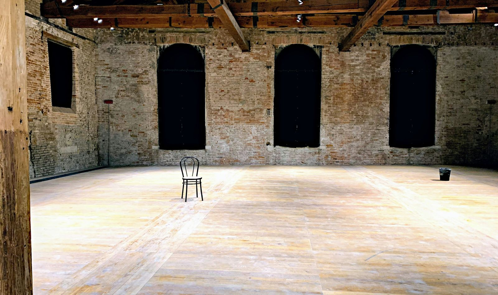

+++
title = "Warum ich nicht (mehr) Coach oder Facilitator sein will "
date = "2025-08-10"
draft = false
pinned = false
tags = ["Gedanken", "Coaching"]
image = "coaching_1.jpg"
description = "Coaching und Facilitating haben ihre ursprüngliche Kraft verloren und sind zu Marketingbegriffen verkommen. Wichtiger als die richtige Bezeichnung ist eine Haltung der Begleitung auf Augenhöhe."
footnotes = "Titelbild: [Serge Le Strat, Unsplash](https://unsplash.com/de/@slestrat)"
+++
# Von verwässerten Begriffen und echter Haltung

## Coaching, Facilitating zwei Begriffe, die nicht (mehr) sind, was sie sein könnten. 

Es gibt Begriffe oder Tätigkeiten, die einmal sehr wichtig für mich waren. Die mich geprägt haben in meiner Arbeit, in meiner Haltung, in meinem Verständnis davon, wie Entwicklung gelingen kann. *Coaching* ist so ein Begriff und später kam auch *Facilitating* dazu. Worte, die in ihrer ursprünglichen (oder korrekten) Bedeutung für etwas stehen, das mir wichtig ist: Begleitung auf Augenhöhe, Räume schaffen, Raum geben und halten, Prozesse ermöglichen, ohne selbst im Zentrum zu stehen.

Es sind Begriffe, die ich kaum noch nutze. Nicht, weil ich mich von dem verabschiedet habe, was sie im Kern meinen. Sondern weil die Begriffe, zumindest in der Art, wie sie im Mainstream gebraucht werden für mich die Kraft verloren haben. Sie haben nicht nur Kraft verloren, sondern haben bei vielen eine ganz andere Bedeutung. 

Ich arbeite lieber mit dem, was sich dahinter verbirgt und habe keinen Anspruch mehr, es benennen oder in (m)ein Rollenprofil giessen zu müssen.

## Was Coaching einmal für mich war und was geblieben ist

Wenn ich an Coaching denke, denke ich nicht an Tools, Modelle oder standardisierte Abläufe (das war es für mich nie, im Gegenteil, dagegen habe ich mich immer gewehrt). Ich denke an einen Raum, in dem jemand da ist, um Fragen zu stellen, ohne eigene Antworten bereit zu halten. An ein Gegenüber, das zuhört, das Resonanz bietet, das mitträgt, ohne zu lenken. Coaching ist für mich im Kern eine Haltung, kein Verfahren. Es ist ein Zusammenspiel von Präsenz, Zurückhaltung und Vertrauen in die Selbstwirksamkeit des anderen.

Was mich stört, ist nicht das Konzept, es sind auch nicht die (oft hilfreichen) Tools, die Methoden und Modelle. Vieles davon ist richtig und sinnvoll. Mich stört, was daraus gemacht wurde und wird. Coaching ist zum Angebot mit versprochener Lösung oder Wirkung (man muss es ja auch verkaufen) geworden. Wer seinem Angebot einen schönen Anstrich geben will, setzt noch das Wort «Coaching» dazu. Egal ob es sich um Training, Beratung oder (ganz schlimm) um das Aufdrängen von Pseudo-Weisheiten handelt. Es hat kaum mehr mit dem zu tun, was es für mich ursprünglich ausgemacht hat: die Offenheit, das Nichtwissen, das Vertrauen in das, was sich zeigt, wenn man wirklich zuhört (und die «richtigen» Fragen stellt).

Ich selbst arbeite oft genau mit diesen Ansätzen oder eben viel mehr mit dieser Haltung. Aber ich muss es nicht (mehr) Coaching nennen, auch wenn ich es manchmal noch möchte. Ich bin nicht (mehr) darauf angewiesen, mich über diesen Begriff zu definieren (ich integriere es heute einfach in meine Rollen). Und trotzdem beschäftigen mich diese Definition, diese Zuschreibungen.

## Facilitator: Der «Coach» für Gruppen

Auch der Begriff des Facilitators gefällt mir eigentlich sehr. Vielleicht, weil er in seiner Grundidee etwas Unterstützendes, Ermöglichendes trägt. Ein Facilitator hält den Raum, strukturiert, balanciert, ohne sich selbst ins Zentrum zu stellen. Er begleitet Gruppen in ihren Prozessen, fördert Dialoge, schafft Bedingungen, unter denen Zusammenarbeit gelingt.

Diesen Begriff habe ich eigentlich nie genutzt. Vieles von dem, was unter Facilitating verstanden wird, ist Teil meiner Arbeit. Ich halte Räume, ich gestalte Prozesse, ich begleite Gruppen durch Übergänge, Spannungen, neue Verständnisse. Ich vermittle nach Möglichkeit nicht, ich gebe kein Wissen weiter. Ich teile allenfalls meine Gedanken, meine Erfahrungen und die Ansätze, die ich kenne. So, dass andere für sich das herausnehmen können, was sie benötigen. Aber klar, ich bin kein reiner Facilitator, oft sind die Ziele und Wünsche der «Kunden» andere. Wichtig ist mir, diese Coaching- oder Facilitatoren-Haltung einzubringen. Sie ist ein Teil meines professionellen Verständnisses, vielleicht sogar ein Teil von mir. 

Ähnlich wie beim Coaching wird dieser Begriff einfach für alles genutzt, was gerade so gefällt und modern klingen soll. Facilitating ist für viele zur Methode geworden mit Frameworks und formalen Abläufen. Eine technische Umsetzung mit wenige oder keiner passenden Haltung. 

## Sich selbst nicht zu wichtig nehmen. Gedanken über Wirkung und Haltung

Ich bin der Meinung, mit dem Begriff Coaching nehmen sich viele zu wichtig. Sie wollen sich oder ihrem Tun einen schönen Anstrich geben und tun dann das, was am einfachsten ist. Vermitteln, Erzählen, Lösungen bieten etc. Viele sind sich ihrer Verantwortung nicht bewusst, sie wollen «einfach helfen», ihre Erfahrungen weitergeben. Wer etwas von Coaching versteht, weiss, dass es genau das nicht ist. 

Beim Coaching geht es um Präsenz, um Beziehung. Es geht um eine Haltung von Offenheit, um das Gestalten eines Prozesses, der eben nicht linear ist, vielleicht zu keiner «Lösung» kommt und es doch vorwärts geht. Coaching braucht Profis, die sich und ihr Tun nicht zum Mittelpunkt zu machen.

Ich nehme mich ernst in meiner Arbeit, aber nicht zu wichtig. Ich habe eine Idee was ich kann, und gleichzeitig lasse ich Raum für das, was im Prozess entsteht. Ich habe Erfahrung, Wissen, Intuition und nutze sie, ohne sie in den Vordergrund zu stellen (und hinterfrage das alles immer wieder). 

An den Begriffen Coach oder Facilitator stört mich wohl, dass sie zu viel mittransportieren, was ich gar nicht meine.

Ich will nicht gegen die Begriffe schreiben. Ich arbeite ja mit Sprache, auch, um Dinge zu klären, sichtbar zu machen, Resonanzräume zu öffnen. Aber ich merke: In meiner Arbeit brauche ich keine festen Begriffe, um klar zu sein. Ich brauche eine Haltung. Und den Mut, mich einzulassen.

Deshalb wähle ich lieber meine eigenen Beschreibungen. Beschreibungen, die nicht auf Titel hinauslaufen, sondern auf Beziehung, Prozess und Entwicklung. Ich verstehe mich als Begleiter. Als jemand, der mitgeht, mitdenkt, mitfühlt, ohne «es» besser zu wissen. 

Was bleibt, ist das Vertrauen: Dass etwas in Bewegung kommt, wenn man nicht stört. Dass Klarheit entstehen kann, wenn man sie nicht erzwingt. Und dass manchmal genau dort Wirkung geschieht, wo niemand sie für sich beansprucht.

**PS:** Ich will hiermit auf keinen Fall sagen, dass ich «es» richtig mache oder genau weiss, wie «es» funktioniert. Ich möchte ein kritisches Hinterfragen anregen und etwas mehr von meinem Verständnis teilen.