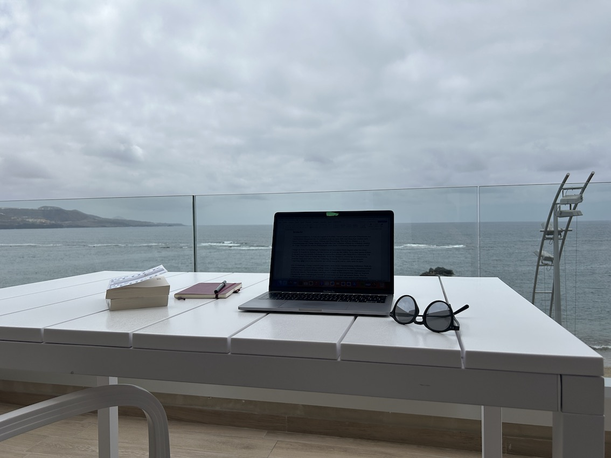
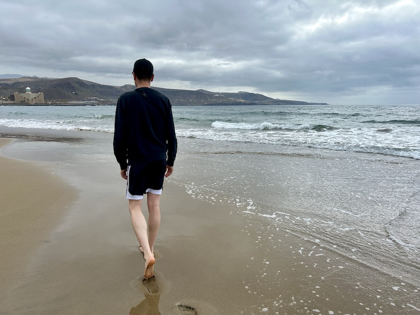
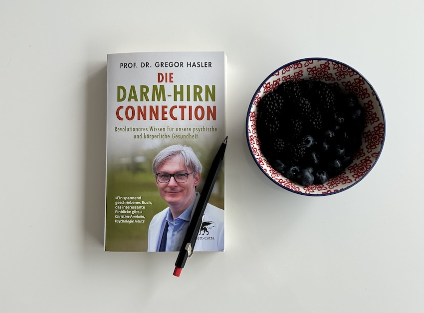
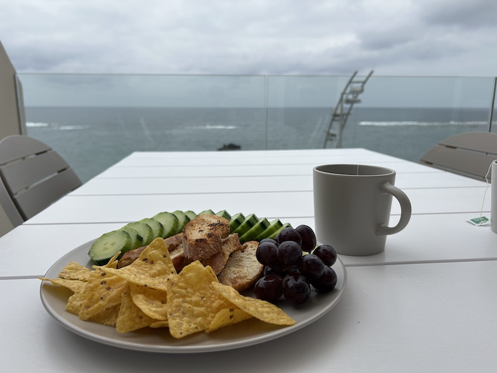

+++
title = "Von Kopf bis Fuss in Bewegung: Eine persönliche Annäherung an die Neurowissenschaft"
date = "2025-06-05"
draft = false
pinned = false
tags = ["Neuro", "Biografie"]
image = "ben-gehen.jpg"
description = "Was bringt unser Nervensystem in Balance? Wie hängen Gehen, Spüren, Denken und unser soziales Miteinander zusammen? In diesem Beitrag verbinde ich persönliche Erfahrungen mit neurowissenschaftlichen Perspektiven – und gehe der Frage nach, was es heisst, ganz Mensch zu sein: von Kopf bis Fuss, innen wie aussen, in Bewegung."
footnotes = "**Interozeption:** \n\n*«Die Interozeption umfasst die bewusste sowie die unbewusste Wahrnehmung des psychischen und körperlichen Innenlebens. Der überwiegende Teil der Interozeption erfolgt dabei unbewusst. Ausnahmen sind Essen und Stuhlgang, die fast immer bewusst ablaufen.»* Hasler (2020), S. 63\n\n**Weitere inspirierende Einblicke in die Welt des Gehens:**\n\n[Hanspeter Tschanz - von Brenzikofen nach Tschechien](https://www.bern-ost.ch/Brenzikofen---Bruecken-schlagen-und-sie-auch-ueberqueren-25386)\\\n[Fredi Zumbrunn: Meerwärts](https://www.fredizumbrunn.ch/tags/meerwarts/)\n\n[Marco Jakob: Auszeit: Gedanken eines Gründers auf Wanderschaft](https://www.marcojakob.blog/auszeit-gedanken-eines-gruenders-auf-wanderschaft/)"
+++
## Einleitung

Ich sitze auf der Terrasse eines Ferien-Apartments in Las Palmas. Da ich in den Ferien dazu neige, zu arbeiten oder Dinge zu tun, die dem nahekommen, wusste ich lange nicht, welche Bücher ich mitnehmen soll – denn ich dachte (wieder einmal), es müsste etwas «Entspannendes» und Arbeitsfreies sein. Irgendwie hätte das meinem Naturell und meinen Interessen widersprochen. Ich liess es daher auf mich zukommen, und tadaaa – plötzlich tauchten zwei Bücher auf, die ich vorher nicht auf dem Schirm hatte. Zwei Bücher, deren Inhalt mich sehr interessierte und die gut in die Ferienzeit passen würden. So sind Darm-Hirn-Connection von Prof. Dr. Gregor Hasler sowie «Das Glück des Gehens» von Prof. Shane O'Mara mit mir auf die Reise gekommen. Beide Autoren verweisen immer wieder auf (aktuelle) Forschungen, ohne abschliessende Allheil-Lösungen anzubieten. 

Sie biete Perspektiven und machen das Wunder des Körpers aus ihrer eigenen Sicht sichtbar. So, wie zum Beispiel Shane O'Mara:

> «Unsere Aufrechte Haltung verändert unsere Beziehung zur Welt, auch, wie wir sehen werden, zur sozialen Welt. Gehen vermittelt unserem Denken Beweglichkeit, die anderen Tieren verwehrt ist.»
>
> *O'Mara (2021), S. 8*

## Buchwahl aus persönlicher Sicht

### Weshalb gerade diese beiden Themen?

In einem [aktuellen Selbstlernprojekt ](https://www.bensblog.ch/kompetenzraster-neuro/)beschäftige ich mich mit der [Neurowissenschaft](https://www.bensblog.ch/tags/neuro/) im Zusammenhang mit [Change](https://www.bensblog.ch/tags/change/) und [Leadership](https://www.bensblog.ch/tags/leadership/). Bücher dazu mitzunehmen, wäre mir tatsächlich zu nah an der Arbeit gewesen. Die gewählten Bücher nehmen sehr wenig konkrete Perspektiven zur Arbeit ein, beleuchten dafür wichtige, ganzheitliche Aspekte. Beide Autoren schlagen die Brücke zwischen dem Buchtthema und dem Gehirn, sowie vielen anderen Zusammenhängen. 

> «Ein simpler Nebeneffekt des Aufstehens und Gehens besteht darin, dass sich die Aktivität über weit auseinanderliegende Gehirnregionen ausbreitet – was die Wahrscheinlichkeit erhöht, dass Halb-Gedanken und Viertel-Ideen unterhalb der Bewusstseinsebene sich zu neuen Kombinationen zusammenschliessen können.» 
>
> *O'Mara (2021), S. 176*

### Persönlicher und biografischer Hintergrund

Wie bereits im Text [«Meine Pinguin-Geschichte»](https://www.bensblog.ch/der-pinguin-und-ich/) näher beschrieben, hatte ich eine schwierige Schulzeit (die vollen neun resp. zehn Jahre!) und erlebte während meiner Ausbildung Mobbing. Schon damals – oder kurz danach – entwickelte ich eine Sozialangst. Ein Symptom davon waren Essprobleme, und ein gutes Sozialleben war in vielfacher Hinsicht sehr schwer (Heilung schien oft hoffnungslos). Das alles führte zu einem Dauerstress in meinem Nervensystem, der auch Jahre danach anhielt, obwohl ich immer wieder und intensiv damit und daran gearbeitet habe.

Seit einigen Jahren begleitet mich eine Histaminintoleranz beziehungsweise eine Histaminstoffwechselstörung, die man weder genau diagnostizieren noch konkret behandeln kann. Die Verbindung zwischen dem Dauerstress in meinem System und den gesundheitlichen Problemen scheint mir bereits länger klar. Aber wo beginnen und wer hilft oder sieht «das Ganze»? Schwierig. In den letzten anderthalb Jahren habe ich viel darüber (und über mich) gelernt – vor allem aus Sicht der Psyche in Verbindung mit dem Körper und dem Nervensystem. Dabei spielte auch Bewegung, konkret Gehen, eine wichtige Rolle. Seit Kurzem widme ich mich meinem Darmmikrobiom. Die Wichtigkeit und Vielfältigkeit des Darms ist mir spätestens seit dem Buch «Darm mir Charme» bekannt. Mit einem tieferen Verständnis für das Nervensystem und insbesonere den Vagus-Nerv bin ich dann auf das Buch von Gregor Hasler gekommen. 

Anders als wir das vielleicht annehmen würden, kommuniziert dieser Nerv sehr stark von «unten nach oben», also aus dem Körper hin zum Gehirn. 

> Der grosse Zuhörer unter den vegetativen Nerven ist der Vagus-Nerv. Nur 20 Prozent seiner Fasern geben Befehle von oben nach unten weiter, die restlichen 80 Prozent hören den Organen zu, um das Hirn über unseren inneren Zustand zu informieren. 
>
> *Hasler (2020), S. 40*

Hier finde ich auch Themen, die ich erst seit kurzem wirklich verstehen kann und lerne, noch mehr über diese «Connection» zwischen Darm und Hirn. 

>  «Frühe und wiederholte Traumatisierungen können aber zu schweren psychischen Störungen führen \[…]. In diesen Fällen ist der Sympathikus in der Regel langfristig übererregt, was zu Angst, dem Gefühl der Bedrohung, übermässiger Schreckhaftigkeit, erhöhter Wachsamkeit, \[…] führt.» 
>
> *Hasler (2020), S. 51*

> «Anhaltender Stress ist der häufigste Grund für eine Störung der Interozeption. Die Aktivierung des Sympathikus führt zu einer Orientierung nach aussen und dadurch zu einer übermässigen Wahrnehmung äusserer Gefahren.» 
>
> *Hasler (2020), S. 65*

Sonderlich sportlich war ich nie und entsprach kaum dem Bild eines klassichen Jungen (oder zumindest nicht dem, wie es zu meiner Zeit auf dem Land vorherrschte). So entwickelte ich nie ein gutes Gespür für meinen Körper und Sport. Passend dazu ein SRF-Beitrag:



  <iframe src="https://www.srf.ch/play/embed?urn=urn:srf:audio:a9490a50-f499-4a9a-8a05-6919aa718585&subdivisions=false" 
          style="width: 100%; height: 100%; border: 0;" 
          allowfullscreen 
          allow="geolocation *; autoplay; encrypted-media">
  </iframe>



Da ist Gehen eine einfache Form der Bewegung. Es geht nicht um Leistung. Zudem haben mich Geschichten und Erlebnisberichte übers Gehen immer wieder interessiert. Da sind zum Beispiel:

[Ich bin dann mal weg von Hape Kerkeling](https://www.exlibris.ch/de/buecher-buch/deutschsprachige-buecher/hape-kerkeling/ich-bin-dann-mal-weg/id/9783492251754/?srsltid=AfmBOor9bj3I-6M1-bJHjpRDfMjbMFiZz6XzmkoVKslh5mLdtOZUG3VR)

[Die unwahrscheinliche Pilgerreise des Harold Fry](https://www.exlibris.ch/de/buecher-buch/deutschsprachige-buecher/rachel-joyce/die-unwahrscheinliche-pilgerreise-des-harold-fry/id/9783596513154/?srsltid=AfmBOoo6PXOr7KJHhcoLYrRREWI2c8umhgvaTSeAT3ExFzkrmn_5u1nG)

[Soweit die Knie tragen tragen, das Buch finde ich nicht mehr](https://www.welt.de/print-wams/article144229/Soweit-die-Knie-tragen.html).

[Wanderexpertin Christine Thürmer – Wie wird man so glücklich wie du?](https://www.youtube.com/watch?v=1rbzIZq9sc0&pp=0gcJCdgAo7VqN5tD)

### Buchwahl aus beruflicher Sicht

Die Ganzheit der Menschen in der Arbeitswelt (auch in der Schule/Bildung) ist mir schon lange – vielleicht schon immer – wichtig. Im Kern beider Bücher geht es um unser Gehirn und das Zusammenspiel mit unserem Körper. Sie ergänzen Neuroleadership und Neuro-Change perfekt, weil sie weniger konkrete Arbeitsbeispiele liefern, dafür aber wichtige, ganzheitliche Perspektiven aufzeigen. Da finde ich bei O'Mara einen passenden Textabschnitt:

> «Häufig werden Kinder von Lehrern ermahnt, nicht aus dem Fenster zu sehen, sondern aufzupassen. Aber es hat den Anschein, als hätten Generationen von Lehrern falsch gelegen: Aufgabenorientierte Aufmerksamkeit und das Umherschweifen der Gedanken sind zwei Seiten derselben mentalen Medaille.» 
>
> *O'Mara (2021) S. 169*

### Das Glück des Gehens - Was die Wissenschaft darüber weiss und warum es uns so guttut

Im Buch [«Das Glück des Gehens»](https://www.exlibris.ch/de/buecher-buch/deutschsprachige-buecher/shane-omara/das-glueck-des-gehens/id/9783499606656/?srsltid=AfmBOopojeAkM9xwvp7aUPUzCpgyock9jRbe-4NvNyf9GGFa2uMpSHvI) habe ich viel Inspiration gefunden, selbst noch öfter zu gehen. Gehen beeinflusst unsere Gesundheit (das ist eigentlich nichts Neues), fördert die Kreativität und ist etwas Soziales. All das habe ich in den letzten Jahren intensiver und bewusster erlebt. Die Wichtigkeit der Bewegung für Kreativität wird im Buch deutlich – und wirft damit auch ein anderes Licht auf die sogenannten Wissens­arbeiter:innen, die bei ihrer Arbeit meistens sitzen.

Gehen bringt gem. O'Mara viele Vorteile für unser Leben ganz allgemein und für unser Denken:

> «Gehen ist ausserordnetlich vorteilhaft für unseren Geist, unseren Körper uns unser Zusammenleben. Gehen ist ganzheitlich: Jeder Aspekt des Gehens fördert jeden Aspekt des Seins.» 
>
> *O'Mara (2021), S. 10* 

> «Gehen verschafft mir die Freiheit, die Dinge zu durchdenken; in einem stummen Dialog mit mir selbst zu klären, wie sich ein Problem lösen lässt.» 
>
> *O'Mara (2021), S. 165*

Meetings oder Mentorings im Gehen – «Gedankengänge» – damit bin ich vor allem im Zusammenhang mit Co­learning und Co­working in Kontakt gekommen. So verwundert es nicht, dass [Colearning.org](https://www.colearning.org) auch teilweise im Gehen gegründet wurde. Damit «Gehen» passieren kann, braucht es so viele Dinge im Körper, die zusammenspielen. So erlebe ich gerade in einer Umgebung, die ich teilweise bereits kenne und doch immer wieder neu erkunden muss, das Wunder des Gehens. Ich habe Zeit, mich dem bewusst zu widmen.

In einer bereits entspannten Zeit bewege ich mich zwischen Stadt und Natur, zwischen Sand und Wasser. Ich spüre die Wirkung für Körper und Geist.

> «Sich durch die Welt zu bewegen, ist ein wesentlicher Teil menschlicher Erfahrung. Bewegung, insbesondere viele regelmässige Spaziergänge und Wanderungen sind gut – sogar hervorragend – für Körper und Geist.» 
>
> *O'Mara (2021), S. 141*

Ob und was in und mit meinem Gehirn genau passiert, weiss und spüre ich nicht. O'Mara meint, es sei bereits nach kurzer Zeit förderlich. 

> Regelmässiges Gehen in vernünftigem Tempo verheisst eine allgemeine Verbesserung der Hirnfunktionen in kurzer Zeit. 
>
> *O'Mara (2021), S. 160*

 

Bewegung beginnt nicht im Körper – sie beginnt im Gehirn. Genauer: im limbischen System, dort, wo auch Emotionen entstehen. Von dort wird der motorische Assoziationskortex informiert. Hier entstehen erste, wilde Bewegungsentwürfe.

Diese rohen Impulse werden gleichzeitig von zwei Instanzen überprüft und überarbeitet:

* Basalganglien: Sie entscheiden, ob eine Bewegung überhaupt stattfinden soll.
* Kleinhirn: Es optimiert die Entwürfe, integriert Gleichgewichtsinformationen und Lageempfinden (Propriozeption). Wie genau das Kleinhirn dabei vorgeht, ist bis heute nicht vollständig verstanden – die Forschung tastet sich voran.

Das Kleinhirn erhält dabei eine riesige Menge an Information:

* Bewegungsentwürfe,
* sensible Rückmeldungen aus dem Körper,
* insbesondere Gleichgewichts- und Lageinformationen.

Rund 200 Millionen Axone (Nervenverbindungen) führen ins Kleinhirn, wo die Daten nach zwei Prinzipien verarbeitet werden:

* **Vorwärts immer, rückwärts nimmer** – Informationen werden nur nach vorne weitergeschaltet.
* **Divergenz & Konvergenz** – Informationen werden aufgesplittert, durchdifferenziert, dann wieder zusammengeführt.

Schliesslich werden die überarbeiteten Bewegungsbefehle im Thalamus gebündelt und an den primär motorischen Kortex weitergeleitet. Von dort geht das Signal ins Rückenmark – und dann zu den Muskeln.

  <iframe src="https://www.youtube.com/embed/fbdgSR_aPWw?si=0afjX963Gk3ZmeFC" 
          title="YouTube video player"
          style="position: absolute; top: 0; left: 0; width: 100%; height: 100%;"
          frameborder="0"
          allow="accelerometer; autoplay; clipboard-write; encrypted-media; gyroscope; picture-in-picture; web-share"
          referrerpolicy="strict-origin-when-cross-origin"
          allowfullscreen>
  </iframe>



Der Nutzen des Gehens ist nicht nur gut für unser Gehirn, sondern für unseren gesamten Körper und wer hätte es gedacht, für unseren Darm. 

> «Regelmässiges Gehen ist eine einfache Form des Herztrainings, und das wiederum bringt grosse Vorteile für die Herz-Hirn-Achse, denn rund 20 % des Herz-Outputs wird dem Gehirn zugeleitet, das viel Sauerstoff und Energie verbraucht. Zu ähnlichen Effekten kommt es im Darm, der ebenfalls viel Energie und Sauerstoff benötigt.»
>
> *O'Mara (2021), S. 143*

Wichitg ist hier vielleicht zu betonen, dass Regelmässigkeit wichtig ist. Dann hilft das also unserem Herzen, dem Darm (der, wie wir noch sehen werden unser zweites Hirn ist) sowie unserem Gehirn. 

> «Regelmässige Bewegung verstärkt die Blutzirkulation im Gehirn und wirkt sich nachhaltig auf dessen Struktur und Funktion aus. Sie hilft dem Gehirn, in einer bestimmten Region, die für Lernen und Gedächtnis von grosser Bedeutung ist, neue Gehirnzellen zu bilden.»
>
> *O'Mara (2021), S. 159*

### Die Darm-Hirn-Connection - Revolutionäres Wissen für unsere psychische und körperliche Gesundheit

Wer spricht oder schreibt schon gerne von seinem Darm? Zum Glück haben verschiedene Autor:innen zur zunehmenden Enttabuisierung beigetragen. Denn wüssten wir mehr darüber, könnten wir vielleicht und ganz natürlich (noch) mehr für unsere Gesundheit tun – und damit meine ich auch die psychische Gesundheit. Prof. Dr. Hasler schreibt aus Sicht eines Professors für Psychiatrie und Psychotherpaie; was ich lese, unterstützt mich in meinem eigenen Prozess, erklärt Vergangenes und öffnet, wie all die anderen Neuro-Themen, eine weitere und wichtige Perspektive auf uns Menschen, unser Zusammenleben und unsere Arbeit. Neben dem Darm und Gehirn spielt in seinem Buch auch das Nervensystem, insbesondere der Vagus-Nerv eine wichtige Rolle. 

Schaue ich auf meine Biografie, dann sind genau die zwei Themen als Schulkind (viel) zu kurz gekommen. Je nach dem wie wir aufgewachsen sind oder wie unsere Erlebnisse in der Vergangenheit waren, nehmen wir die Welt und unser Umfeld unterschiedlich sicher wahr. Neben unserer Wahrnehmung gibt es ja dann auch noch die Realität. Im Kontext von Arbeit könnte das heissen, dass die Realität mit der Schaffung eines psychologisch sicheren Umfeldes (u. a. Sicherheit & Verbundenheit) gestaltet werden kann. 

> «Sicherheit und das Empfinden von Verbundenheit sind die Voraussetzungen für die Integration des vegetativen und des sozialen Vagus­-Nervs im Hirnstamm. Das ist ein wichtiger Teil der Darm-Hirn-Connection. Eine gelungene Integration ist die Grundlage für authentische soziale Beziehungen und das Bewusstsein für eine gesunde Ernährung.» 
>
> *Hasler (2020), S. 69*

> «Gemeinsames Essen und Trinken kittet Bindungen und entscheidet über Weltpolitik.»
>
> *Halser (2020), S. 46*

Der Perspektivenwechsel mit der «Darm-Hirn-Connection» wirft für mich auch ein neues oder anderes Licht auf Meditation, körperorientierte Verfahren, Ernährung, gemeinsames Kochen und Essen. Er verleiht dem Genusstraining für mich nochmals eine tiefere Bedeutung. 

Gemeinsames Essen war für mich oft eine Herausforderung oder noch öfter unmöglich. Das kam u. a. daher, dass mein gesamtes System durch die Sozialangst im Alarmmodus war. Es wäre aber wichtig gewesen. Auch aufgrund meiner gemachten Erfahrung habe ich mich für die Ausbildung zum Genusstrainer entschieden. Beim Genuss geht es um viel mehr als Essen und Trinken. Es geht um alle Sinne. Dazu kann auch Gehen gehören. Wie ein neuronales Netz verbinden sich die Themen in diesem Text immer mehr. 

> Es ist klar, dass Gehen neben verbesserter kognitiver Fähigkeiten viele andere Vorteile bietet. \[...] Gehen schützt und heilt Organe, die grossen Belastungen ausgesetzt sind. Es ist gut für den Darm, weil es für eine bessere Verdauung sorgt. 
>
> *O'Mara (2021), S. 18*

Auch wenn es einfach und auch irgendwie schön wäre, diese Verbindungen alle erkennen und nutzen zu können, so bleibt doch vieles ein Geheimnis oder so individuell wie wir alle. Die gewonnenen Einblicke und Erkenntnisse helfen, vieles besser zu verstehen und aus einer anderen Perspektive zu betrachten. 

> Dass der mächtige Beruhigungsnerv des Körpers und der Seele strikte Logik, Ordnung und Regeln nicht gern hat, ist eine wichtige Lektion der menschlichen Anatomie. 
>
> *Hasler (2020), S. 41*
>
> Wenn sich die Natur bei so extrem wichtigen Funktionen wie der Stimme, dem Sprechen und Schlucken einen unlogisch langen Weg erlaubt, warum sollten wir dann erwarten, bei den wichtisten Dingen im Leben auf dem kürzesten Weg ans Ziel zu gelangen? 
>
> *Hasler (2020), S. 42*

Freuen wir uns doch über kurvige und steinige Wege, über schöne Ausbilcke und eine Toilette zum richtigen Zeitpunkt. 

## Gedanken zum Schluss

In diesem Beitrag versuche ich, gemeinsam mit den Buchinhalten anhand meiner eigenen Themen (die einzigen, die ich wirklich gut kenne) Zusammenhänge und die Komplexität von uns Menschen und unserem System – alles, was in unserem Körper drin ist und eigentlich auch drum herum – aufzuzeigen. Wenn wir an Change oder an Leadership denken, wenn wir an physische und psychische Heilung denken, dann tun wir gut daran, das grosse Ganze zu betrachten, Altes in Frage zu stellen und Neues zu entdecken.

So tut es uns allen gut, uns von den Schreibtischen wegzubewegen (oder zumindest immer wieder aufzustehen) und so nicht nur körperliche Vorgänge zu ermöglichen, sondern auch die Perspektive zu wechseln. 

> «Wollen wir freiere Formen kreativer kognition fördern, müssen wir die Menschen von ihren Schreibtischen und Bildschirmen wegholen und sie dazu bringen, sich mehr zu bewegen. Die positive Auswirkung der Bewegung auf Kreativität ist eine ergiebige und weitgehend unerschlossene Quelle, neue Ideen zu erzeugen.» 
>
> *O'Mara (2021), S. 179*

Dass Darm und Gehen wichtig sind, sollte eigentlich nicht neues sein. Hippokrates werden folgende passenden Zitate zugeschrieben: 

> «Alle Krankheiten beginnen im Darm» und «Gehen ist die beste Medizin».