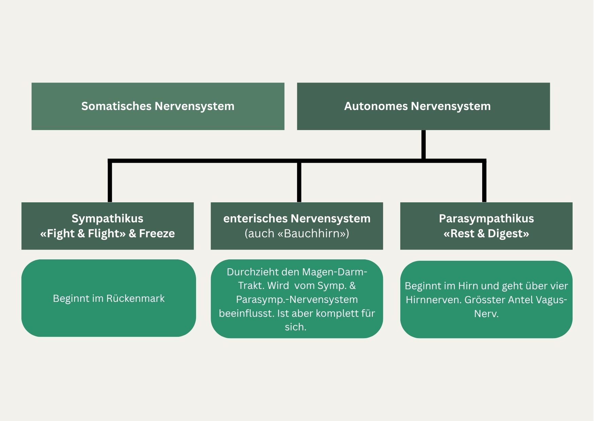

+++
title = "Was, wenn wir Wandel nicht machen, sondern ermöglichen?"
date = "2025-06-08"
draft = false
pinned = false
tags = ["Neuro", "Change", "Leadership", "Gedanken"]
image = "img_3047.jpg"
description = "Was, wenn Wandel nicht gemacht, sondern ermöglicht wird? Veränderung beginnt nicht im Kopf allein, sondern entfaltet sich im Körper, im ganzen System und in echter Beziehung. Durch Resonanz statt Druck."
footnotes = "[Die Darm-Hirn-Connection, Prof. Dr. Gregor Hasler](https://www.exlibris.ch/de/buecher-buch/deutschsprachige-buecher/gregor-hasler/die-darm-hirn-connection-wissen-amp-leben/id/9783608983845/?srsltid=AfmBOoo_fZo8SJ6LSwpWlPvps7-4lOpZccsyBe6Xa2iN3lI032FHwlrG)\n\n[Das Glück des Gehens, was die Wissenschaft darüber weiss und warum es uns so guttut, Shane O'Mara](https://www.exlibris.ch/de/buecher-buch/deutschsprachige-buecher/shane-omara/das-glueck-des-gehens/id/9783499606656/)"
+++
## Gedanken über Entwicklung, die im Innern beginnt und Beziehung braucht.

Veränderung ist kein rein geistiger Prozess und es hat nur sehr am Rande mit dem «richtigen» Mindset zu tun. Wer sich mit Entwicklung beschäftigt (persönlich, in Teams oder Organisationen) merkt im Idealfall: Es reicht nicht, den Kopf zu überzeugen. Veränderung beginnt tiefer. Sie beginnt im Körper jeder und jedes Einzelnen. Sie beginnt im gesamten System und sie beginnt in der Beziehung – zu mir und zu den anderen. 

Was mich an neurobiologischen und körperorientierten Ansätzen interessiert, ist nicht die Idee, Verhalten effizienter zu steuern (definitiv nicht!). Es ist ein weiterer Ansatz, um Entwicklung anders zu betrachten, als es oft getan wird. Entwicklung als etwas, das nicht gemacht, sondern ermöglicht wird. Die Frage lautet nicht: «Wie bringen wir Menschen dazu, sich zu verändern?» Sondern: «Welche inneren und äusseren Bedingungen sollten gegeben sein, damit nachhaltige Veränderung möglich wird.»

## Der Körper als Resonanzraum

Unser Nervensystem spielt dabei eine zentrale Rolle. Und dieses System beginnt oder endet nicht nur im Kopf. Es ist im gesamten Körper. In den Darm, im vegetativen Nervensystem, in hormonellen Kreisläufen und alles spielt zusammen. Die sogenannte Darm-Hirn-Achse ist nur ein Beispiel dafür, wie eng Denken, Fühlen und körperliche Prozesse miteinander verwoben sind. Ein Körper in (chronischer) Anspannung, ein Nervensystem in Alarmbereitschaft: Das sind keine idealen Voraussetzungen für Entwicklung. Das gilt übrigens auch für ganze Organisationen, deren «Nervensystem» sozusagen auch in Daueranspannung ist. Was in Change-Prozessen oft als «Widerstand» bezeichnet wird, ist manchmal Ausdruck eines überreizten Systems. Veränderung beginnt dann nicht mit der nächsten Strategie, sondern mit der Frage: «Was hilft diesem Menschen, sich innerlich sicher zu fühlen?» Der Ansatz der psychologischen Sicherheit bietet hier Unterstützung. Aber auch dieser ist kein Patentrezept und keine Einmaldosis, sondern etwas, das kontinuierlich gepflegt werden muss. Alles bleibt in Bewegung – nur wir oft nicht. 



Wir sollten uns davon lösen, das Gehirn (oder den Kopf) als die Zentrale für alles zu betrachten. Unser Gehirn steht in direkter Verbindung mit dem autonomen (vegetativen) Nervensystem, das unbewusst unsere Reaktionen auf Stress, Sicherheit und Beziehung steuert.

Der **Sympathikus** aktiviert uns – für Leistung, Reaktion, Fokus. Gut beschreiben lässt er sich mit Fight-Flight (& Freeze) Er ist wichtig, aber im Dauerbetrieb führt er zu (viel) Anspannung. 

Der **Parasympathikus**, besonders der über den Vagusnerv vermittelte Anteil, ist zuständig für Entspannung, soziale Verbundenheit und innere Ruhe.

Wenn der Sympathikus dominiert, sind wir in Alarmbereitschaft – aber nicht wirklich lernbereit. Das Gehirn hat in solchen Zuständen keinen guten Zugriff auf Selbststeuerung, Empathie oder kreatives Denken.  Es geht dabei ums «Überleben».

**Mehr dazu auch hier:**

<iframe width="560" height="315" src="https://www.youtube.com/embed/ihqaARY-Va4?si=qzVbMvlYgTUuhSK7" title="YouTube video player" frameborder="0" allow="accelerometer; autoplay; clipboard-write; encrypted-media; gyroscope; picture-in-picture; web-share" referrerpolicy="strict-origin-when-cross-origin" allowfullscreen></iframe>

Und dann ist da noch die **Neuroplastizität**, also die Fähigkeit des Gehirns, sich durch Erfahrung zu verändern, braucht Sicherheit – auf körperlicher, emotionaler und sozialer Ebene. Erst wenn das Nervensystem reguliert ist, können neue Verbindungen entstehen, die über den Moment hinaus Bestand haben. Veränderung geschieht also nicht gegen den Körper, sondern mit ihm. 



## Gehen als Praxis der Selbstverbindung

Bewegung ist mehr als Mobilität. Sie kann zu einer inneren Haltung werden. Das muss und soll nichts Schnelles sein. Schritt für Schritt, immer wieder in Bewegung, das reicht. Wer geht, bringt nicht nur seine Muskeln in Schwung, sondern auch vegetative, emotionale und kognitive Prozesse. Gehen kann regulierend wirken, klärend, verbindend – mit sich selbst und mit anderen. Vielleicht bewirkt ein Gang ums Bürogebäude mehr als ein weiterer Workshop. Vielleicht, weil der Schritt nach draussen auch ein Schritt nach innen ist. Bewegung braucht Regelmässigkeit und Bewegung ist Rhythmus. 

## Rhythmen statt Rezepte

Veränderung verläuft selten (wohl nie) linear. Sie kommt in Wellen und folgt inneren Rhythmen. Während ich diese Zeilen schreibe, schaue ich aufs Meer. Wellen, Ebbe und Flut. Sichtbares und Unsichtbares. Das Meer wird zur Metapher für das, was auch in uns geschieht: Regulation ist kein Zustand, sondern ein steter Vorgang. Ein immer wieder neues Austarieren zwischen Anspannung und Loslassen, zwischen Aktion und Ruhe. Gerade der Vagusnerv, ein zentraler Akteur in unserem vegetativen Nervensystem, könnte einen weiteren Hinweis geben: Entwicklung braucht Resonanz, nicht Druck. Er braucht Beziehung, nicht Kontrolle und manchmal braucht er vor allem Zeit. 

## Komplexität ernst nehmen

Wer Komplexität (wirklich) ernst nimmt, hört auf, nach eindeutigen Lösungen zu suchen. Stattdessen entstehen Räume für das Uneindeutige, für das noch Ungeformte. Entwicklung lässt sich nicht planen, wie ein Projekt (auch wenn man das oft versucht und es zuweilen auch sinnvoll ist) . Sie lässt sich nur ermöglichen – durch passende Bedingungen (für die es auch kein Patentrezept gibt), durch Selbst- und Co-Regulation, durch echtes Zuhören, durch echte Begegnungen, durch Vertrauen, durch den offenen Umgang mit Unsicherheit und vieles mehr. 

In diesem Sinne sollte die Frage nicht sein: «Wie gestalten wir Change effizienter?» Sondern: «Wie schaffen wir Bedingungen, in denen Wandel organisch entstehen kann – von innen heraus?» Das bedeutet, Kontrolle durch Kontakt oder Beziehung zu ersetzen. Und Klarheit nicht als Einfachheit zu begreifen, sondern als (tiefe) Verbindung mit dem, was gerade lebendig ist (und das ist in Bewegung). Auch ich (wie wohl alle in ähnlichen Positionen) stehe bei Begleitungen immer wieder vor den Fragen, wie genau das zwischen all den äusseren Faktoren, dem Alltagsstress, den einzelnen Systemen in der Organisation und all dem was da sonst noch ist, gelingen kann.