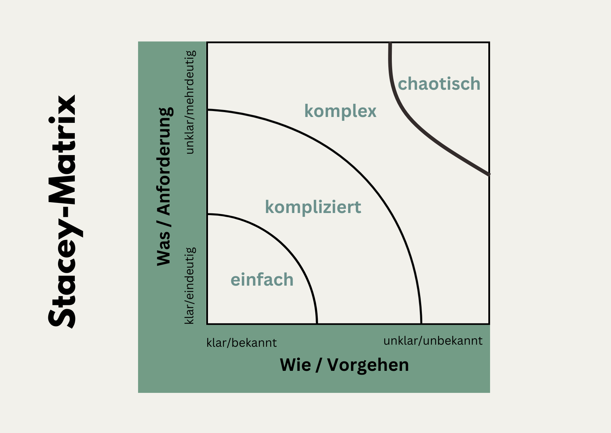

+++
title = "Wann sind agile Vorgehensweisen sinnvoll?"
date = "2024-07-01"
draft = false
pinned = false
tags = ["Organisationsentwicklung", "Agilität", "CAS"]
image = "rafting-4353428_640.jpg"
description = "Wann ist agile Arbeit oder der Einsatz von agilen Ansätzen sinnvoll? Dazu bietet die Stacey-Matrix eine Orientierungshilfe."
footnotes = "📕 [Zwischen Alt und Neu liegt gut, Wie wir mit Good Work eine zukunftsfähige Arbeitskultur gestalten können, ohne alles neu machen zu müssen, Jule Jankowski](https://www.exlibris.ch/de/buecher-buch/deutschsprachige-buecher/jule-jankowski/zwischen-alt-und-neu-liegt-gut/id/9783800669332/)\n\nTitelbild: [websiteproud](https://pixabay.com/de/users/websiteproud-6171224/?utm_source=link-attribution&utm_medium=referral&utm_campaign=image&utm_content=4353428) auf [Pixabay](https://pixabay.com/de//?utm_source=link-attribution&utm_medium=referral&utm_campaign=image&utm_content=4353428)"
+++
## Gedanken zu Agilität und dem passenden Einsatzbereich

> «Wenn man ein Werkzeug anwendet, dann übernimmt man auch die Managementphilosophie, die diesem Werkzeug innewohnt.» 
>
> *Clay Shirky Zitat in Reinvanting Organisations, S. 41*

Im Beitrag [«Agilität - ein Überblick»](https://www.bensblog.ch/agilitaet) habe ich einen kurzen Ein- und Überblick über die agile Arbeit gegeben. Bereits dort habe ich einen Hinweis darauf gegeben, dass Agilität resp. agile Arbeitsweisen gerne als Lösung für vieles (oder fast alles) gepredigt werden. Wie alle anderen Ansätze, Methoden und Tools ist auch Agilität nicht die Zauberlösung. Doch wann ist agile Arbeit oder der Einsatz von agilen Ansätzen sinnvoll? Dazu bietet die Stacey-Matrix eine Orientierungshilfe. Diese Matrix unterscheidet die vier Kategorien Einfach, Kompliziert, Komplex und Chaos. 

**1. Einfach**

* Klare Zusammenhänge
* Bekanntes Wissen hilft
* Das Problem und die Anforderung an eine Lösung sind klar
* Hier kann es sich zum Beispiel um wiederholende Prozesse oder Arbeiten handeln 

**Mögliche Vorgehensweisen und Tools:**

* Standardisierte Prozesse: Detaillierte Schritt-für-Schritt-Anleitungen und Checklisten.
* Wasserfallmodell: Ein linearer Ansatz, bei dem jede Phase vollständig abgeschlossen wird, bevor die nächste beginnt.

**2. Kompliziert**

[Der Duden sagt zu «Kompliziert»:](<https://www.duden.de/rechtschreibung/kompliziert>) schwierig; verwickelt; \[aus vielen Einzelheiten bestehend und daher] schwer zu durchschauen und zu handhaben. 

*  Das Problem kann analysiert und erkannt werden 
* Es braucht Fachexperten 

**Mögliche Vorgehensweisen und Tools:** 

* Wenn Anforderungen klar sind, kann die Wasserfallmethode immer noch nützlich sein. 
* Lean-Management: Stetige Verbesserung
* Wenn es kompliziert wird, dann sind Experten gefragt. Sie analysieren und beraten. 

**3. Komplex**

[Der Duden sagt zu «Komplex»:](<https://www.duden.de/rechtschreibung/komplex>) vielschichtig; viele verschiedene Dinge umfassend, zusammengesetzt; nicht allein für sich auftretend, ineinandergreifend, nicht auflösbar

* Zusammenhang zwischen Ursache und Lösung unklar
* Viele unbekannte Elemente
* Unvorhersehbare Auswirkung

**Vorgehensweisen/Tools:**

* Hier kommen die agilen Methoden zum Einsatz. Flexibilität und laufende Anpassungen werden durch iterative Prozesse ermöglicht. 
* Scrum: Kurze, iterative Sprints, regelmäßige Reviews und Retrospektiven.
* Kanban: Visuelle Verwaltung von Aufgaben mit kontinuierlicher Lieferung und Anpassung.
* Design Thinking: Ein Ansatz bei dem die Nutzer im Zentrum stehen

**4. Chaos**

* Sehr hohe Unsicherheit
* Keine Lösungen und Anforderungen
* Handeln ist notwendig

 **Vorgehensweisen/Tools:**

* Im Chaos können Krisenmanagement-Ansätze helfen. Es braucht schnelle Entscheide und man muss sich flexibel anpassen können.
* Agile Methoden können hier ebenfalls zum Einsatz kommen.  

 

## Gedanken zum Schluss

> «Agile Ansätze sind vor allem dann hilfreich, wenn es darum geht, komplexe Aufgaben mit unklarem Ursache-Wirkungs-Zu-sammenhang zu bewältigen in einem dynamischen Umfeld mit einer Reihe von Unvorhersehbarkeiten. Nicht mehr, nicht weniger.»
>
> *aus Zwischen Alt und Neu liegt gut, S. 192*

Ob agil oder nicht, hängt m. E. nicht nur von der Ausgangslage und der Herausforderung (komplex, unsicher, …) ab. Es kommt ebenso auf die Haltung, die Unternehmenskultur, die Werte, die Kompetenzen innerhalb der Organisation etc. an. Agile Methoden sind insbesondere dann sinnvoll, wenn in komplexen (und/oder chaotischen) Umgebungen, Märkten eine schnelle und flexibel Anpassungsfähigkeit gefragt sind. Die Stacey Matrix bietet eine wertvolle Orientierungshilfe, um das richtige Vorgehen zu definieren. 

>   «Kein Ansatz, der sich auf Wissen, auf Training, auf die Annahme irgendeiner Lehre verlässt, kann auf Dauer von Nutzen sein. Haltung ist entscheidend, nicht Worte.»
>
> *Carl R. Rogers*

Dieses Zitat von Carl R. Rogers bezieht sich zwar auf die therapeutische Begleitung, passt aus meiner Sicht jedoch immer dann, wenn es um den «blinden» Einsatz von Tools geht. Denn diese Ansätze müssen auch langfristig funktionieren und das tun sie wohl dann am besten, wenn sie zur Person (im Fall des Therapeuten) oder eben in den Unternehmenskontext passen. In Bezug auf Agilität denke ich, dass gerade eine klare Haltung, das (Er-)kennen der eigenen Stärken, das konsequente Handeln nach den eigenen (Unternehmens-) Werten und die Orientierung an der Vision eine wesentliche oder die entscheidende Rolle spielen. Also die Basis für agiles Handeln sind.