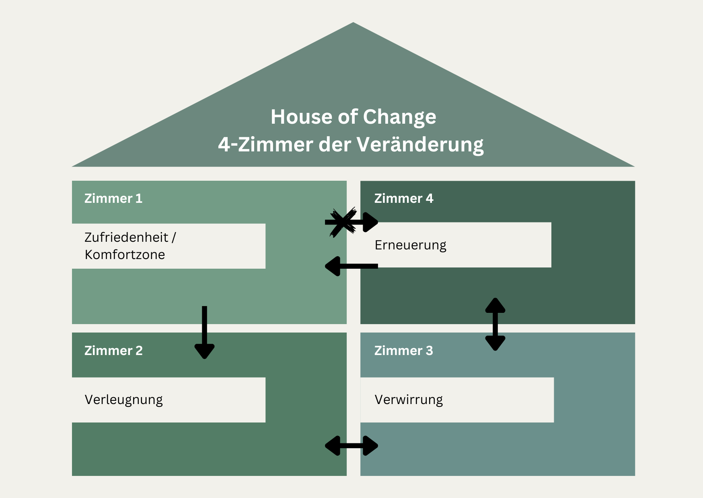
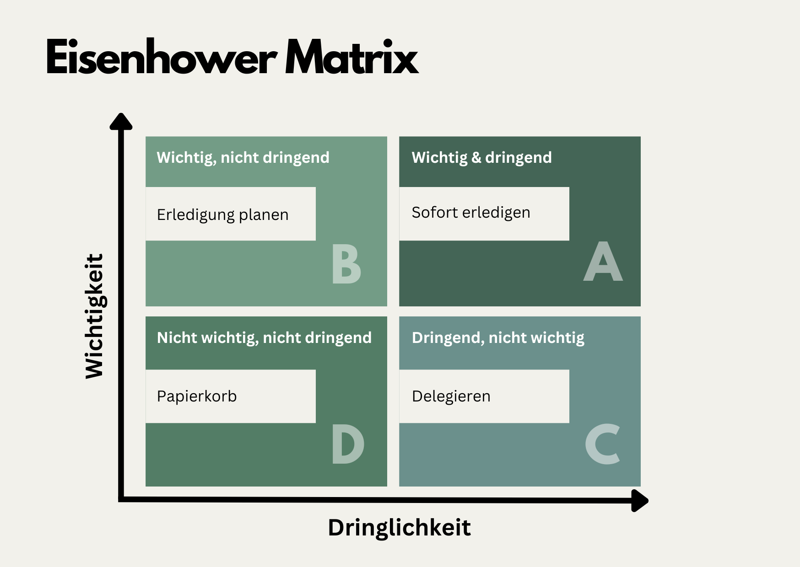

+++
title = "Warum Pläne helfen"
date = "2024-06-29"
draft = false
pinned = false
tags = ["Organisationsentwicklung", "Change", "CAS"]
image = "hike-5796976_640.jpg"
description = "Bei Change-Management oder in der Organisationsentwicklung ist ein guter Plan wichtig. Ein Plan gibt die Richtung vor und unterstützt die gemeinsame Orientierung."
footnotes = "Titelbild: [Felix Merler](https://pixabay.com/de/users/felix_merler-3317441/?utm_source=link-attribution&utm_medium=referral&utm_campaign=image&utm_content=5796976) auf [Pixabay](https://pixabay.com/de//?utm_source=link-attribution&utm_medium=referral&utm_campaign=image&utm_content=5796976)"
+++
## Einleitende (und persönliche) Gedanken

Auf meinem beruflichen Weg und meinen Lernwegen folge ich einer Spur, die mir oft (zumindest rückblickend) eher wie Zufall vorkommt. Obwohl ich den Eindruck habe, dass ich (meine) Pläne mache und verfolge, meine Ziele im Blick habe und von einer Vision gezogen werde. Wahrscheinlich ist es eine Mischung aus stetig wachsender Selbst(er)kenntnis, Plan, Vision, Zielen und Zufällen. Vielleicht ist das, was ich als Zufälle bezeichne, auch die Reaktion auf Hindernisse und Gelegenheiten, also eine Art Flexibilität oder Agilität. Es könnte sein, dass mir Werte wie Freiheit, Entwicklung und Neugier dabei helfen. In meinen Notizen zum «WHY» stehen Dinge wie inspiriere, verschiebe Grenzen, nutze Möglichkeiten, Handeln oder Intuition. So bin ich auch beim CAS Organisationsentwicklung und Change Leadership gelandet. Hier beschäftige ich mich u. a. mit der Planung von Entwicklungs- und Veränderungsvorhaben. Darum geht es in diesem Beitrag. 

## Pläne in Organisationsentwicklung und [Change-Management](https://www.bensblog.ch/change-management/)

Bei Change-Management oder in der Organisationsentwicklung, ja sogar so ganz allgemein, ist ein guter Plan wichtig. Ein Plan gibt die Richtung vor und unterstützt die gemeinsame Orientierung. Schliesslich geht es auch um Geld, um den Einbezug verschiedener Anspruchsgruppen, um die Ressourcenplanung und so vieles mehr. In diesem Beitrag werden wir beleuchten, warum ein Plan wichtig ist, worauf man bei der Planung achten kann und welche Rolle dabei Kunden und Anspruchsgruppen, menschliche Reaktionen auf Veränderungen, Werte, Visionen, Agilität und Priorisierung spielen.

## Warum ist es wichtig, einen Plan zu machen

Entwicklungs- und Veränderungsvorhaben beschreibe ich gerne als Reise oder noch eher als Expedition. Eine Expedition ist in meiner Definition mehr ein Erkunden von Unbekanntem. Sie ist geprägt von Neuem, Unvorhergesehenen und sie braucht eine gute Vorbereitung - einen guten Plan. Es ist also sinnvoll, die Landkarte zu studieren, sich einen Plan zu machen und die möglichen (Aus- oder Um-) Wege zu kennen. Ohne diesen Plan besteht die Gefahr, in chaotische Zustände oder Ineffizienz zu landen. 

In der Organisationsentwicklung und im Change Management hilft ein Plan auch dabei, dass alle Anspruchsgruppen wissen, wo die Expedition hingeht und welche Planungs- und Umsetzungsschritte dazu nötig sind. Mit einem klaren Plan, der allen zugänglich ist, wird die Transparenz gefördert und die Kommunikation zwischen den Beteiligten wird erleichtert. 

### Kunden und Anspruchsgruppen im Fokus haben

Bei allen Vorhaben sollten die Kundinnen und Anspruchsgruppen im Fokus stehen. Was benötigen sie? Welche Bedürfnisse und Erwartungen treiben sie um? Diese Menschen soll(t)en so früh wie möglich, am besten von Anfang an miteinbezogen werden. Ihre Perspektive ist wichtig. Zudem fördert der Einbezug die Akzeptanz des Vorhabens. Wichtig dabei ist, regelmässige Austauschmöglichkeiten zu schaffen und eine offene Kommunikation zu leben und zu fördern. Siehe auch die 8 Schritte nach Kotter. 

### Wie Menschen auf Veränderungen reagieren – Die 4 Zimmer der Veränderung

Veränderungen lösen bei Menschen unterschiedliche Reaktionen aus. Im Beitrag [«Umgang mit Widerständen bei Change und Transformation»](https://www.bensblog.ch/umgang-mit-widerstand/) habe ich bereits über die Schwierigkeiten und wie man damit umgehen kann, geschrieben. Ein weiteres Modell in diesem Zusammenhang sind die «4 Zimmer der Veränderung» oder «House of Change» von Claes F. Janssen. Darin werden vier Phasen beschrieben, die Menschen in Veränderungsprozessen durchlaufen. 

1. Zufriedenheit: Hier fühlen sich die Menschen wohl und sind mit der aktuellen Situation zufrieden. Man könnte es auch als die Komfortzone beschreiben. 
2. Verleugnung: Erste Anzeichen von Veränderung werden ignoriert oder abgelehnt. Menschen möchten am Bestehenden festhalten. 
3. Verwirrung: Die Notwendigkeit der Veränderung wird erkannt. Unsicherheit und Angst prägen diesen Zustand immer noch. Es ist die Zeit zwischen dem Alten und Neuen. 
4. Erneuerung: Es herrscht Aufbruchstimmung und Erleichterung. Die Veränderung wird akzeptiert und aktiv mitgestaltet. 

Ein guter Plan berücksichtigt die möglichen Reaktionen der Menschen und bietet Unterstützung, um sie durch diesen Prozess zu begleiten.

### Werte und Visionen als Grundlage für die Planung

Ein erfolgversprechender Plan sowie eine gute Strategie orientierten sich an den Werten und der Vision der Organisation. Die Werte definieren, was im Unternehmen als wichtig erachtet wird und wie gedacht und gehandelt werden soll. Die Vision wiederum beschreibt die Richtung. Konkrete Ziele werden aus diesen beiden Elementen abgeleitet. 

## Agilität und Planungsbedarf

Braucht es denn in einer Welt, die sich so schnell verändert und in der agil gearbeitet wird, überhaupt einen Plan? Natürlich! Auch oder gerade bei agilen Arbeitsweisen ist (wie bei einer Expedition) eine gute Planung wichtig! Agilität heisst, schnell und flexibel auf Veränderungen reagieren zu können. Dafür werden kurzfristigere Ziele gesetzt und regelmässig überprüft. So kann auf Veränderungen schnell(er) reagiert werden. 

## Priorisierung mit der Eisenhower-Matrix

Bei der Planung ist es wichtig, Prioritäten zu setzen. Die Eisenhower-Matrix ist ein bewährtes Werkzeug, um Aufgaben nach Dringlichkeit und Wichtigkeit zu ordnen:

1. Dringend und wichtig: Sofort erledigen.
2. Wichtig, aber nicht dringend: Terminieren und planen.
3. Dringend, aber nicht wichtig: Delegieren.
4. Weder wichtig noch dringend: Nicht bearbeiten oder eliminieren.

Durch diese Priorisierung wird sichergestellt, dass die Ressourcen effizient eingesetzt und die wichtigsten Aufgaben zuerst erledigt werden.

## Fazit

Eine gute Planung ist die Basis von erfolgreichem Change-Management und zielführender Organisationsentwicklung. Dazu gehört natürlich auch eine umsichtige Analyse der Ausgangslage, des Umfelds, der Marktveränderungen etc. Dieses Fundament hilft, die Ziele und Umsetzungsschritte klar zu definieren. Die Richtung gibt die Vision vor, während die Werte handlungsleitend sind. Durch gelebte Agilität und eine bewusste Priorisierung wird die Umsetzung effizient und flexibel gestaltet. 

## Schlussgedanken

Auch dieser Text reiht sich in Beiträge ein, die einen Einblick in ein mögliches Vorgehen sowie Umsetzungsansätze innerhalb von Veränderungs- und Entwicklungsvorhaben geben. Zu diesem Beitrag hat mich u. a. auch [das Gespräch mit Christine Thürmer im Podcast Hotel Matze](<https://hotelmatze.podigee.io/351-christine-thuermer>) inspiriert. Sie spricht davon, wie wichtig es ist, beim Wandern einen guten Plan zu haben, gerade weil es dann immer anders kommt oder kommen kann.