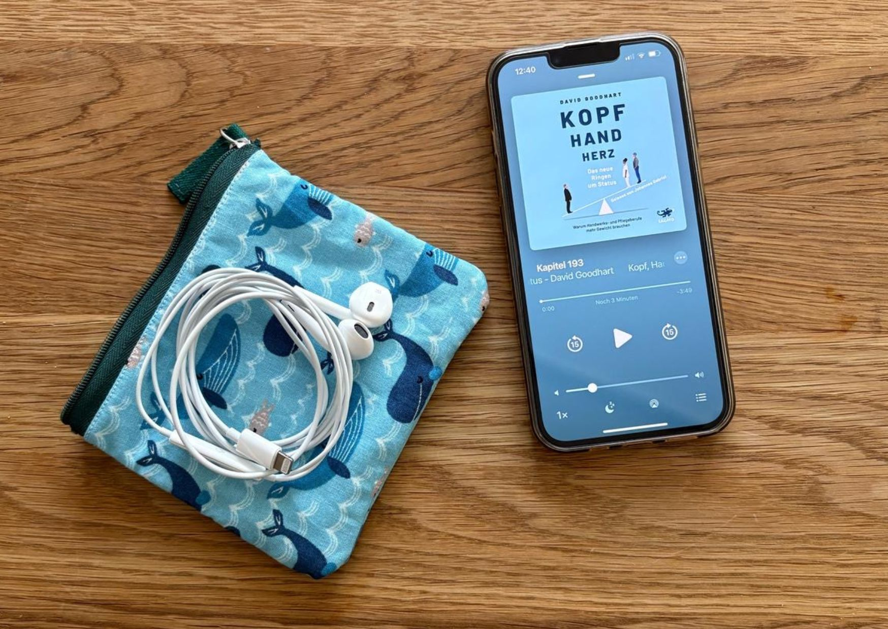

+++
title = "Was bereitet eigentlich aufs Leben vor? – Ein Blick auf Schule, Selektion und gespaltene Arbeitswelten"
date = "2025-05-12"
draft = false
pinned = false
tags = ["Bildung", "Lernen", "Gedanken", "Arbeit"]
image = "was-bereitet-aufs-leben-vor.jpg"
description = "Zwischen Homeoffice und Schichtarbeit, zwischen Kopf und Hand: Eine Gedankenreise durch unsere vielfältigen Bildungs- und Arbeitswelten, die mehr verbinden als trennen sollte. "
footnotes = "**PS:** Da ich das wertvolle Buch von David Goodhart nur als Hörbuch habe, fehlen leider Originalzitate und ich habe mich deshalb auf die von Dr. Hans Rusinek konzentriert, die auch Inhalte von Goodhart aufgreifen. \n\n📚**Weitere passende Bücher zu diesen Themen:** \n\n📕[Kopf, Hand, Herz Das neue Ringen um Status, Warum Handwerks- und Pflegeberufe mehr Gewicht brauchen.](https://www.exlibris.ch/de/buecher-buch/e-books-deutsch/david-goodhart/kopf-hand-herz-das-neue-ringen-um-status/id/9783641258771/)\n\n📕[Work Survice Balance, Hans Rusinek](https://www.exlibris.ch/de/buecher-buch/deutschsprachige-buecher/hans-rusinek/work-survive-balance/id/9783451399657/?srsltid=AfmBOoorlKgR7JgBGXkztYGHWb04Walc7uhOi5OYvPHAdL-23qSlfJne)\n\n📕[Würde - Was uns stark macht - als Einzelne und als Gesellschaft](<https://www.exlibris.ch/de/buecher-buch/deutschsprachige-buecher/gerald-huether/wuerde/id/9783570553930/>), Gerald Hüther\n\n📕[Was wir sind und was wir sein könnten - Ein neurobiologischer Mutmacher, Gerlad Hüther](<https://www.exlibris.ch/de/buecher-buch/deutschsprachige-buecher/gerald-huether/was-wir-sind-und-was-wir-sein-koennten/id/9783596188505/>)\n\n📕[Entlehrt euch! Ausbruch aus dem Vollständigkeitswahn](<https://www.exlibris.ch/de/buecher-buch/deutschsprachige-buecher/rolf-arnold/entlehrt-euch/id/9783035504590/>), Rolf Arnold\n\n📕[Entschulung der Gesellschaft - Eine Streitschrift, Ivan Illich](https://www.exlibris.ch/de/buecher-buch/deutschsprachige-buecher/ivan-illich/entschulung-der-gesellschaft/id/9783406709791/)\n\nTitelbild: Ben Zaugg\n\nFoto Hörbuch: Ben Zaugg"
+++
Wenn wir über Schule sprechen, dann tun wir das oft mit einer Selbstverständlichkeit. Schule ist so und soll so sein, wie sie eben ist. Punkt. Sie soll auf das Leben vorbereiten – oder auf das Arbeitsleben. Dass sie genau das tut, davon sind viele unumstösslich überzeugt. Doch ich habe schon lange den Eindruck, dass sie das – in ihrer heutigen Struktur – nicht (mehr) tut. Diese Beobachtung stammt teils aus meiner eigenen Schulzeit, die schon eine Weile zurückliegt (und ja, auch aus dem eigenen Schmerz). Und teils aus meinem Blick von aussen – als jemand, der seit Jahren viel mit Menschen in Entwicklungsprozessen arbeitet.

Was ich sehe, ist ein System, das «abfüllt», prüft und selektiert. Aber bereitet es wirklich auf die Vielfalt des Lebens oder der Arbeitswelt vor? (Als gäbe es *das* Leben oder *die* Arbeitswelt) Ich bezweifle das. Zu gross ist die Lücke zwischen Anspruch und Realität. Zu wenig Raum bleibt für echtes Erleben, für Begegnung mit dem, was später zählt: mit Menschen, mit Tätigkeiten, mit Sinn und mit sich selbst.

> «Unsere Arbeitswelt ist ganz massiv darauf ausgelegt, Menschen für Kopfarbeit zu begeistern und die dafür notwendigen Fähigkeiten zu fördern – etwa so «smart» mit Zahlen umzugehen wie die Lehman Brothers. Diejenigen mit anderen Formen der Intelligenz dürfen sich bereits in der Schule als Versager fühlen.» 
>
> *Hans Rusinek, Work Survive Balance, S. 125*

## **Der Übergang zur Berufsbildung – ein Lichtblick mit Schatten**

Gerade in der Schweiz haben wir ein Bildungssystem, das mit der Berufsbildung ein wertvolles Fundament bietet. Es ist grundsätzlich möglich, über verschiedene Wege – sei es eine Lehre oder ein Studium – seinen eigenen Platz zu finden. Doch auch hier stellen sich Fragen: Wie sollen junge Menschen herausfinden, was sie wollen, wenn sie einen grossen Teil ihrer Zeit in Schulzimmern verbringen? Wenn sie die Welt der Arbeit oft nur von aussen, aus der Ferne kennen – wenn sie Glück haben, aus ein paar Schnuppertagen? Wenn ihnen oft (sorry!) arbeitswelt- und arbeitsmarktfremde Menschen sagen, was sie später «werden» können und was nicht. 

Die Berufsbildung beginnt also bereits mit einem grossen Fragezeichen. Denn viele Jugendliche wissen schlicht nicht, was sie interessiert – nicht, weil sie desinteressiert wären, sondern weil ihnen der Kontakt zur «realen» Welt fehlt. Und gleichzeitig beginnt genau hier eine Selektion, die Folgen hat.

## **Selektion – aber wonach eigentlich?**

Die Schule selektiert. Sie tut es über Noten, über Prüfungen, über scheinbare «Intelligenz» An dieser Stelle möchte ich das [Buch Kopf, Hand, Herz Das neue Ringen um Status, Warum Handwerks- und Pflegeberufe mehr Gewicht brauchen von David Goodhart](https://www.exlibris.ch/de/buecher-buch/e-books-deutsch/david-goodhart/kopf-hand-herz-das-neue-ringen-um-status/id/9783641258771/) empfehlen, denn da wird mit dem Intelligenz-Begriff aufgeräumt. Doch was bedeutet das eigentlich? Ist Intelligenz wirklich das, was wir im aktuellen System messen? Oder geht es vielmehr darum, wer sich gut anpassen kann, wer sich gut präsentieren kann, wer es schafft, den Erwartungen zu entsprechen – und wer auch ideale familiäre Voraussetzungen hat. 

Diese Art der Selektion blendet vieles aus. Sie bevorzugt bestimmte Denkweisen und unterdrückt andere. Sie macht aus Vielfalt Vergleichbarkeit. Und sie beginnt früh: schon in der Schule trennt sich, wer «oben» und wer «unten» zu sein scheint oder gesellschaftlich eben bereits ist. Diese Trennung setzt sich später in der Arbeitswelt fort.

##  **Mehrere Arbeitswelten – und immer weniger Verbindung**

Hans Rusinek spricht davon, dass wir längst nicht mehr von einer Arbeitswelt sprechen können. Wer mit dem Kopf arbeitet, erfährt mehr gesellschaftliche Anerkennung. Wer mit den Händen arbeitet, oft weniger. 

>  «Manchmal scheint es mir, als würden wir nur Kopfarbeit als wirklich tolle Arbeit ansehen, und die, die mit Hand oder Herz arbeiten, wären einfach nur solche Menschen, bei denen es vom Kopf her nicht gereicht hat.» 
>
> *Hans Rusinek, Work Survive Balance, S. 125*

Diese Anerkennung zeigt sich nicht nur in Worten, sondern in konkreten Arbeitsbedingungen. Während Wissensarbeitende von Homeoffice, flexiblen Arbeitszeiten, Sabbaticals oder Gesundheitsprogrammen (meistens mehr) profitieren, bleibt all das für viele andere schwer- oder unerreichbar. Menschen in der Pflege, in der Produktion, in der Reinigung, im Strassenbau – sie können ihre Arbeit nicht einfach nach Hause verlagern. Sie tragen Verantwortung im Hier und Jetzt, körperlich präsent, oft mit hoher Belastung – und gleichzeitig mit wenig gesellschaftlicher Sichtbarkeit. Dabei braucht es beides – und zwar gleichermassen.

>  «Die Arbeitsbereiche der abstrakten Kopf-Arbeit haben sich in den letzten Jahrzehnten immer weiter von der restlichen Arbeitswelt isoliert – Akademisierung, Pandemie, Digitalisierung sind, wie wir sehen werden, die massgeblichen Triebkräfte dieser Entwicklung. Im Ergebnis kann gar nicht nicht mehr von einer Arbeitswelt gesprochen werden, und bald vielleicht auch nicht mehr von einer Gesellschaft.» 
>
> *Hans Rusinek, Work Survive Balance, S. 123*

 Was mich besonders beschäftigt: Wir sprechen gern von der Berufslehre als «Königsweg». Und ja, sie kann ein Königsweg sein. Doch gleichzeitig erleben viele Jugendliche, dass gewisse Lehrstellen kaum zu haben sind – oder dass ihre schulischen Leistungen (wieder) zum Hindernis werden. Firmen wiederum geben an, auf Noten verzichten zu wollen, weil sie «den Menschen sehen» möchten. Klingt gut. Ist aber oft nur eine Reaktion auf die Tatsache, dass Noten längst nicht mehr halten, was sie versprechen und der «Nachschub» in gewissen Lehrberufen zunehmend austrocknet. Noten habe immer weniger Aussagekraft. Auch wenn einige von der Selektion durch Noten wegkommen, machen viele munter weiter oder beziehen sich auf irgendwelche Tests. 

## **Wer kommt in den «Genuss» von Weiterbildung?**

Nach der Lehre oder dem Studium stehen viele Weiterbildungen offen – theoretisch. In der Praxis kosten sie (viel) Geld und sie kosten Zeit. Und, die finanzielle oder zeitliche Unterstützung oder Zulassungsbedingungen setzen oft bereits eine bestimmte Position voraus. Wer also kommt wirklich in den Genuss dieser Entwicklungsmöglichkeiten? Häufig jene, die schon in einer vorteilhaften Lage sind. Klar, der Bildungsmarkt ist immer härter umkämpft und so gibt es etliche Wege und «Schlupflöcher». Viele sind von diesen Möglichkeiten trotzdem noch weit entfernt. 

> «Ein kluger Kopf zu sein, ist zum «Goldstandard menschlicher Wertschätzung» geworden, viel mehr Goldstandard, als etwa ein guter Mensch zu sein, so David Goodhart.» 
>
> *Hans Rusinek, Work Survive Balance, S. 125*

So verfestigt sich eine Hierarchie, die wir eigentlich überwinden sollten. Handwerkliche Berufe, Pflegeberufe, Tätigkeiten in Reinigung, Produktion, Schichtarbeit – sie gelten schnell als «einfach». Und genau hier findet die stille Abwertung statt. Dabei sind es genau diese Berufe, die unsere Gesellschaft im Alltag tragen.

## **Wertschätzung statt Romantisierung**

Ich spreche gern von den «unsichtbaren Heldinnen und Helden». Gleichzeitig merke ich: Auch das ist problematisch. Denn es hebt sie wieder auf eine symbolische Ebene (dort wo applaudiert wird), statt konkret über ihre Rechte, ihre Bedingungen, ihre Bedürfnisse zu sprechen. Die einen Berufe glänzen mit Benefits, Homeoffice und anderen Freiheiten. Die anderen mit Schichtplänen, Lärm und körperlicher Belastung.  Es ist ein Auseinanderdriften, das kaum mehr zu übersehen ist: Auf der einen Seite die vielbeschworene „New Work“-Welt mit Purpose, Agilität und Feelgood-Kultur. Auf der anderen Seite eine Realität, in der Menschen ihren Alltag im Akkord, in der Nacht, im Stehen oder im Dreck verbringen. Nicht, weil sie weniger leisten. Sondern weil ihre Arbeit weniger gilt – zumindest in den Strukturen, die über Status, Einkommen und Anerkennung entscheiden. Und dazwischen? Da ist ein Graben, der immer grösser wird.

## **Was wäre, wenn wir Menschen bei ihren Stärken begleiten?**

Ich glaube: Eine Schule der Zukunft – und ein Bildungssystem der Zukunft – sollten mehr Raum geben für Stärken, für Talente, für individuelle Wege. Nicht im Sinne einer Wohlfühloase, wie sich nun etliche Kritiker denken. Sondern als echte, ernst gemeinte Orientierung an dem, was Menschen gut können und gerne tun. Wer sich in seinen Stärken entfalten kann, hat eher die Kapazität, auch an seinen «Schwächen» zu arbeiten. 

Das heisst nicht, dass alles leicht wird und sein soll. Aber es heisst, dass wir aufhören sollten, an einem Ideal zu messen, das längst vielen Lebensrealitäten widerspricht und vor sich hin bröckelt. Wir sollten Menschen zu begleiten – nicht zu bewerten. Entwicklung ist keine abzuarbeitende Checkliste.

>  «Die Würde in der Arbeit kommt ja nicht nur über das Gehalt zustande: In der Arbeit erkenne ich mich in dem, was ich mache, die Arbeit wird zu einem stützenden Teil meiner Idendität, die Arbeit baut eine Beziehung zwischen mir und der Welt auf, die mir das Gefühl gibt, nicht grundlos zu existieren.» 
>
> *Hans Rusinek, Work Survive Balance, S. 125*

## **Etwas wie ein Abschluss**

Ich habe keine abschliessende Lösung. Aber ich sehe viele kleine Möglichkeiten. In der Art, wie wir Kinder begleiten. Wie wir Jugendliche unterstützen, ihren Weg zu finden. Wie wir Berufe und Menschen in der Arbeit wahrnehmen – nicht nur dort, wo es glänzt, sondern auch dort, wo es schmutzig, laut oder körperlich anstrengend wird. Vielleicht beginnt Veränderung genau dort: im Hinsehen. Im Anerkennen. Und im Fragen, wie es anders gehen könnte. Nicht morgen, sondern heute.