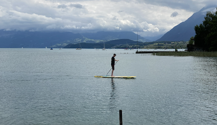

+++
title = "Du kannst die Wellen nicht anhalten"
date = "2022-11-16"
draft = false
pinned = false
image = "bildschirmfoto-2022-11-16-um-13.16.56.png"
description = "Die Wellen des Lebens können wir nicht anhalten, wir können aber lernen mit ihnen umzugehen. Ein paar Gedanken, Erfahrungen und Erlebnisse dazu in diesem Beitrag. "
+++
> «Du kannst die Wellen nicht stoppen, aber du kannst lernen sie zu surfen.» 
>
> *Jon Kabat-Zinn (bin mir bis heute nicht ganz sicher, ob es wirklich von ihm stammt)*

Ein häufig benutztes Zitat und ein aus meiner Sicht so wahres und wunderbares. Ich mag das Wasser, das Meer, den Wind, die Wellen und manchmal hasse ich das alles. Aber der Reihe nach. 

Raus aus der Komfortzone, das mache ich immer wieder. Gelernt habe ich das vor allem, weil ich in Phasen meines Lebens dazu «gezwungen» war. Zumindest dann, wenn ich mich in meinem Leben freier und wohler füheln wollte. Mich selbstständig zu machen war dann noch einmal ein richtiger Sprung. Zuerst fühlte sich alles toll an, ich war voller Energie und investierte viel. Ich war oft alleine, Corona war noch überall, später traf ich immer mehr Menschen und die Welt öffnete sich langsam wieder. Irgendwann kamen Zweifel und durch Impulse aus meinem Umfeld wurde meine Selbstständigkeit ergänzt durch eine Lern-, Entwicklungs- und Entdeckungsreise. Das gab wieder Halt, es gab (wieder) einen Sinn und so machte ich plötzlich ganz verschiedene Dinge. Ich bot immer noch Laufbahnberatungen an, half beim Schreiben von Bewerbungen oder bei der Vorbereitung auf Vorstellungsgespräche. Dazu kamen etliche andere Themen, von einigen liest du in diesen Blogbeiträgen. Was irgendwie Eindruck hinterliess war, dass ich mit Podcast-Interviews plötzlich Geld verdienen konnte. Das war ja nie und nimmer mein Ziel. Es war einfach etwas, mit den ich begonnen hatte und etwas, das mir wirklich Freude macht. 

#### Eine Erkenntnis

Lern-, Entdeckungs- und Entwicklungsreise heisst auch, dass sich einiges bewegt oder bewegen kann. Irgendwann zwischen Frühling und Sommer lief vieles wirklich gut. Plötzlich wurde mir sehr klar, dass diese Form von Arbeit nicht das ist, was ich wollte. Ich will wieder in eine Anstellung. Es war ein so klarer Moment, der keine Zweifel offen liess. Aber wo oder in welcher Funktion möchte ich arbeiten? Ich hatte ein gutes Gefühl für das was ich kann und für das, was mir wichtig ist. Aber was will ich? Ich begann mich sehr gezielt zu bewerben und noch gezielter mein bestehendes Netzwerk miteinzubeziehen und neue Kontakte zu knüpfen. 

#### Unbekannte Gewässer

Was hat das nun alles mit den Wellen und dem Wasser zu tun? Das Leben ist für mich oft mit dem Meer (oder anderen Gewässern) vergleichbar. Surfen auf den Wellen des Lebens hatte ich bis dahin gelernt. Nur so war es überhaupt möglich, in die Selbstständigkeit oder in neue Gewässer einzutauchen. Diese Zeit war aber dann nicht nur surfen. Das stille Wasser war manchmal Spiegel und ermöglichte mir unter die Oberfläche zu sehen. Manchmal (vermutlich) bis auf den Grund. Da waren aber auch Unterströmungen, Tiefen und Untiefen, da waren neue, andere Wellen, die ich noch nicht kannte, der Wind war anders, die Wassertemperatur. 

#### Die Wellen

Da waren sie nun, die Wellen. Neue Spots und andere Herausforderungen. Wie gehe ich damit um, wenn ich surfen möchte, aber keine Wellen da sind? Was mache ich, wenn die Wellen kommen und ich einfach etwas paddeln möchte? Ich surfte, paddelte, fiel vom Brett, Wellen überrollten mich. Manchmal lag ich am Strand oder sass in der Strandbar. 

> «Gib mir die Gelassenheit, Dinge hinzunehmen, die ich nicht ändern kann, den Mut, Dinge zu ändern, die ich ändern kann, und die Weisheit, das eine vom anderen zu unterscheiden.»
>
> *Reinhold Niebuhr*

#### Warum hier das [Gelassenheitsgebet](https://de.wikipedia.org/wiki/Gelassenheitsgebet)?

Während ich so schreibe, kommen mir diese Worte in den Sinn. Es sind Worte, die ich zum ersten Mal rund um die [REVT](https://de.wikipedia.org/wiki/Rational-Emotive_Verhaltenstherapie) Rational-Emotive-Verhaltenstherapie gehört habe. Passend hier wäre auch *«Nicht die Dinge beunruhigen die Menschen, sondern ihre Meinung über die Dinge.»*[ Epiktet](https://de.wikipedia.org/wiki/Epiktet)

Denn das passt für mich sehr gut zu diesen Wellen (des Lebens). Hier noch ein Zitat von [Viktor E. Frankl](https://www.viktorfrankl.org/) (dann ist Schluss, ich verspreche es) *«Zwischen Reiz und Reaktion liegt ein Raum. In diesem Raum liegt unsere Macht zur Wahl unserer Reaktion. In unserer Reaktion liegen unsere Entwicklung und unsere Freiheit.»*

Wir können also entscheiden und wir müssen entscheiden. Auch ein nicht Entscheiden ist ein Entscheid. Es gilt also, Raum oder Bewusstsein zu schaffen für diese Lücke zwischen dem Reiz und der Reaktion. Das ermöglicht dann auch zu erkennen, was ist wahr und was entsteht «nur» in meinem Kopf. Und, ganz wichtig, wann kann ich etwas ändern und wann ist Akzeptanz gefragt. 

#### Stand Up Paddling

Vom Gelassenheitsgebet zum Stand Up Paddling? Wie kommts? \
Stand Up Paddling - ein Sport, der nichts für mich ist. Das war mich schon in der Zeit klar, in der ich die ersten Flyer und Prospekte mit diesen neuen Trend-Dingern erstellt habe. Gegen Ende dieses Sommers landete ich aber aus Langeweile (weil ich warten musste) auf einem Stand Up Paddle. Ich war in meinen Alltagskleidern und das Ziel war, nicht ins Wasser zu fallen, sonst hätte wäre ich wohl für den Rest des Tages nass gewesen. Ich weiss nicht wie, aber es hat mich gepackt. Und ohne, dass ich das wollte, lande ich auch bei diesem Beitrag beim Paddeln. Auch beim Paddeln beeinflussen Wind, Wetter, Wellen (auf dem See meistens nicht so stark) und das eigene Befinden das Erlebnis. Wie reagiere ich auf grössere Wellen, die plötzlich von einem Boot kommen? Wo bin ich mit meinem Kopf? Wie viel Energie habe ich? Wo schaue ich hin? Wann mache ich eine Pause? Alles nicht unwichtig beim Paddeln. Denn nur so bleibe ich im Gleichgewicht. 

#### Wirr oder einfach die Wellen des Lebens?

Hier frage ich mich selbst, ob dieser Beitrag nun etwas zu wirr ist oder ob das einfach die Wellen des Lebens sind. Das Leben ist nicht sauber und linear. Hier beschreibe ich einen Teil meiner inneren und äusseren Reise. Es ist mir wichtig zu zeigen, wie Höhen und Tiefen dazugehören. Es ist mir auch wichtig zu zeigen, dass wir dem nicht hilflos ausgeliefert sind und trotzdem nicht immer etwas tun können. Manchmal sind es die Stürme, die uns stärker machen und manchmal die ruhige See. 

#### So gehts weiter

Ich wusste bis am Schluss nicht so genau, was ich denn nun arbeiten möchte. Meine Ideen und Ziele wurden immer konkreter, ich ging aber mit den Wellen. Manchmal als «cooler» Surfer und manchmal fegte es mich bitterböse vom Brett. Nun freue ich mich sehr, im nächsten Jahr einen neuen Job in der Berufsbildung zu beginnen.