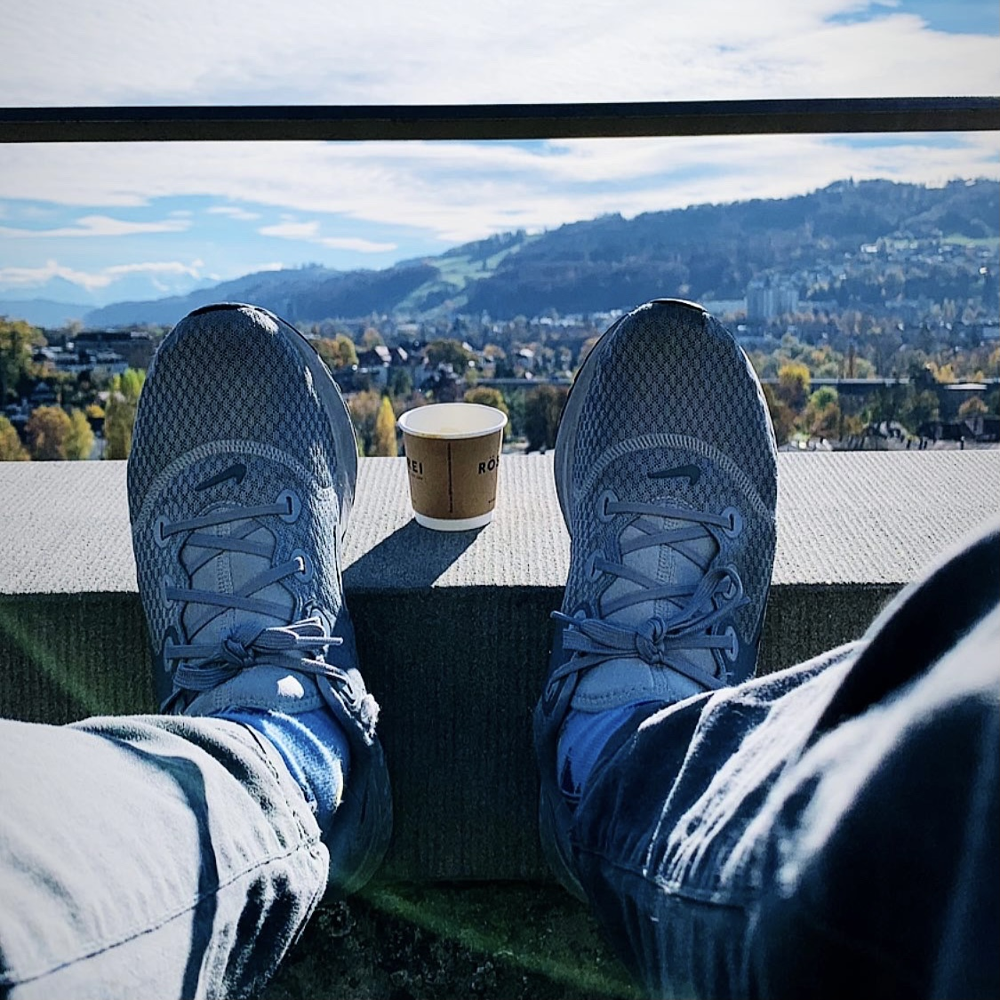

+++
title = "Wenn Lösungen und Wege vor der Nase liegen"
date = "2021-12-11"
draft = true
pinned = false
tags = ["Tagebuch", "Biografie", "Gedanken"]
image = "994f2b5a-c9a2-467c-90e9-b6b8335d8b8d.jpg"
description = "Eigentlich habe ich keine grosse Lust einen Beitrag zu schreiben, mache es aber trotzdem. Denn ich habe mir vorgenommen meinen Prozess zu dokumentieren und transparent zu machen. Bevor ich bald aus dem Haus gehe, gibts noch einen kurzen Einblick."
footnotes = " [entwicklungsfreiraum - der Podcast](https://entwicklungsfreiraum.podigee.io)"
+++
Bevor ich bald aus dem Haus gehe, gibts noch einen kurzen Einblick in meinen Prozess. Seit nun mindestens einem Jahr bin ich mit einem enormen Tempo unterwegs. Noch vor einem Jahr arbeitete ich im Covid-Track eines Spitals anstatt meiner eigentlichen Aufgabe (mich um die Ausbildung von Mitarbeitenden zu kümmern) nachzugehen. Da war ich zeitgleich auch bereits im Prozess des Aufbaus von ZUKUNFTSHELDEN. So richtig startete ich im Februar, da meine offizielle Anstellung noch bis Ende Januar dauerte. Bereits da war klar, dass ich 2 Monate später wieder 50 % in einer Ausbildungsrolle tätig sein würde (das war nämlich immer der Plan) und reiste während rund drei Monaten ein paar Mal durch die Schweiz, um bei Schulungen dabei zu sein, welche ich später selbst durchführen sollte. Kurz vor Ende der Probezeit entschied ich mich gegen die Sicherheit oder für den inneren Frieden und kündete diese Stelle. Anschliessend war ich intensiv auf der Suche nach einer neuen Anstellung, das gestaltete sich aber (auch für mich als Bewerbungs«experte») schwierig. Hier und da war ich als Tellerwäscher unterwegs (bin ich noch heute ab und zu) und fand dann die Möglichkeit, befristet in einem anderen Hilfsjob zu arbeiten und seit Oktober bin ich noch in meinem Praktikumsjob. Es waren also allein in diesem Jahr sehr viele Wechsel, neue Dinge, neue Menschen, neue Strukturen, Chaos, Ordnung, viele Fragen, ... und ich bin müde. Nicht mehr so müde wie vor ein paar Tagen aber die Energie ist begrenzter als sonst. Das hat unter anderem auch mit Zukunftssorgen zu tun und den Gedanken, wie ich mein Geld im nächsten Jahr verdiene. Leider mag das klassiche Arbeitssystem Menschen wie mich nicht so gerne und so sind meine Möglichkeiten etwas eingeschränkt. Was kann also ich tun, damit es mir besser geht? Ich kann mich mit aller Unsicherheit und dem Moment anfreunden. Etwas Hilfe habe ich in einem meiner Bücher gefunden. Vielleicht hast du bereits einen meiner Podcast über Wabi Sabi gehört? Einen gibts hier [«Die Schönheit des Unperfekten und Vergänglichen»](https://open.spotify.com/episode/57WdmPeXnrTaZhPidM0nVI?si=db307720d7f04b20) und den anderen hier [«Unperfekt perfekt»](https://open.spotify.com/episode/1POtsE04Eaut3BjHa9ET6W?si=120bf9edf465436d). Manchmal liegen Lösungen oder zumindest Wege vor der Nase. So widme ich mich wieder bewusst dem Unperfekten und lasse für die nächsten Tage und vielleicht 1..2.. Wochen die Dinge wieder mehr fliessen. Ich mache mir bewusst (immer wieder), wofür ich dankbar bin und was ich genau in diesem Moment habe. Mehr nicht. Aber auch nicht weniger. 

> Der unperfekte Weg, den Ihr Herz Sie entlangführt, ist der für Sie perfekte. 
>
> *Aus Wabi Sabi von Beth Kempton*

