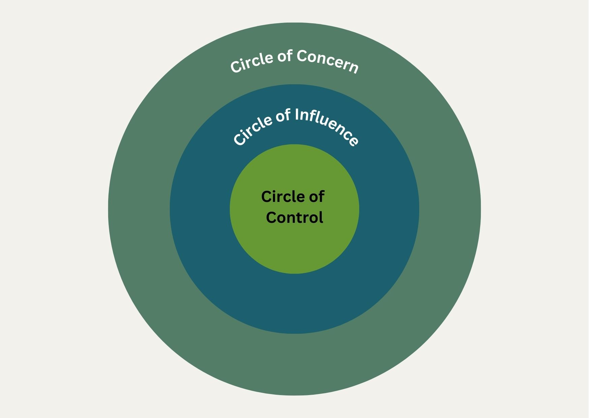
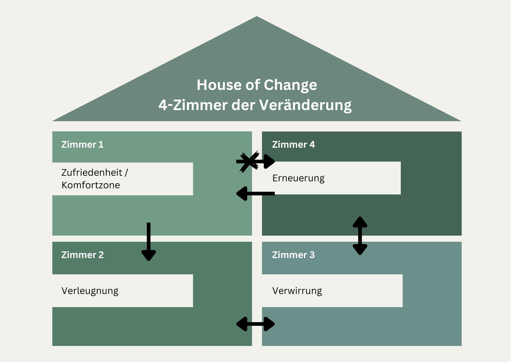
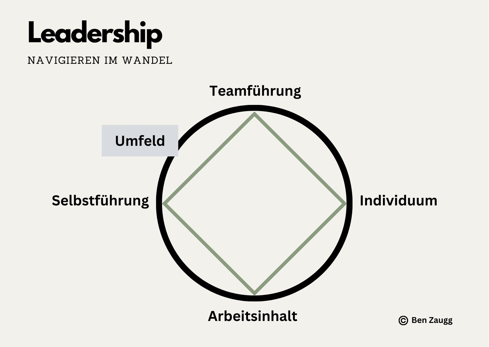

+++
title = "Widerstände anerkennen: Der Schlüssel zu nachhaltiger Veränderung"
date = "2024-11-22"
draft = false
pinned = false
tags = ["Change", "Change-Management", "Leadership", "Personalentwicklung", "Organisationsentwicklung"]
image = "img_0615-2.jpg"
description = "Widerstände in Veränderungsprozessen sind keine Hindernisse, sondern wertvolle Signale, die auf Bedürfnisse und Potenziale hinweisen."
footnotes = "Titelbild: Ben Zaugg\n\nPassende Bücher\n\n📕[Rogers Carl R. (1973), Entwicklung der Persönlichkeit: Psychotherapie aus der Sicht eines Therapeuten](https://www.exlibris.ch/de/buecher-buch/deutschsprachige-buecher/carl-r-rogers/entwicklung-der-persoenlichkeit-konzepte-der-humanwissenschaften/id/9783608964172/)\n\n📘 [Das neue Führen, Führen und sich führen lassen in Zeiten der Unvorhersehbarkeit, Bodo Janssen](https://www.exlibris.ch/de/buecher-buch/deutschsprachige-buecher/bodo-janssen/das-neue-fuehren/id/9783424202854/)\n\n[Blogbeitrag über das Buch](https://www.bensblog.ch/das-neue-fuehren/)\n\n📕 [TZI - Die Kunst sich selbst und eine Gruppe zu leiten](https://www.exlibris.ch/de/buecher-buch/deutschsprachige-buecher/cornelia-loehmer/tzi-die-kunst-sich-selbst-und-eine-gruppe-zu-leiten/id/9783608961225/)\n\n📘[Kotter John P. (2011), Leading Change, Wie Sie Ihr Unternehmen in acht Schritten erfolgreich verändern](https://www.exlibris.ch/de/buecher-buch/deutschsprachige-buecher/john-p-kotter/leading-change/id/9783800637898/)\n\n📕[Die angstfreie Organisation, Wie Sie psychologische Sicherheit am Arbeitsplatz für mehr Entwicklung, Lernen und Innovation schaffen](https://www.exlibris.ch/de/buecher-buch/deutschsprachige-buecher/amy-c-edmondson/die-angstfreie-organisation/id/9783800660674/)\n\n📘 [Trust me, warum Vertrauen die Zukunft der Arbeit ist, Karin Lausch](https://www.exlibris.ch/de/buecher-buch/deutschsprachige-buecher/karin-lausch/trust-me-warum-vertrauen-die-zukunft-der-arbeit-ist/id/9783648172353/)\n\n\\\n**Herkunft der Modelle:** \n\n* Circle of Influence: Stephen R. Covey\n* Störungen haben Vorrang: Ruth C. Cohn\n* 4-Zimmer der Veränderung: Claes D. Janssen"
+++
## Einführung

In Veränderungsprozessen werden Widerstände oft als Hindernisse wahrgenommen, die überwunden werden müssen. Doch was, wenn Widerstände keine Blockaden, sondern wichtige Signale wären? In diesem Text schreibe ich darüber, wie man Widerstände in den Veränderungsprozess integriert und sie als Wegweiser nutzt.

## Widerstände als Wegweiser verstehen

Widerstände treten in jedem Veränderungsprozess auf und sind total menschlich. Dabei kann es sich um einen individuellen Widerstand handeln oder den von ganzen Teams oder Organisationen. Sie sind Ausdruck von Unsicherheiten, Ängsten wie Kontrollverlust oder mangelndes Vertrauen in den Prozess. 

Doch anstatt sie zu ignorieren oder zu bekämpfen, können (und sollten) wir sie nutzen, denn:

* Widerstände signalisieren Bedürfnisse: Sie weisen darauf hin, dass wichtige Aspekte übersehen wurden.
* Widerstände sind Schutzmechanismen: Sie bewahren vor Überforderung und Unklarheit und das in einer (Arbeits-)Welt, die sich ständig und in kurzen Zyklen verändert.

Wenn wir Widerstände anerkennen und verstehen, gewinnen wir wertvolle Einblicke in die Dynamik von Veränderung. Dafür stelle ich hier vier Ansätze vor, die in Change- und Transformationsprozessen helfen. Sie beleuchten und beinhalten auch Kompetenzen, die für Change-Agents, Coaches, Facilitator:innen etc. in Change-Prozessen wichtig sind.  

* Der Circle of Influence 
* die 4-Zimmer der Veränderung 
* das Prinzip „Störungen haben Vorrang“ 
* Zusätzlich beleuchten wir die Rolle von Change-Begleitern, die Menschen und Teams durch den Wandel führen.

## Der Circle of Influence - Was können wir beeinflussen?

Der Circle of Influence bietet eine gute Struktur, um zu analysieren, was bei Veränderungen innerhalb des eigenen Einflussbereiches liegt (worüber habe ich die Kontrolle), wo man zwar einen Einfluss darauf hat, jedoch keine Kontrolle ausüben kann und was komplett ausserhalb der eigenen Kontrolle und des Einflussbereichs liegt. 

**Circle of Control: Das sind Dinge, auf die ich direkt einen Einfluss habe. Dazu gehören:**

* Meine Gedanken
* Meine Handlungen
* Meine Einstellung(en)
* Meine Art zu arbeiten
* Meine Entschiedungen

**Circle of Influence: Hier habe ich einen Einfluss, kann aber nicht entscheiden wie es ausgeht. Dazu gehören:**

* Entscheidungen anderer
* Gedanken und Meinungen von anderen
* Handlungen von anderen
* Eigene Gesundheit
* Der Verlauf von Projekten
* (Arbeits-) Beziehungen
* Meine Karriere
* Kundenentscheidungen

**Circle of Concern: Das liegt ausserhalb meines Einflussbreiches:**

* Wetter
* Weltpolitk
* Verkehrssituation
* Nachrichten
* Neue Gesetze
* Entwicklung der Wirtschaft

### **Den Circle of Influence bei Widerständen anwenden:**

Der Circle of Influence ist ein anschauliches und einfaches Tool für Individuen und Teams, um zu analysieren, was innerhalb des eigenen Einflussbereiches liegt und was eben nicht, auch wenn man es gerne anders hätte. Das hilft zu erkennen und zu akzeptieren, dass einiges nicht im eigenen Einflussbereich liegt und den Fokus auf das zu lenken, was man selbst tun kann. 

Wenn klar ist, was für ein Individuum oder ein Team im eigenen Kontroll- und/oder Einflussbereich liegt, können in einem nächsten Schritt Ressourcen identifiziert werden, die in diesen zwei Kreisen genutzt werden können. Das hilft, die Selbstwirksamkeit zu fördern und zu stärken. 

## Die 4-Zimmer der Veränderung - In welcher Phase sind wir?

Das Modell der 4-Zimmer der Veränderung beschreibt die typischen Phasen, die Menschen während eines Wandels durchlaufen. Es hilft Verhaltensweisen von Mitarbeitenden in Veränderungsprozessen einzuordnen und sie in diesem Prozess zu begleiten. Man sagt, der Mensch müsse durch jedes Zimmer hindurch, um ins vierte Zimmer der Erneuerung zu kommen. Ein direkter Weg von der Zufriedenheit in die Erneuerung sei nicht möglich. 

### **Die vier Zimmer:**  

1. **Zufriedenheit:** Hier fühlen sich die Menschen wohl und sind mit der aktuellen Situation zufrieden. Man könnte es auch als die Komfortzone beschreiben. 
2. **Verleugnung:** Erste Anzeichen von Veränderung werden ignoriert oder abgelehnt. Menschen möchten am Bestehenden festhalten. 
3. **Verwirrung:** Die Notwendigkeit der Veränderung wird erkannt. Unsicherheit und Angst prägen diesen Zustand immer noch. Es ist die Zeit zwischen dem Alten und Neuen. 
4. **Erneuerung:** Es herrscht Aufbruchstimmung und Erleichterung. Die Veränderung wird akzeptiert und aktiv mitgestaltet. 

### Widerstände erkennen und einordnen:

Folgende Fragen helfen Teams selbst (falls eine eigene Analyse überhaupt möglich ist) und Change-Begleiter:innen im Prozess zur Klärung: 

* In welchem „Zimmer“ befindet sich die Person oder das Team?
* Welche Unterstützung wird benötigt, um den nächsten Schritt zu machen? 
* Welche Ressourcen sind vorhanden? Welche benötigen wir von aussen?

**Konkretes Beispiel:** Wenn ein Team in der Verleugnung verharrt, kann ein:e Change-Begleiter:in durch offene Kommunikation und das Ansprechen von Ängsten den Übergang in die Phase der Verwirrung erleichtern. Es geht dabei nicht nur darum zu erkennen in welcher Phase Menschen sich befinden, sondern auch, was sie davon abhält (Sorgen, Ängste, fehlendes Vertrauen, unzureichende Informationen etc.) einen Schritt weiterzugehen. 

> «Störungen und Betroffenheit haben Vorrang, ob wir es wollen oder nicht! Es kommt nur darauf an, wie wir mit ihnen umgehen – darin liegt ein Teil unserer Freiheit.»
>
> *Ruth C. Cohn im Buch TZI, Die Kunst sich selbst und eine Gruppe zu leiten, S. 58*

## Störungen haben Vorrang – Den Widerstand (an-)erkennen und ansprechen

Nach Ruth C. Cohns Prinzip „Störungen haben Vorrang“ sind Störungen nicht zu ignorieren, sondern anzusprechen und ihnen Raum zu geben. 

Störungen zeigen uns, dass etwas nicht «nicht stimmt» und bieten eine Möglichkeit der Klärung und Verbesserung. Solange diese Störung da ist, wird ein Weiterkommen schwierig bis unmöglich sein. 

### Es ist daher für Change-Begleiter:innen wichtig: 

* Störungen frühzeitig wahrzunehmen
* Raum zu schaffen, in dem Widerstände offen angesprochen und geklärt werden können
* Die Grundlage für einen respektvollen und wertschätzenden Umgang miteinander zu schaffen. 

**Beispiel:** In einem Meeting äussert ein Teilnehmer Unmut über eine geplante Strategieänderung. Anstatt diese Meinung zu übergehen, wird sie als Ausgangspunkt genutzt, um tieferliegende Unsicherheiten zu besprechen.

## Die Rolle von Change-Begleitern

Change-Begleiter:innen spielen eine wichtige Rolle in Veränderungsprozessen, indem sie Widerstände erkennen, einordnen und Menschen durch unsichere Phasen führen. Zu ihren Rollen gehören: 

**Differenzierte und differenzierende Beobachter:innen:** Sie erkennen (verborgene) Widerstände und nutzen Modelle wie den Circle of Influence oder die 4-Zimmer der Veränderung. Dabei helfen sie Teams sich auf das zu konzentrieren, was in ihrem Einflussbereich liegt und schaffen Raum für Veränderung. 

**Moderator:innen und Mediator:innen:** Sie schaffen eine offene Atmosphäre, in der Widerstände angesprochen und besprochen werden können, damit die Teams selbst Lösungen und Wege finden. 

**Coach und Motivator:innen:** Sie begleiten Menschen durch die emotionalen Höhen und Tiefen eines Wandels. Dabei unterstützen sie diese beim Erkennen, Aufbauen und Nutzen von ihren eigenen Ressourcen. 

### Nutzung der Ansätze

Die drei vorgestellten Modelle können einzeln genutzt werden und sie lassen sich auch ideal miteinander kombinieren:

* Circle of Influence: Identifiziert die Einflussmöglichkeiten.
* 4-Zimmer der Veränderung: Zeigt, wo im Prozess Unterstützung nötig ist.
* Störungen haben Vorrang: Sichert, dass Widerstände nicht ignoriert, sondern als wertvolle Impulse genutzt werden.

## Gedanken zum Schluss

Widerstände sind (auch wenn sie so wirken) keine Hindernisse, sondern wertvolle Hinweise in Veränderungsprozessen. Mit den richtigen Ansätzen sowie der Unterstützung durch kompetente Change-Begleiter:innen lassen sich Widerstände sinnvoll und wirksam nutzen. So wird nachhaltige Veränderung möglich.

