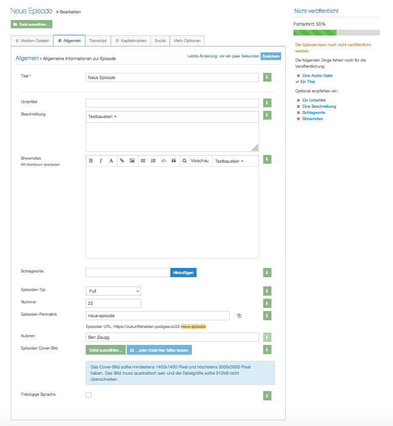
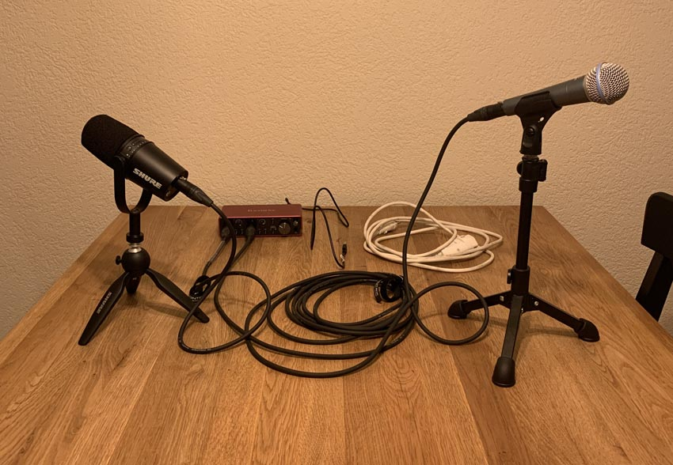

+++
title = "Wie startet man einen Podcast"
date = "2021-11-02"
draft = false
pinned = false
image = "img_9554-2.jpg"
description = "Mit einem Podcast zu beginnen ist recht einfach. Es gibt jedoch unendlich viele Möglichkeiten und hier gebe ich einen kleinen Einblick in meinen Weg bis heute. "
+++
Eigentlich ist der Titel etwas zu hoch gegriffen. Denn ich habe hier keine Patentlösung, dafür einen Einblick, wie ich es gemacht habe. Bereits hier möchte ich darauf hinweisen, dass es mein Weg ist und es wirklich viele verschiedene Möglichkeiten gibt. Ich bevorzuge immer, einfach mal anzufangen und auszuprobieren. So habe ich es auch im Frühling 2020 gemacht.

Im Frühling 2020 startete ich mit möglichst viel vorhandenem Material den entwicklungsfreiraum-Podcast. Dort habe ausschliesslich ich gesprochen und die Aufnahmen im Büro unserer damaligen Wohnug gemacht sowie später in der neuen Wohung. Beide sind sehr unterschiedlich und es hat überall gut geklappt. Der Raum hat zwar einen Einfluss aber zum Beginn spielt es keine grosse Rolle. Heute nehme ich sogar in ganz verschiedenen Räumen auf und das klappt ganz gut. 

**Zum Start-Equipment gehörten:**

* Mein **Mac** (inkl. Garageband)
* Ein vorhandenes **Mikrofon (Shure 58 A Beta)** und einem XLR-Kabel

Um das Mikro mit dem Mac verbinden zu können brauchte ich zusätzlich ein Interface. Damals habe ich mich für das **Shure MVi Audio Interface** entscheiden. Dort lässt sich (nur) ein Mikrofon anschliessen und es dient als Schnittstelle zwischen dem XLR-Mikro und Mac. Um zu starten brauchte es nicht mehr an Hardware. Einzig ein Hosting wird noch benötigt um den Podcast online zu schalten und da hat sich **podigee.com** als äusserst hilfreich erwiesen, da es sehr einfach ist und dich durch die wichtigsten Schritte führt. Hier ist es auch möglich den eigenen Podcast auf spotiy, apple Podcasts und anderen Portalen anzubieten. Podigee ist kostenpflichtig und aus meiner Sicht absolut zu empfehlen.

Ende 2020 wollte ich ein neues Format schaffen, bei dem ich mit Menschen spreche. Es war noch immer Pandemie und deshalb entschied ich mich für Onlineaufnahmen. Dafür nutzete ich **zencastr** mit einer kostenlosen Version. Zu diesem Zeitpunkt noch ohne Videofunktion und später mit. Bei zencaster kann man mehrere Tonspuren aufnehmen und anschliessend ganz einfach herunterladen. Zwei Tonspuren sind ideal, um später beide einzeln bearbeiten zu können. Zum Beispiel dann, wenn eine Person schlechter zu hören ist, was bei solchen Aufnahmen schnell der Fall sein kann. Vor einiger Zeit häuften sich jedoch die Probleme bei den Onlineaufnahmen. Gesprächspartner*innen konnten keine Verbindung herstellen, zencastr läuft nicht auf allen Browsern, Aufnahmeschwierigkeiten etc. Seit ca. 3 Monaten treffe ich mich nun mit Menschen in Sitzungszimmern, bei mir in der Küche oder bei ihnen zuhause. Dafür nutzte ich zuerst und weil es etwas eilte, ein zweites vorhandenes Mikrofon, das **Shure MV88+** (Video-Kit). Da dieses nur bedingt für Gespräche geeignet ist, habe ich mich für das **Shure MV7** entschieden. Dieses ist für Podcast-Aufnahmen und Gespräche gedacht und damit bin ich nun ganz zufrieden. 

**So bin ich heute wie folgt unterwegs:**

* Macbook und Garageband
* **Shure 58A Beta** sowie **Popschutz K&M 23956**
* **Shure MV7** (dieses verbinde ich meistens mit XLR über das Audio Interface. Es hat aber auch einen USB-Anschluss)
* **Audio Interface Adapter Focusrite Scarlett 2i2 3rd Gen**
* **2 Tischstative**, hier gibt es etliche Möglichkeiten

**Fazit:** Wenn ich eine Idee habe, dann beginne ich am liebsten einfach einmal. Das wurde in diesem Fall manchmal etwas mühsamer, da ich mir Equipment dazu gekauft habe, dass nicht ideal aufeinander abgestimmt ist. Dafür habe ich Erfahrungen mit verschiedenen Produkten und Möglichkeiten gesammelt. Heute würde ich (das denke ich zumindest) von Anfang an auf das Shure MV7 in zweifacher Ausführung sowie das Focusrite Scarlett setzen. Dieses Mikrofon ist zum starten aber relativ teuer. Eine günstige Alternative die ich nie selbst ausprobiert habe, aber in einigen Blogs und Foren empfohlen wird, ist das Audio Technica ATR 2100x usb. 

> «*Das haben wir noch nie probiert, also geht es sicher gut.*» Pippi Langstrumpf

Zu den Podcasts gehts hier:

[ZUKUNFTSHELDEN-Podcast](https://www.zukunftshelden.ch/podcast)

[entwicklungsfreiraum - der podcast](https://entwicklungsfreiraum.podigee.io/)

In diesem Blog ist keine Werbung enthalten. Alle Produkte und Anbieter nenne ich als Hilfe, falls du selbst etwas davon ausprobieren möchtest.