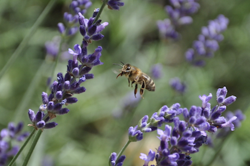
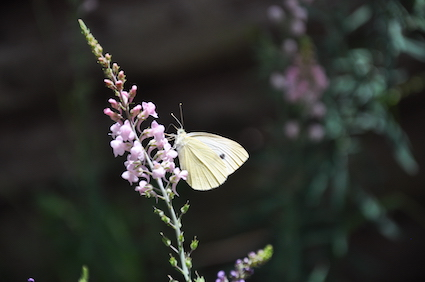
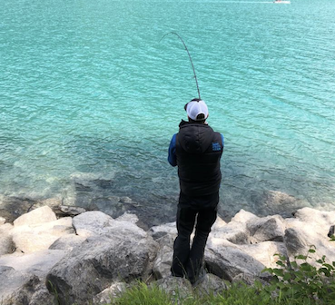
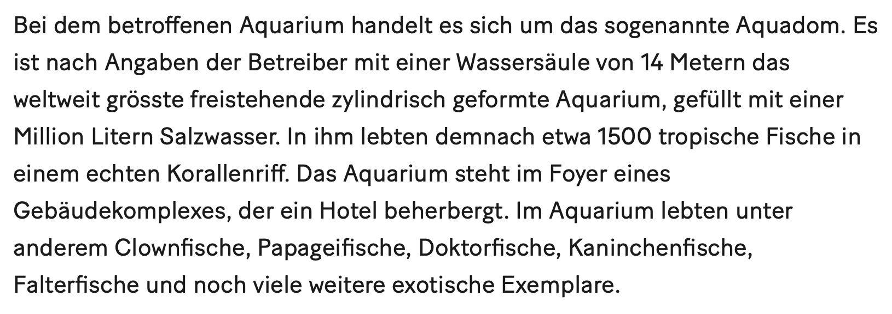

+++
title = "Wir und die Natur"
date = "2022-12-16"
draft = false
pinned = false
tags = ["Natur", "Tiere", "Gedanken"]
image = "bildschirm-foto-2022-12-16-um-13.27.27.png"
description = "Die Natur ist stark, wunderschön und auch so verletzlich. \n"
footnotes = "Buch: [Mission Erde, die Welt ist es wert, um sie zu kämpfen, Robert Marc Lehmann](https://www.exlibris.ch/de/buecher-buch/deutschsprachige-buecher/robert-marc-lehmann/mission-erde-meer-als-nur-ein-bildband/id/9783982457307/?utm_source=google&utm_medium=cpc&utm_campaign=Performance+Max+CSS+Rang+10+(pm-CH-de)&utm_content=&utm_term=&gclid=CjwKCAiAy_CcBhBeEiwAcoMRHIh8JfZf54KoIzrQNrihv8mkR94Uj4uEbFCWEUW5AdZklWJ63jHJDBoCrBYQAvD_BwE&gclsrc=aw.ds)"
+++
### Wir und die Natur

Heute ist in Berlin ein Aquarium in einem Hotel geplatzt oder explodiert. Gestern hat Joscha Tschanz über «den richtgen Weg etwas zu ändern» geschrieben. Jetzt schreibe ich meine Gedanken, weil beides gerade zu dem passt, womit ich mich immer wieder beschäftige. Denn ich wollte eh zu Mission Erde, resp. [Robert Marc Lehmann](https://www.robertmarclehmann.com/de) etwas schreiben. Ihn könnte man m. E. auch als gutes Beispiel für selbstbestimmtes und selbstorganisiertes Lernen nehmen und als jemanden, der sein Lernen teilt. Das ist aber heute nicht das Thema. 

Übrigens irritierte mich beim Lesen seines Buches (und manchmal auch auf Youtube) die häufigen Bezüge zu sich selbst, die auch einfach Selbstdarstellung sein könnten oder auch sind. Ich mache das aber auch oft und denke, diese Art zu schreiben oder etwas zu zeigen ist nötig. Nötig, um authentisch zu sein und nötig, um  Theorie und Erleben in Zusammenhang zu stellen. 

#### Mein Bezug zur Natur und zu Tieren

Zuerst zu meinem persönlichen Bezug zur Natur und zu Tieren. Meine ersten fünf Lebensjahre verbrachte ich in der Nähe zum Wald, zwischen Bauernhöfen und Apfelbäumen. Kein Witz! Ich «half» oft beim Grasen oder Heuen in der «Hostet» (Grasfläche/Weide mit Obstbäumen), war im Stall zwischen Kühen und Kälbern, Hunden, Katzen, Hühnern etc. Es war einfach normal und es war schön. Dann zogen wir in ein Quartier in einem anderen Dorf. Kindergarten. Schule. Ich kannte fast alle Bäume im Wald, die Käfer, die Spinnen, die Waldtiere, die Vögel, ... . Das alles war aber nicht so wichtig in der Schule. Ausser natürlich, wenn es ein Thema war. Ich entfremdete mich immer mehr von meinem ursprünglichen Interesse an Tieren und der Natur. Oder vielleicht müsste ich eher sagen, ich beschäftigte mich nicht mehr so sehr damit.

Als junger Erwachsener beschäftige ich mich teilweise sehr intensiv mit nachhaltiger Ernährung, wobei da auch die Genusstrainer Thematik reinspielte. Das wars aber dann irgendwie nicht. Dann rückten viele Themen wieder in den Hintergrund. Anderes war wichtiger. 

Mittlerweile hatte ich wieder etwas mehr Zeit und bin durch die [Youtube Serie 7 vs. Wild](https://www.youtube.com/watch?v=tbapalw2-Eo) auf [Robert Marc Lehmann und Mission Erde](https://www.youtube.com/@MissionErde) gestossen. Es sind wohl nicht nur die Tiere, sondern auch seine Art, wie er Videos macht. Er ist ehrlich, offen und direkt, hinterfragt auch immer wieder und weisst auf die Wissenschaft hin. Dabei spricht er beispielweise auch von «Erkenntnissen», die er im Studium gelernt hat und die heute widerlegt sind. Da kommt mir eine Aussage in den Sinn, die ich von Eckhardt von Hirschhausen kenne: «Die Wissenschaft ist immer der aktuellste Stand des Irrtums». Ich bin wieder voll im Thema Natur und Tiere drin, so, als wäre es niemals weg gewesen (war es wohl auch nie). Ich spüre mein eigenes Interesse und meine Begeisterung. Wobei ich meine Ablehnung gegenüber Tauben (Ratten der Lüfte) etwas ablegen konnte und ein relativ grosses Interesse für [Haie](https://www.youtube.com/watch?v=zSYGVWhQuk0&t=2s) (die waren mir vorher einfach unheimlich) entdeckt habe. 

#### Biene? Wespe? Hilfe!

Wenn ich so schaue wie (nicht Allergiker) mit den Händen fuchteln, aufstehen, weglaufen ö. Ä. wenn sie Bienen oder Wespen um sich haben, ja, sie vielleicht sogar töten, dann denke ich mir oft, wie weit sind die eigentlich von der Natur entfernt. Insekten wollen wir nicht um uns haben und darum töten oder verjagen sie möglichst schnell. Warum? Weil wir sie nicht (gut genug) kennen. Weil wir uns ekeln, weil wir Angst haben. Ja, Spinnen sind gar nicht meins und andere (vor allem unbekannte) Krabbeltiere auch nicht. Ich kann sie dann töten oder mich überwinden und ihnen einen Weg in die Freiheit suchen. 

#### Unkraut? Bitte nicht.

Während zwei oder drei Jahren habe ich mit meiner Frau einen Garten bewirtschaftet. Ich hatte keine sonderlich grossen Kenntnisse, aber ich wollte vieles so natürlich wachsen lassen wie möglich. Aber andere meinten, man müsse Unkraut jäten, man sollte dieses oder jenes nicht stehen lassen. Das ist in den Köpfen vieler Gärtner:innen und dabei könnten Gärten so schön sein und einen (wenn vielleicht auch nur kleinen) Beitrag zur Artenerhaltung und Artenvielfalt leisten. 

#### Fisch am Haken und jetzt?

Irgendwann habe ich angefangen zu fischen. Es ist entspannend, die Zeit in der Natur zu verbringen, gespannt zu sein, wann einer anbeisst und einfach im Moment zu sein. Lange haben wir nichts gefangen, weil Anfänger und weil es eben nicht mehr so viele Fische gibt. Dann kam der Moment und der 1. hing am Haken, Adrenalin und Konzentration, bis der Fisch an Land ist und dann.. Shit, dann zappelt der im Netz, flutscht aus den Händen. Ein Fisch. Ein Lebewesen. Ich weiss genau, wie er tierschutzgerecht zu töten ist. Mache ich. Fühlt sich nicht gut an. Seither habe ich die Angel nicht mehr ausgeworfen. Dafür sehe ich auf dem Weg zum Bahnhof in einem kleinen Becken in einem Bächlein immer wieder Fische. Wunderschön.

#### Zurück zu Mission Erde

Die Videos von RML waren bereits informativ, unterhaltsam und bewegend. Das Buch gibt aber m. E. noch einmal einen ganz anderen Einblick. Wenn man sich überlegt, dass Tierschutz oder Tierrettungsaktionen manchmal ablaufen wie Militäroperationen und sogar von ehemaligen Elitesoldaten wie zum Beispiel ehem. Navy Seals durchgeführt werden (müssen), dann gibt das noch einmal eine ganz andere Perspektive. Hast du gewusst, dass 99 % der kommerziell interessanten, international angebotenen Salzwasser-Zierfische nicht gezüchtet werden können und «direkt» als Wildfang aus den Ozeanen kommen? Mission Erde (2021), S. 39. Wenn du dann noch liest, wie diese Fische gefangen werden oder wie viele beim Transport sterben, könnte dir das Kotzen kommen. Erst recht, wenn du siehst, wie viele hier gestorben sind.

RML gibt in seinem Buch einen Einblick hinter die Kulissen von (lokalen) Tierschützern, die oft für wenige Geld und viel Arbeit ihr Leben riskieren, um nicht «nur» einzelne Tiere, sondern ganze Arten zu beschützen. Er zeigt dabei (wie auch in seinen Youtube-Videos), wie er selbst leidet und was für eine Arbeit hinter schönen Tierfotos und Dokumentarfilmen steckt. 

#### Trailer zum Bildband Mission Erde

<iframe width="560" height="315" src="https://www.youtube.com/embed/vjZ4q5tRzvA" title="YouTube video player" frameborder="0" allow="accelerometer; autoplay; clipboard-write; encrypted-media; gyroscope; picture-in-picture" allowfullscreen></iframe>\

#### Wie soll ich jetzt von hier aus ein Nashorn retten?

\
Ich habe oben bereits geschrieben, wie ich den Bezug zur Natur mit der Zeit etwas verloren hatte und ich denke (eigentlich bin ich mir sicher), dass viele Menschen diesen Kontakt verloren haben resp. diesen gar nie so richtig hatten. Dann gibt es natürlich viele, die sich engagieren wollen. Aber auch das «richtig» zu tun ist gar nicht so einfach. Dafür müssen wir aber nicht weit reisen und auch keine anderen grossen Sprünge machen. Es würde bereits reichen, wenn man damit beginnt, den Balkon mit einheimischen blühenden Pflanzen zu verschönern und dann die über 30 in Deutschland (sind es in der Schweiz gleich viele?) zu findenden Hummelarten beobachtet und identifiziert. Das kann man mit Kindern tun, geht aber ganz gut auch ohne.

**Ja, die Welt ist es wert um sie zu kämpfen.**