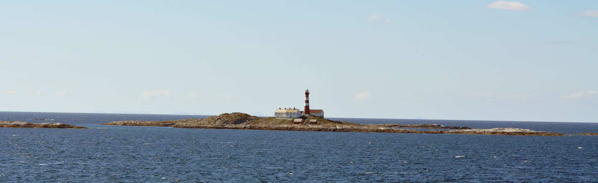

+++
title = "Zuerst passiert vieles im Untergrund"
date = "2021-10-19"
draft = false
pinned = false
tags = ["Biografie", "Tagebuch", "Recovery"]
image = "leuchtturm_1.jpg"
description = "(Entwicklungs-)Prozesse sind mindestens genau so wichtig wie das Resultat. Einige Gedaneken dazu. "
footnotes = "Foto: Ben Zaugg, aufgenommen irgendwo in Norwegen"
+++
Pilze verbringen einen grossen Teil ihrer Lebenszeit unter dem Boden. Ähnlich ist es oft auch mit Lernprozessen und beim Aufbau von Unternehmen. Man sieht Resultate erst nachdem im Hinter- oder Untergrund bereits vieles passiert ist. Dabei geht oft vergessen, dass genau auch diese Prozesse enorm wichtig sind. In so einem Prozess befinde ich mich gerade und dabei geht es nicht nur um das «[Pilzprojekt](https://www.pilzfarm.be)» im colearning. Es sind viele Prozesse die offen sind. Klar, ich bin mit [ZUKUNFTSHELDEN](https://www.zukunftshelden.ch) unterwegs und das ist mein Weg oder genauer ein Teil meines Weges. Anfang 2020 habe ich mich auf diese Reise gemacht mit der Idee, dass daraus mehr und anderes entstehen kann. In so einem oder in meinem Prozess kenne ich Freude, Spannung, Glücksmomente, Zweifel, Erschöpfung, Verwirrung, Klärung und vieles mehr. Das alles gehört dazu und ist gut so. Dabei merke ich, dass alte Denk- und Verhaltensmuster auftauchen und gerade diese Zweifel streuen. Wie immer wieder in meinen Beiträgen zu lesen oder zu hören ist, war mein Weg während und nach der Schule oft schwierig. Heute geht es mir gut aber wenns aus der Komfortzone raus geht, dann tauchen die Dämonen manchmal auf. Manchmal sind es nur unbewusste Erinnerungen daran, manchmal Schatten oder echte Gruselgestalten. Auch wenns natürlich immer nur in den Gedanken stattfindet. Übrigens, Dämonen nenne ich sie wegen «Dämonen auf dem Schiff» aus dem Buch von Russ Harris, Wer dem Glück hinterherrennt, rennt daran vorbei. Ein Praxisbuch mit und über die Akzeptanz- und Commitmenttherapie. 

Hier bin ich also, habe viele Ideen was man in der Lern- und Arbeitswelt besser machen könnte und sollte. Viel ist es eigentlich nicht. Vielleicht passt das Zitat von Carl R. Rogers einigermassen. Denn wir können «seelische Hilfe» mit Lernen, Potenzialentfaltung, Selbstwahrnehmung, Akzeptanz, etc. oder Helfer mit Lehrer\*in, Arbeitskolleg\*in, Chef*in, und und und ersetzen. 

> «Bedingungslose positive Zuwendung: Die seelische Hilfe gelingt dann am ehesten, wenn der Helfer diese Haltung bringt.» 
>
> *Carl R. Rogers*

Es sind Dinge am entstehen, bei denen die Haltung entscheidend ist. Wenn wir uns und andere akzeptieren wie wir sind, dann entsteht dort ein wunderbarer Entwicklungsfreiraum. Oft vergesse ich, dass dabei der Prozess mindestens genauso wichtig ist, wie das Resultat und verliere in diesen Momenten diesen Kontakt zu mir. Wobei was heisst schon Resultat.. da passt vielleicht eher Zwischenstopp, Meilenstein, Ankerplatz, ... . Das mache ich mir heute bewusst. 

Gerne möchte ich noch ein anderes Zitat von Carl R. Rogers mit dir teilen, dass ich hier ganz passend finde. 

> «Ich bin fähig gewesen, mich für neue Ideen, neue Gefühle, neue Erfahrungen und neue Risiken zu öffnen. Ich entdeckte immer mehr, dass lebendig sein bedeutet, Wagnisse einzugehen, trotz fehlender Gewissheit zu handeln und sich auf das Leben einzulassen. All dies bringt Veränderungen mit sich, und für mich ist der Prozess der Veränderung mit dem Leben identisch. Mir ist klar, dass ich, wenn ich stabil und starr und statisch wäre, eine lebende Leiche wäre. Deshalb akzeptiere ich Verwirrung und Ungewissheit und Furcht und emotionale Höhen und Tiefen, weil sie der Preis sind, den ich für ein strömendes, rätselhaftes, erregendes Leben gern bezahle.» 
>
> *Carl R. Rogers*